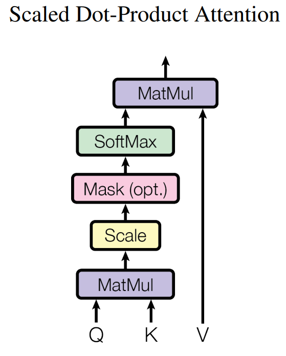

-----

| Title     | ML Attention SDPA                                     |
| --------- | ----------------------------------------------------- |
| Created @ | `2025-02-08T02:47:28Z`                                |
| Updated @ | `2025-02-08T02:47:28Z`                                |
| Labels    | \`\`                                                  |
| Edit @    | [here](https://github.com/junxnone/aiwiki/issues/499) |

-----

# Scaled Dot-Product Attention

  - Scaled Dot-Product Attention - 缩放点积注意力

## 定义与公式

Scaled Dot-Product Attention的计算公式为：

$$Attention(Q,K,V) = softmax(\\frac{QK^T}{\\sqrt{d\_k}})V$$

?\> 其中 $Q$ 是Query矩阵 ?\> $K$ 是Key矩阵 ?\> $V$ 是Value矩阵 ?\> $d\_k$ 是 $K$ 的维度
?\> $softmax$ 函数用于将得分转换为概率分布，表示每个位置的重要性权重。

## 计算过程

1.  **计算点积**：首先计算 $Q$ 和 $K$ 的转置的点积 $QK^T$
    。这个操作可以理解为计算Query与所有Key之间的相似度得分，得到一个得分矩阵。例如，在处理文本序列时，它能衡量每个位置的Query与其他位置的Key的关联程度。
2.  **缩放**：将点积结果除以 $\\sqrt{d\_k}$ ，这一步是为了防止点积结果过大，导致 $softmax$
    函数的梯度消失或不稳定。因为当 $d\_k$
    较大时，点积结果可能会变得很大，通过缩放可以使数值保持在一个合适的范围，有助于模型的训练和收敛。
3.  **计算注意力权重**：对缩放后的结果应用 $softmax$ 函数，得到注意力权重矩阵。 $softmax$
    函数会将每个得分转换为一个概率值，这些概率值表示了在当前Query下，每个位置的Key相对于其他位置的重要性程度。
4.  **加权求和**：最后，将注意力权重矩阵与Value矩阵 $V$
    相乘，得到加权后的Value，也就是经过注意力机制处理后的输出。这个输出融合了根据Query和Key的相似度加权后的Value信息，突出了与当前Query相关的重要内容。

## 作用与优势

  - **高效计算**：相比于一些其他的注意力计算方式，Scaled Dot-Product
    Attention的计算效率较高，能够在大规模数据上快速计算注意力权重，适用于处理长序列数据，如自然语言处理中的长文本、语音识别中的长时间序列等。
  - **自适应关注**：它能够让模型自适应地关注输入序列中的不同部分，根据Query动态地分配注意力权重，从而捕捉到输入数据中的长距离依赖关系。例如在机器翻译中，能够准确地将源语言中的不同部分与目标语言中的对应部分建立联系，提高翻译的准确性。
