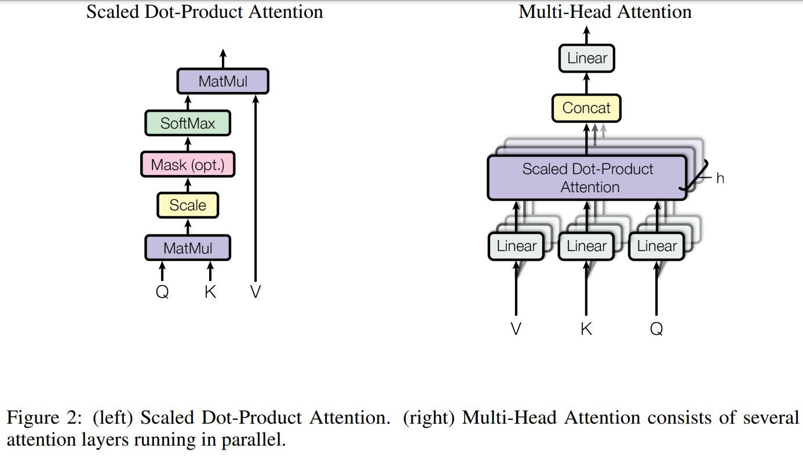

-----

| Title     | ML Attention MHA                                      |
| --------- | ----------------------------------------------------- |
| Created @ | `2025-02-08T03:10:53Z`                                |
| Updated @ | `2025-02-08T03:10:53Z`                                |
| Labels    | \`\`                                                  |
| Edit @    | [here](https://github.com/junxnone/aiwiki/issues/500) |

-----

# Multi-Head Attention

  - 多头注意力机制是在 Scaled Dot-Product Attention
    基础上发展而来的，它通过多个头（head）的并行计算，让模型能够同时关注不同方面的信息，从而捕捉到更丰富的语义和结构信息。
  - 简单来说，就是将输入的 Query、Key 和 Value
    分别投影到多个不同的子空间中，在每个子空间中独立地进行注意力计算，然后将这些结果合并起来，得到最终的输出。

## Arch

## 计算过程

1.  **线性投影**：首先，将输入的Query、Key和Value分别通过多个不同的线性变换矩阵 $W^Q\_i$ 、 $W^K\_i$ 、
    $W^V\_i$ （ $i = 1,2,\\cdots,h$ ， $h$ 为头的数量）进行投影，得到 $h$
    组不同的Query、Key和Value，即 $Q\_i = QW^Q\_i$ ， $K\_i =
    KW^K\_i$ ， $V\_i = VW^V\_i$ 。
2.  **并行计算注意力**：对于每组投影后的 $Q\_i$ 、 $K\_i$ 、 $V\_i$ ，分别进行Scaled
    Dot-Product Attention计算，得到 $h$ 个注意力输出 $Z\_i =
    Attention(Q\_i,K\_i,V\_i)$ 。
3.  **拼接与线性变换**：将这 $h$ 个注意力输出 $Z\_i$ 按照列的方向进行拼接，得到一个拼接后的矩阵 $Z$
    ，然后再通过一个线性变换矩阵 $W^O$ 进行线性变换，得到最终的多头注意力输出
    $MultiHead(Q,K,V) = W^OZ$ 。

## 作用与优势

  - **增强表示能力**：多个头可以并行地学习到不同的特征和模式，每个头都可以关注输入序列中的不同部分或不同类型的信息，从而使模型能够更全面、更深入地理解输入数据，提高模型的表示能力。例如，在处理自然语言时，有的头可能更擅长捕捉句子中的语法结构，有的头可能更关注语义信息，通过组合这些头的结果，模型能够更好地理解和处理语言。
  - **捕捉复杂关系**：能够更好地捕捉输入序列中的复杂关系，比如不同位置之间的长期依赖关系、不同语义角色之间的关系等。在图像识别中，它可以同时关注图像中的不同区域，捕捉到物体之间的空间关系和语义关联；在语音处理中，能够同时处理不同频率段的信息，提高语音识别和合成的效果。

## 在Transformer中的应用

在Transformer架构中，多头注意力机制在编码器和解码器中都有广泛应用。在编码器中，它帮助模型对输入序列进行更好的编码，提取出更丰富的特征表示；在解码器中，除了对解码器自身的输入进行自注意力计算外，还通过多头注意力机制与编码器的输出进行交互，从而在生成输出序列时能够充分利用输入序列的信息，实现更准确的预测和生成。
