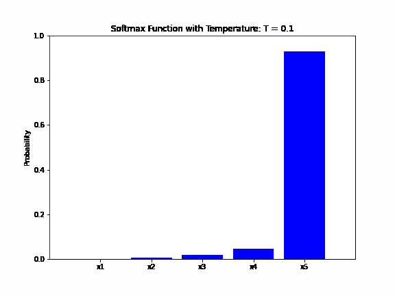
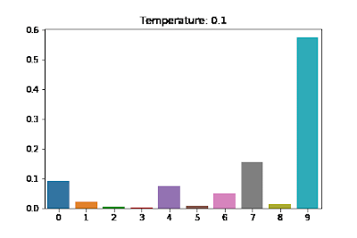

-----

| Title     | LM LLMs Parameters                                    |
| --------- | ----------------------------------------------------- |
| Created @ | `2025-02-08T07:56:33Z`                                |
| Updated @ | `2025-02-08T07:56:33Z`                                |
| Labels    | \`\`                                                  |
| Edit @    | [here](https://github.com/junxnone/aiwiki/issues/502) |

-----

# LLM Parameters

  - max length
  - top-p
  - temperature

## top-p

  - LLM 生成 tokens 后需要选择最优token
  - **Beam Search** - 总是选择最高分的 token, 会出现重复
  - **top-k sampling** - 选择前 k 个，会出现 `胡言乱语`
  - **top-p** - Nucleus Sampling 80/20 长尾分布，头部token 概率多，从 `top-p`
    的概率中取token
      - 例如 75%，前 N 个词概率和大于 75%，则取前 N 个词

## tempurature

  - Temperature 是一个超参数, 来源于 `Softmax with Temperature @ paper 2015`
    [Distilling the Knowledge in a Neural
    Network](https://arxiv.org/abs/1503.02531)
  - 用于控制生成语言模型中生成文本的随机性和创造性
  - 用于调整模型的softmax输出层中预测词的概率。温度参数定义为在应用 softmax 函数之前用于调整 logits
    的比例因子的倒数。
  - **↓** - 当Temperature
    设置为较低的值时，预测词的概率会变尖锐，这意味着选择最有可能的词的概率更高。这会产生更保守和可预测的文本，因为模型不太可能生成意想不到或不寻常的词。
  - **↑** 当Temperature
    设置为较高值时，预测词的概率被拉平，这意味着所有词被选择的可能性更大。这会产生更有创意和多样化的文本，因为模型更有可能生成不寻常或意想不到的词。
  - 温度参数通常设置为 0.1 到 1.0 之间的值，具体取决于生成文本中所需的随机性和创造性水平。
  - 温度值为 1.0 对应于标准 softmax 函数，其中预测词的概率未按比例缩放。

$\\Huge softmax(y\_i)=\\frac{e^{z\_i}}{ \\sum e^{z\_j} } \\Rightarrow
softmax(y\_i)=\\frac{e^{\\frac{z\_i}{T}}}{\\sum e^{ \\frac{z\_j}{T} }}$

  - 随着 T 的变化 softmax Probability 分布变化

## Reference

  - [NLP / LLMs中的Temperature
    是什么?](https://blog.csdn.net/deephub/article/details/129682591)
  - [Prompt⼯程中LLM的参数](https://zhuanlan.zhihu.com/p/646399189)
  - [The Curious Case of Neural Text
    Degeneration](https://arxiv.org/abs/1904.09751)
