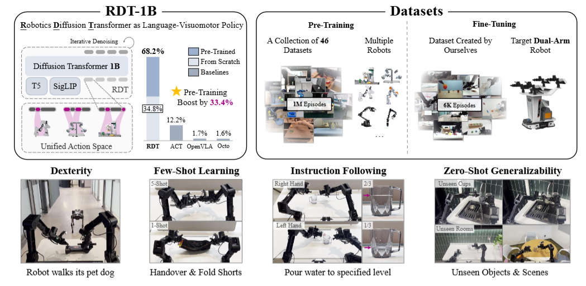
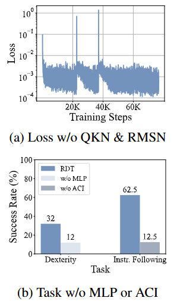
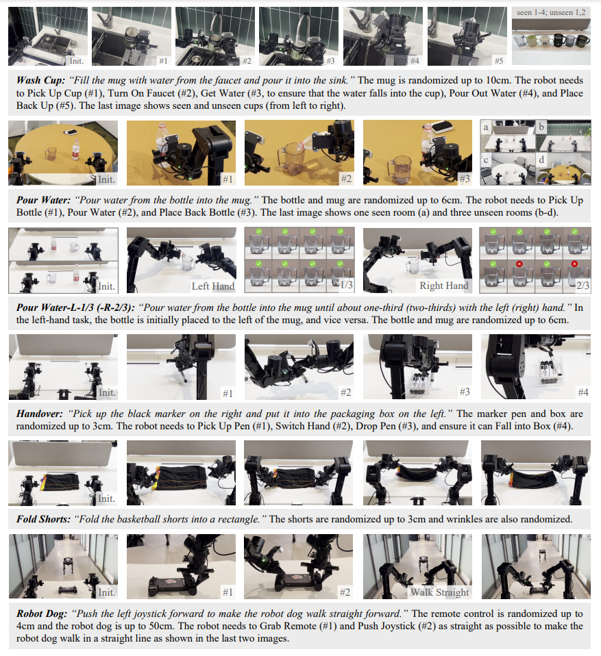
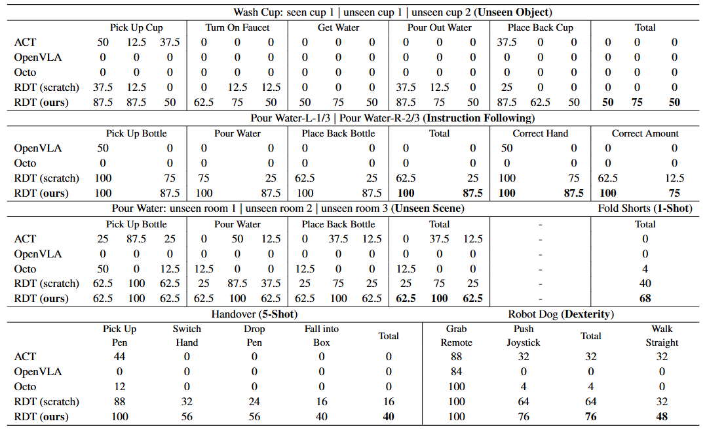

-----

| Title     | paper RDT CN                                          |
| --------- | ----------------------------------------------------- |
| Created @ | `2025-02-18T03:20:41Z`                                |
| Updated @ | `2025-02-18T06:34:39Z`                                |
| Labels    | \`\`                                                  |
| Edit @    | [here](https://github.com/junxnone/aiwiki/issues/508) |

-----

# RDT-1B 翻译

## 摘要

双手操作在机器人领域至关重要，但由于协调两个机械臂存在固有复杂性（会导致多模态动作分布）以及训练数据稀缺，开发基础模型极具挑战性。在本文中，我们**提出了机器人扩散变换器（RDT），这是一种开创性的用于双手操作的扩散基础模型**。RDT基于扩散模型构建，能够有效表示多模态性，通过创新性地设计可扩展的Transformer，来处理多模态输入的异构性，并捕捉机器人数据的非线性和高频特征。为解决数据稀缺问题，我们进一步引入了物理可解释统一动作空间，它可以在保留原始动作物理意义的同时，统一各种机器人的动作表示，有助于学习可迁移的物理知识。通过这些设计，我们成功在迄今为止规模最大的多机器人数据集上对RDT进行预训练，并将其参数扩展至12亿，这使其成为基于扩散的最大规模机器人操作基础模型。最后，我们在自行创建的包含6000多个情节的多任务双手操作数据集上对RDT进行微调，以优化其操作能力。在真实机器人上进行的实验表明，RDT显著优于现有方法。它对未见物体和场景具有零样本泛化能力，能够理解并遵循语言指令，仅通过1
- 5次演示就能学习新技能，还能有效处理复杂、灵巧的任务。代码和视频请访问项目页面。

## 1 介绍

*图1：10亿参数的机器人扩散变换器（RDT - 1B）概览。这是一种用于双臂操作的语言条件视觉 -
运动策略，对未见场景具有最先进的泛化能力（指标计算细节见附录H）。*

双手操作对于机器人完成现实世界的任务至关重要（埃辛格和肯普，2007年）。在实际应用中，一个有效的操作策略应能够推广到未知场景，例如从未见过的物体和场景。然而，当前的方法要么依赖特定任务的基本要素（米拉扎维·萨利希安等人，2017年；拉基塔等人，2019年；格兰嫩等人，2023a），要么局限于小规模模型、数据以及简单任务（克雷布斯等人，2021年；弗兰泽塞等人，2023年；格兰嫩等人，2023b；赵等人，2023年；格罗茨等人，2024年；刘等人，2024年），因此仅具有有限的泛化能力，在复杂任务中往往难以奏效。随着自然语言处理（阿基亚姆等人，2023年；图夫龙等人，2023年）和计算机视觉（拉德福德等人，2021年；基里洛夫等人，2023年）领域取得成功，实现可泛化行为的一个有前景的方向，是通过在大规模数据集上进行模仿学习来开发基础模型。

然而，开发一个双手操作基础模型极具挑战性。一个主要原因是，由于硬件成本高昂，特定双臂机器人可获取的数据极为稀缺（夏尔马等人，2018年；协作团队等人，2023年），这无法满足训练基础模型对数据密集型的要求。受近期单臂操作研究尝试（布罗汉等人，2023年；金等人，2024年）的启发，我们尝试先在广泛的多机器人数据集上进行预训练，然后在目标双臂机器人上收集的小数据集上进行微调。这可以帮助我们将数据规模扩大三个数量级，并有潜力从其他机器人的数据集中学习可迁移的物理知识。尽管如此，仍存在两个关键技术挑战。首先，一个具有泛化能力的基础模型在表现力和可扩展性方面都需要一个高性能的架构。双手操作中动作空间的维度是单臂操作的两倍，
这使得可行动作的分布具有更高程度的多模态性（李，2006年；贾等人，2024年），如图2b所示。因此，该模型必须具有足够的表达能力，以捕捉动作分布中的多模态性。以往的方法（赵等人，2023年；布罗汉等人，2023年；金等人，2024年）通常无法达到这一标准，导致性能不尽人意。此外，该架构需要有效地处理来自不同模态的输入，包括文本、图像和动作。它必须具有可扩展性，以便在大规模机器人数据上进行稳定训练。其次，数据异质性是由不同机器人之间物理结构和动作空间定义的差异造成的，这可能会在多机器人数据训练过程中导致负迁移，并阻碍策略的泛化（潘和杨，2009年）。现有方法要么舍弃动作空间不同的机器人，要么只保留数据中在不同机器人间结构不变的部分，这是以丢失有价值的数据为代价的（布罗汉等人，2023年；戈什等人，2023年；沙阿等人，2023a）。

在本文中，我们介绍了机器人扩散变换器（RDT），这是目前规模最大且具有强泛化能力的双手操作基础模型。RDT采用扩散变换器（DiTs）作为其可扩展的主干网络（谢等人，2020年），并针对结合视觉的语言条件双手操作进行了特殊设计。在表现力方面，RDT借助扩散模型对复杂分布进行建模的能力（索恩等人，2015年；何等人，2020年），能够从海量数据中出色地捕捉双手动作的所有模态。在可扩展性方面，我们利用Transformer主干架构，并精心设计多模态编码，以消除各种模态的异质性。机器人数据具有非线性动力学特性（德维特等人，2012年）、高频变化（戈什等人，2023年）以及固有的不稳定数值范围，这与具有时空连续性的图像和视频显著不同（陈等人，2019年；梁等人，2022年），为了刻画这些特性，我们对原始DiT结构进行了重要修改，包括多层感知器（MLP）解码、改进的归一化以及交替条件注入（其重要性见图4）。为了进一步实现RDT在异构数据上的训练，我们提出了物理可解释统一动作空间，这是一种适用于各种带夹爪机械臂机器人的统一动作格式。这种创新格式在保留原始动作物理意义的同时，减轻了不同机器人之间可能存在的冲突，有助于模型从各种机器人数据集中学习可泛化的物理知识。

通过上述设计，我们成功在迄今为止规模最大的多机器人数据集上（协作团队等人，2023年；沃克等人，2023年；方等人，2023年；库马尔等人，2024年）对RDT模型进行了预训练，并将其参数扩展至12亿，这使其成为基于扩散的规模最大的机器人操作预训练模型。为进一步提升其双手操作能力，我们在自行收集的包含6000多条轨迹的多任务双手操作数据集上对RDT进行了微调，该数据集是规模最为庞大的双手操作数据集之一。在实验中，我们将RDT与双手操作和机器人基础模型领域的强大基线模型进行了全面对比评估。结果表明，RDT取得了领先的性能，在一系列具有挑战性的任务中，成功率比基线模型提高了56%，表现超越了基线模型。特别是，RDT对未见物体、场景，指令，甚至技能具有出色的零样本和少样本（1
- 5次示例）泛化能力，
它还能够完成需要精细操作的任务，比如用操纵杆控制机器狗。最后，消融实验表明，扩散建模、大规模模型以及大量数据，都对其卓越性能有所贡献。

图2：（a）ALOHA双臂机器人示意图。（b）抓取立方体的一个示例。与单臂操作相比，双臂操作有更多可能的动作模式，从而具有更强的多模态性。颜色由浅至深表示时间推进。

## 2 相关工作

**基于学习的双手操作**。学习双手操作策略面临的一个重大挑战是动作空间的高维度性，这加剧了数据稀缺问题（佐尔纳等人，2004年；史密斯等人，2012年；利奥蒂科夫等人，2016年；施泰普蒂西斯等人，2022年）以及多模态行为问题（科洛梅与托拉斯，2018年、2020年；菲格罗亚与比拉德，2017年；夏尔马等人，2018年；谢等人，2020年；弗兰泽塞等人，2023年）。一些研究开发了更具成本效益的数据收集接口（赵等人，2023年；阿尔达科等人，2024年），但它们仅限于特定的硬件配置，仍然不足以填补可泛化策略的数据缺口。其他研究尝试通过引入归纳偏差来降低数据需求，例如区分双臂以实现稳定性和功能性（格兰嫩等人，2023b）、对运动原语进行参数化（巴蒂尼察等人，2017年；阿马迪奥等人，2019年；奇特尼斯等人，2020年；弗兰泽塞等人，2023年），或者使用体素表示（格罗茨等人，2024年；刘等人，2024年）。这些方法使用了强先验或简化建模，成功缩小了动作空间，但代价是应用范围缩小，且无法表达双手行为的多模态性（皮尔斯等人，2023年）。

**机器人领域的基础模型**。基础模型通过在大规模多任务机器人数据集（协作团队等，2023年；布罗汉等，2022年；方等，2023年）上训练多任务“通用型”模型（布罗汉等，2022年、2023年；戈什等，2023年；金等，2024年），在实现可泛化行为方面展现出巨大潜力。大多数研究对大型视觉
-
语言模型进行调整，以直接预测动作（布罗汉等，2022年；德里伊斯等，2023年；布罗汉等，2023年；协作团队等，2023年；金等，2024年）。尽管这些模型在对新物体和新任务的泛化方面有所表现，但在应用于双手操作时，它们面临量化误差和行为不协调等问题（皮尔斯等，2023年），这在很大程度上是由于其对动作空间的离散化处理。为了提高精度，扩散模型已被用于连续控制（何等人，2020年；池等人，2023年；皮尔斯等人，2023年；戈什等人，2023年）。戈什等人（2023年）在Open
X -
具身（协作团队等，2023年）数据集的一个子集（25个数据集）上预训练了一个基于Transformer的扩散策略，该模型参数多达9300万。

## 3 问题表述与挑战

图3：RDT框架。各类机器人的异构动作空间被嵌入到一个统一动作空间中，以进行多机器人训练。

  - 输入：本体感受 $z\_{t}$ 、含噪动作块 $\\tilde{a}\_{t: t+T\_a}$ 控制频率 $c$ 以及扩散时间步
    $k$ , 作为去噪输入
  - 图像输入 $T\_{img}=2$ $X = {X^{1}, X^{2}, X^{3}}$
    表示一组来自外部、右手腕和左手腕摄像头的图像）和语言输入，作为条件。
  - 输出：去噪后的动作块 $a\_{t: t + T\_{a}}$ 。

我们首先阐述任务并详细说明面临的挑战。为了在硬件上评估模型，我们选择ALOHA双臂机器人作为目标机器人，因为它是最具代表性的双臂机器人之一，且适合通过远程操作收集人类演示数据（赵等人，2023年；傅等人，2024年；阿尔达科等人，2024年）。图2a展示了目标机器人的示意图，它由两个带夹爪的机械臂和三个摄像头组成。请注意，我们的设置和基础模型适用于任何带夹爪的双臂机器人。

我们考虑结合视觉的语言条件双手操作这一具体任务，该任务在机器人领域至关重要，且在诸如家庭场景等现实世界场景中具有重大价值（施泰普蒂西斯等人，2020年；布罗汉等人，2022年；赵等人，2023年）。正式地讲，给定语言指令
$\\ell$ ，在 $t \\in \\mathbb{N}^{+}$ 时刻，策略会接收观测值 $o\_{t}$ ；然后生成一个动作
$a\_{t}$ ，以控制两个机器人手臂实现由 $\\ell$ 指定的目标。观测值表示为 一个三元组 $o\_{t}:=(X\_{t -
T\_{max} + 1 : t + 1}, z\_{t}, c)$ ，其中 $X\_{t - T\_{img} + 1 : t + 1} :=
(X\_{t - T\_{img} + 1}, \\ldots, X\_{t})$ 是RGB 观测历史长度为 $T\_{img}$，
$z\_t$ 是机器人的低维本体感知信息， $c$ 是控制频率。动作 $a\_t$ 通常是期望的本体感知 $z\_{t + 1}^1$
的一个子集。

双手操作中的特定任务通常包含多个要素：一项技能（例如 “拾取” 或 “擦拭” 等动词）、一个物体（例如 “瓶子” 或 “桌子”
等名词）、一个场景（即任务发生的环境），以及描述技能如何执行的一种方式（例如 “用左手拾取瓶子”
这样的状语）。面对一项新任务，实际应用中的策略需要能够泛化到训练数据中未出现过的新要素。正如第2节所讨论的，这对于以往基于规则的方法，以及基于小模型或少量数据的学习方法而言，都是具有挑战性的。

我们旨在通过模仿学习训练一个基础模型策略以实现泛化能力。然而，由于硬件成本高昂，特定双臂机器人可用的数据极为稀缺（轨迹数量少于10000条），远远达不到训练基础模型的一般要求。为解决这一问题，我们从近期单臂操作的研究进展中获得启发（戈什等人，2023年；协作团队等人，2023年；金等人，2024年），提议采用预训练和微调流程（拉德福德等人，2018年），以利用多个机器人的数据。通过这种方式，我们将数据规模扩大三个数量级。具体而言，我们首先在大规模多机器人数据集
$D\_{pre}$（大多为单臂机器人数据）上对模型进行预训练，然后在目标机器人的数据集 $D\_{ft}$ 上进行微调。我们将数据集表示为
$D = {(\\ell^{(i)}, o\_{t}^{(i)}, a\_{t}^{(i)}) | 0 ≤ t \< T^{(i)}, 1 ≤
i ≤ N}$ ，其中 $T^{(i)}$ 是第 $i$ 条轨迹的长度，$N$
是轨迹的数量。此外，值得强调的是，我们的目标是利用多机器人数据来提升模型在双手操作中的泛化能力，而非为各种机器人开发一个跨实体模型。利用多机器人数据开发这样一个基础模型主要面临两个挑战：

**挑战1：如何设计一个强大的架构？**
一个具有泛化能力的基础模型需要一个强大的架构。这一要求主要涵盖两个方面。首先，该架构必须具备足够的表现力，以捕捉动作分布中的多模态性。图2b展示了一个简单示例，机器人试图抓取一个立方体。我们可以看到，与仅控制单个机械臂的单臂操作不同，完成此任务存在多种方式。在收集演示数据时，人类操作员可能会随机选择其中一种方式，这就导致收集到的动作数据具有多模态性。其次，这种架构必须具备可扩展性。作为一个基础模型，它应该能够有效地处理来自各种模态（文本、图像、动作等）的异构输入，同时具备可扩展性，以便在大规模数据集上进行稳定训练。

**挑战2：如何在异构数据上进行训练？**
在多机器人数据上进行训练带来了数据异构性这一独特挑战。不同机器人之间的物理结构和动作空间可能差异巨大。
不同机器人的物理结构和动作空间可能差异巨大。以往的尝试要么局限于动作空间相似的部分机器人（杨等人，2023年；戈什等人，2023年；金等人，2024年），要么只保留结构相同的部分输入数据（协作团队等人，2023年；杨等人，2024年），但这样做会损失大量信息。如何在这类异构数据上训练模型，在很大程度上仍未得到有效解决。

图4：(a) 未使用QKNorm和RMSNorm进行训练时不稳定的损失曲线。(b)
在机器狗（直线行走子任务）和倒1/3杯水（水量正确子任务）中，RDT（无MLP解码器或无ACI）的成功率。任务定义见图5。由于资源限制，本实验中的所有模型均未进行预训练。

## 4 机器人扩散变换器

如图3所示，我们现在介绍机器人扩散变换器（RDT）。在4.1节中，我们将阐述扩散模型及相应架构，以应对挑战1。在4.2节中，我们提出一种物理可解释的统一动作空间，来统一各种机器人的动作空间并实现多机器人预训练，从而解决挑战2。我们还收集了一个全面的多任务双手操作数据集用于微调，以提升RDT的双手操作能力。

### 4.1 RDT Model

扩散建模。由于存在多模态性，给定语言指令 $\\ell$ 和观测值 $o\_t$ ，可能有许多种可能的动作 $a\_t$
来推进任务。如果我们将策略建模为确定性映射 $(\\ell, o\_t) \\mapsto
a\_t$ ，并对训练数据中的 $(\\ell, o\_t, a\_t)$ 元组进行回归，那么该策略将学习动作模式的
“平均值”。这可能会导致产生分布外的动作，比如多种模式的算术平均值，而这种动作可能完全不可行（皮尔斯等人，2023年）。相反，我们选择对连续条件分布
$p(a\_t | \\ell, o\_t)$
进行建模。如第2节所讨论的，在各种方法中，扩散模型在表现力和采样质量方面都很出色，但对高维数据（如图像）进行采样时可能速度较慢。幸运的是，对于我们的设定而言，这个缺点影响不大，因为
$a\_t$ 的维度比图像低得多，只需要极少的采样开销。这使得扩散模型成为策略建模的理想选择，正如池等人（2023年）的研究所示。

然而，将扩散模型应用于机器人任务面临着独特的挑战，因为机器人物理量（即动作和本体感知）的固有特性与图像/视频数据不同。图像和视频数据虽然维度高，但往往具有一定程度的时空连续性（陈等人，2019；梁等人，2022），帧与帧之间的变化通常是渐进的。相比之下，机器人物理量具有非线性动力学特性（德维特等人，2012），并且由于碰撞、约束以及阻尼等材料特性所产生的物理相互作用，可能会出现高频变化。此外，这些物理量还具有不稳定的数值范围，这可能是由不可靠传感器产生的极端值导致的。这突出了对当前扩散模型进行调整，以有效捕捉机器人数据的不稳定性和非线性的必要性。接下来，我们将首先详细阐述扩散公式，然后介绍我们为解决这些挑战而设计的架构。

在使用扩散策略进行决策时，我们首先对一个完全随机的噪声动作 $a\_{t}^{K} \\sim N(0, I)$ 进行采样，然后执行 $K
\\in \\mathbb{N}^{+}$ 次去噪步骤，将其从 $p(a\_{t} | \\ell, o\_{t})$
分布中去噪为一个干净的动作样本 $a\_{t}^{0}$ 。

$$a\_{t}^{k - 1}=\\frac{\\sqrt{\\overline{\\alpha}^{k - 1}}
\\beta^{k}}{1 - \\overline{\\alpha}^{k}}
a\_{t}^{0}+\\frac{\\sqrt{\\alpha^{k}}(1 - \\overline{\\alpha}^{k -
1})}{1 - \\overline{\\alpha}^{k}} a\_{t}^{k}+\\sigma^{k} z, \\quad k =
K, \\ldots, 1, \\quad (1)$$

其中， ${\\alpha^{k}}*{k = 1}^{K}$ 、 ${\\sigma^{k}}*{k = 1}^{K}$
是由噪声调度预先定义的标量系数（尼科尔和达里瓦尔，2021）。这里， $\\beta^{k} :=
1 - \\alpha^{k}$ ，且 $\\overline{\\alpha}^{k - 1} := \\prod\_{i = 1}^{k -
1} \\alpha^{i}$ ，当 $k \> 1$ 时， $z \\sim N(0, I)$ ；否则，
$\\overline{\\alpha}^{k - 1} = 1$ ， $z = 0$ 。然而，在采样完成之前， $a\_{t}^{0}$
是难以处理的。我们选择使用一个带有参数 $\\theta$ 的可学习去噪网络 $f\_{\\theta}$
，从一个含噪样本中估计干净样本： $a\_{t}^{0} \\leftarrow
f\_{\\theta}(\\ell, o\_{t}, a\_{t}^{k}, k)$
。为了训练这样一个网络，我们将最小化以下去噪均方误差（MSE）：

$$\\mathcal{L}(\\theta) := MSE\\left(a\_{t}, f\_{\\theta}\\left(\\ell,
o\_{t}, \\sqrt{\\overline{\\alpha}^{k}} a\_{t}+\\sqrt{1 -
\\overline{\\alpha}^{k}} \\epsilon, k\\right)\\right), \\quad (2)$$

其中， $k \\sim Uniform({1, \\ldots, K})$ ， $\\epsilon \\sim N(0, I)$ ，并且
$(\\ell, o\_{t}, a\_{t})$ 是从我们的训练数据集中采样得到的。在本文后续内容中，我们将含噪动作输入记为
$\\tilde{a}\_{t} := \\sqrt{\\overline{\\alpha}^{k}} a\_t + \\sqrt{1 -
\\overline{\\alpha}^{k}} \\epsilon$ ，为简化起见，省略了 $k$
的上标。此外，在实际应用中，我们更倾向于一次性预测一系列动作，即一个动作块，以促进时间一致性（池等人，2023），并通过减少任务中的决策数量来缓解随时间累积的误差（赵等人，2023）。

具体而言，我们对 $p(a\_{t:t + T\_{a}} | \\ell, o\_{t})$ 进行建模，其中 $a\_{t:t +
T\_{a}} := (a\_{t}, \\ldots, a\_{t + T\_{a} - 1})$ 是一个动作块，并且
$T\_{a}$表示块大小（赵等人，2023年）。我们在附录A中进行详细讨论。 现在我们介绍架构的设计，包括多模态输入的编码以及
$f\_{\\theta}$ 的网络结构，具体细节留到附录B介绍。

异构多模态输入的编码。多模态输入的异构性体现在结构上，即每种模态的格式和维度数量都有显著差异。这给多模态训练带来了挑战。为解决这一问题，我们将这些不同的模态编码到一个统一的潜在空间中。以下是编码方法：

  - **低维输入**
    是代表机器人物理量的低维向量，包括本体感知、动作块和控制频率。为了对它们进行编码，我们使用多层感知器（MLP，并结合傅里叶特征（坦西克等人，2020年）），这种方法能够有效地捕捉低维空间中的高频变化。

  - **图像输入** 维度高，且包含丰富的空间和语义信息。为提取紧凑的表征，我们使用图像 -
    文本对齐的预训练视觉编码器SigLIP（翟等人，2023年）。训练期间，我们冻结其权重以节省GPU内存。

  - **语言输入**
    长度不一且高度抽象，因其复杂性和模糊性给整合带来了挑战。为对其进行编码，我们使用基于Transformer的预训练语言模型T5-XXL（拉菲尔等人，2020年）。训练过程中，我们同样冻结其权重以节省GPU内存。

除了结构上的差异，异构性还体现在不同输入所包含的信息量不同。首先，不同模态的数据包含的信息量不同。例如，图像通常比文本包含更多信息，并且编码后会生成更多的标记。其次，同一模态的不同输入可能包含截然不同的信息量。例如，如图3右上角所示，机器人的外部摄像头视角更全面，相比腕部摄像头包含更丰富的信息。在这种情况下，模型可能会找到捷径：只关注外部视角而忽略腕部视角，从而丧失感知深度的能力。为解决这一问题，我们在编码过程中以一定概率对每个多模态输入进行随机且独立的掩码处理，防止模型过度依赖特定输入。

**$f\_{\\theta}$的网络结构**。我们选择Transformer作为可扩展的主干网络（鲍等人，2023年；皮布尔斯和谢，2023年），并结合机器问题的特点，对扩散变换器（DiT）做出以下三个关键修改：

  - **QKNorm与RMSNorm**。输入的机器人物理量数值范围不稳定，可能导致梯度不稳定和数值溢出等问题，尤其是在训练大型基础模型时。为解决这一问题，我们添加QKNorm（亨利等人，2020年），以避免在计算注意力时出现数值不稳定的情况。此外，我们注意到我们的问题可被视为时间序列预测任务，原始扩散变换器（DiT）的层归一化（LayerNorm）中的中心化操作可能会导致标记偏移和注意力偏移，从而破坏时间序列的对称性（黄等人，2024年）。因此，我们用RMSNorm（张和森里奇，2019年）取代LayerNorm，RMSNorm不进行中心化操作。图4a表明，若不进行此修改，大规模预训练往往会非常不稳定，甚至出现梯度爆炸。

  - **MLP解码器**。为提升对非线性机器人动作的逼近能力，我们将最终的线性解码器替换为非线性MLP解码器，以此作为从潜在空间到物理空间的投影。如图4b的实证所示，若没有这种设计，机器人扩散变换器（RDT）无法有效捕捉非线性动力学特性，进而丧失完成需要精细操作的灵巧任务的能力。

  - **交替条件注入（ACI）**。在我们的模型中，图像和语言输入作为条件，它们维度高且长度可变，这与传统扩散变换器（DiT）中的类别标签条件不同（谢等人，2020）。这些信息丰富的条件很难压缩成单个标记，使得原来的自适应层归一化方法不再适用。因此，我们采用交叉注意力机制来容纳不同长度的条件，避免在进一步压缩中造成信息损失。此外，我们进一步分析发现，鉴于图像标记通常比文本标记多得多，同时注入这两种模态的信息往往会掩盖与文本相关的信息，从而削弱模型执行指令的能力（定量结果见图4b）。为缓解这一问题，我们采取策略，在连续层的交叉注意力中交替注入图像和文本标记，而非在每一层都同时注入两者。

### 4.2 Data

在异构多机器人数据上进行训练。为了能够在异构多机器人数据上开展训练，我们需要一个各类机器人共享的统一动作空间，它能够为多机器人动作提供统一格式。从机器人的原始动作空间到统一动作空间的映射应该具有物理可解释性，其每个维度都应该有明确的物理意义。这可以促使模型从不同机器人的数据中学习共享的物理规律，从而提高从不同机器人数据中学习的效率（沙阿等人，2023a）。

该空间的设计包含两个步骤。第一步，对于每台机器人而言，我们可以用单一空间来同时容纳其本体感知$z\_{t}$和动作$a\_{t}$。这是因为$a\_{t}$通常是期望的$z\_{t
+
1}$的一个子集（德维特等人，2012；库瓦里塔基斯和坎农，2016），所以$z\_{t}$的空间自然涵盖了$a\_{t}$的空间。第二步，我们设计一个统一空间，该空间涵盖了大多数带有机械臂抓手的机器人的所有主要物理量。如图3左侧所示，我们依据原始动作向量中每个元素的物理意义，将其填充到统一动作空间向量的相应位置，把机器人的动作空间嵌入到这个统一空间中，其余位置则进行填充。该空间的具体定义在附录C中给出。

在这个统一空间下，我们能够在几乎所有配备机械臂抓手的现代机器人的数据上对机器人扩散变换器（RDT）进行预训练，并根据基础模型的需求大幅扩大数据规模。具体而言，我们收集的预训练数据集涵盖46个各类机器人的数据集，总共有100多万条轨迹，数据量达21TB。更多细节及预处理内容留待附录D介绍。

**收集全面的多任务双臂数据集**。尽管机器人扩散变换器（RDT）已在大规模数据集上进行了预训练，但由于具身差距，它在零样本泛化到目标双臂机器人时仍可能面临困难。为弥合这一差距，我们需要在目标机器人上收集一个多任务双臂数据集用于微调。大语言模型的最新进展（齐格勒等人，2019年；布朗等人，2020年；图夫龙等人，2023年）表明，高质量的微调数据集对模型性能至关重要。我们从三个方面确保数据集的高质量：（1）在数量方面，我们收集了6000多条轨迹，使我们的数据集成为目前最大的双臂数据集之一；（2）在全面性方面，我们考虑了300多个具有挑战性的任务，涵盖了大多数操作任务类型，从拾取和放置到插拔电缆，甚至包括书写数学方程式；（3）在多样性方面，我们准备了100多个具有不同大小和纹理的刚体和非刚体物体，以及15多个具有不同光照条件的不同房间。此外，我们进一步利用GPT
- 4 - Turbo（阿奇亚姆等人，2023年）重写人工标注的指令，以增加文本多样性。更多信息请参考图6和附录E。

## 5 实验

我们旨在通过实际机器人实验回答以下问题： 问题1：机器人扩散变换器（RDT）能否对未见的物体和场景进行零样本泛化？
问题2：对于未见模态，RDT的零样本指令跟随能力效果如何？
问题3：RDT能否助力对先前未见技能的少样本学习？
问题4：RDT是否有能力完成需要精细操作的任务？
问题5：大模型规模、海量数据以及扩散建模对RDT的性能是否有帮助？

### 5.1 实验设置

**任务**。我们选取了7项具有挑战性的任务，从不同维度评估机器人扩散变换器（RDT）的泛化能力，这些任务涵盖了模型在实际应用中可能遇到的复杂场景，例如各种未知元素和灵巧操作。表1展示了每个任务的维度说明，图5则提供了详细定义和可视化内容。

**数据**。我们使用4.2节中的预训练和微调数据集。现在列出微调数据集中与每个任务相关的演示次数。洗杯子：针对已见过的杯子，共有133次演示，针对未见杯子的演示次数为0；倒水：针对已见过的房间，共有350次演示，针对未见房间的演示次数为0；倒1/3杯水（左）与倒2/3杯水（右）：少量水位的演示有18次，半杯水的演示有19次，满杯水的演示有19次；交接：5次演示；叠短裤：1次演示；机器狗：68次演示。

**模型训练与推理**。我们将机器人扩散变换器（RDT）的规模扩展至12亿个参数，使其成为目前最大的基于扩散模型的机器人基础模型。该模型在48块H100
80GB
GPU上进行了为期一个月的预训练，共计100万次训练迭代步骤。使用相同的GPU对该模型进行13万步的微调需要三天时间。更多细节我们放在附录F中，包括运行平台、设计选择以及数据增强技术。对于实时推理，我们采用DPM
-
Solver++（卢等人，2022年），这是一种最新的扩散模型采样加速器。它可以将采样一个动作块所需的扩散步骤从100步减少到5步，在目标机器人板载的RTX
4090 24GB GPU上，实现动作块推理频率达到6赫兹（每秒动作块数），平均动作推理频率达到381赫兹（每秒动作数）。

**基线模型**。为全面评估机器人扩散变换器（RDT），我们纳入了机器人基础模型和双臂操作领域中最先进的基线模型，其中包括基于Transformer的动作分块（ACT）（赵等人，2023年）、OpenVLA（金等人，2024年）以及Octo（戈什等人，2023年）。ACT是双臂操作领域的一种前沿方法，它利用变分自编码器（VAE）对动作分布进行建模。OpenVLA是最大的开源基础模型（70亿参数），采用离散化建模。Octo是一个基于扩散模型的基础模型，其最大版本仅有9300万个参数。

**评估指标与硬件**。我们采用成功率作为主要评估指标，其计算方式为成功试验次数除以总试验次数。洗杯子任务中，每个杯子测试8次（1个见过的杯子、2个未见过的杯子，共24次测试）。倒水任务中，每个房间测试8次（3个未见过的房间，共24次测试）。倒1/3杯水（左）和倒2/3杯水（右）任务各测试8次。交接、叠短裤和机器狗任务各测试25次。所有测试均在ALOHA双臂机器人上进行（硬件配置详见附录G）。实验细节，如具体实现和超参数设置，在附录H中有详细阐述。

**消融研究**。为回答问题5，我们针对模型规模、预训练以及建模方法进行了消融研究，以了解它们的重要性。我们考虑以下几种变体：

  - RDT（我们的模型）：原始的机器人扩散变换器（RDT）。
  - RDT（回归）：不采用扩散建模的RDT。它对确定性映射$(\\ell, o\_{t}) \\mapsto a\_{t}$进行建模。
  - RDT（小模型）：不具备大量参数的RDT。它仅有1.66亿个参数。
  - RDT（从头开始）：不进行预训练的RDT。它在微调过程中从零开始训练。

在表2中，我们从泛化性的三个维度对这些变体进行评估。表7给出了RDT不同变体以及基线模型的对比情况。

图5：任务定义与可视化。针对7项具有挑战性的任务，我们阐述了其语言指令、随机化设置以及每个子任务的定义。对于“向左倒三分之一杯水”和“向右倒三分之二杯水”任务，我们在两张图片中展示了最终的水位情况。

| 任务名称      | 维度          | 解释                         |
| --------- | ----------- | -------------------------- |
| 洗杯子       | 未见物体（问题1）   | 用水龙头清洗1个见过的杯子和2个未见过的杯子     |
| 倒水        | 未见场景（问题1）   | 在3个未见过的房间里，将水倒入杯子中         |
| 向左倒三分之一杯水 | 指令跟随（问题2）   | 用左手向杯子里倒水，直至杯子水量达到三分之一     |
| 向右倒三分之二杯水 | 指令跟随（问题2）   | 用右手向杯子里倒水，直至杯子水量达到三分之二     |
| 交接物品      | 5次样本学习（问题3） | 将标记物移动到盒子处，由于距离较远，需要进行物品交接 |
| 叠短裤       | 1次样本学习（问题3） | 将短裤水平对折                    |
| 控制机器狗     | 精细操作（问题4）   | 水平推动操纵杆，控制机器狗直线行走          |

表1：设计任务时的考量维度。对于“向左倒三分之一杯水”和“向右倒三分之二杯水”任务，在训练指令中仅出现少量、一半（即二分之一）和满杯的水位描述。对于“交接物品”和“叠短裤”任务，数据集分别仅包含该技能的5个演示和1个演示。对于“控制机器狗”任务，它需要精细操作，因为推动操纵杆时稍有角度偏差就会使机器狗偏离路线。

| 模型变体       | “洗杯子”任务（未见过的杯子2，总成功率） | “倒水”任务（未见过的房间3，总成功率） | “向左倒三分之一杯水”任务（水量正确子任务） |
| ---------- | --------------------- | -------------------- | ---------------------- |
| RDT（我们的模型） | \[具体成功率数值1\]%         | \[具体成功率数值2\]%        | \[具体成功率数值3\]%          |
| RDT（回归）    | \[具体成功率数值4\]%         | \[具体成功率数值5\]%        | \[具体成功率数值6\]%          |
| RDT（小模型）   | \[具体成功率数值7\]%         | \[具体成功率数值8\]%        | \[具体成功率数值9\]%          |
| RDT（从头开始）  | \[具体成功率数值10\]%        | \[具体成功率数值11\]%       | \[具体成功率数值12\]%         |

表2呈现了原始RDT及其三个变体在“洗杯子”（未见过的杯子2，总成功率）、“倒水”（未见过的房间3，总成功率）和“向左倒三分之一杯水”（水量正确子任务）等任务中的成功率（%）。除RDT（从头开始训练）外，所有模型在微调前均进行了预训练。

### 5.2 结果分析

从表3的结果中，我们可以看到，机器人扩散变换器（RDT）始终优于其他基线模型。这是因为RDT采用扩散模型与强大的网络架构，能够准确地对多模态动作的分布进行建模，而离散化方法和变分自编码器（VAE）分别缺乏准确性和表现力。此外，大规模预训练后的大量参数提供了许多先验知识，显著提高了泛化能力。以下是详细分析：

**问题1和问题2**：RDT能够对未见的物体、场景和模态进行零样本泛化。在洗杯子和倒水任务中，RDT在未见场景下仍能实现较高的成功率，其表现与在已见场景下并无太大差异。相比之下，其他基线模型甚至无法完成整个任务。在倒1/3杯水和倒2/3杯水任务中，从图5或图10（放大版）的第三行可以发现，即使RDT从未见过“三分之一”或“三分之二”这样的表述，它也能准确理解该用哪只手操作以及该倒多少水，并通过行动严格遵循指令。这正是得益于大规模预训练。
正是因为经过大规模预训练，RDT见识过大量多样的物体、场景和指令，才具备如此强大的零样本泛化能力。

**问题3**：RDT仅需少量样本就能学习新技能。在交接和叠短裤任务中，RDT通过少样本学习掌握了交接和折叠等全新且复杂的技能，其动作模式与已知技能大不相同，而其他模型的成功率几乎为零。这种提升同样得益于大规模预训练。少样本学习能帮助RDT快速适应新的工作环境，这对实际应用具有重要意义。

**问题4**：RDT能够处理精细任务。在机器狗任务中，RDT在推动操纵杆时能精确控制角度，而其他模型则导致机器狗偏离。这是因为扩散模型结合我们强大的网络架构，能够对多模态和非线性动作的分布进行建模，从而使动作精度满足精细任务的要求。我们还注意到，操纵杆和遥控器都是黑色的，这使得操纵杆在视觉上不太明显。这可能导致ACT容易失败。相比之下，大规模预训练使RDT对操纵杆概念学习到了更好的视觉
- 语言表征，提高了识别能力。

**问题5**：大模型规模、海量数据以及扩散模型都是我们模型表现出色的关键因素。从表2中可以看出，缺少任何一个因素都会导致性能严重下降，这证明了我们这些改进的必要性。特别是RDT（从头开始训练）在未见物体和场景上表现不佳，这表明预训练获得的知识对模型的泛化能力至关重要。

表3：量化结果。我们报告了ACT、OpenVLA、RDT（从头开始训练，无预训练）以及RDT（我们的模型，经过预训练）在7项任务中的成功率（%）。每个子任务单元格中的子列代表不同的元素（物体、指令、场景）。ACT并非基于语言条件，因此无法完成指令跟随任务。我们的RDT模型始终优于其他模型。

## 6 结论

在本文中，我们通过开发机器人扩散变换器（RDT）应对了可泛化双臂操作中数据稀缺和操作复杂性增加的挑战。RDT是一种基于扩散的基础模型，用于语言条件下的视觉
-
运动模仿学习。我们的模型在大规模多机器人数据集上进行预训练，并在自行收集的双臂数据集上进行微调。我们还引入了一个具有物理可解释性的统一动作空间，以统一不同机器人的动作表示，增强鲁棒性和可迁移性。RDT超越了现有方法，不仅在灵巧双臂操作能力和指令跟随方面展现出显著提升，还在少样本学习以及对未见物体和场景的零样本泛化方面取得了卓越表现。
