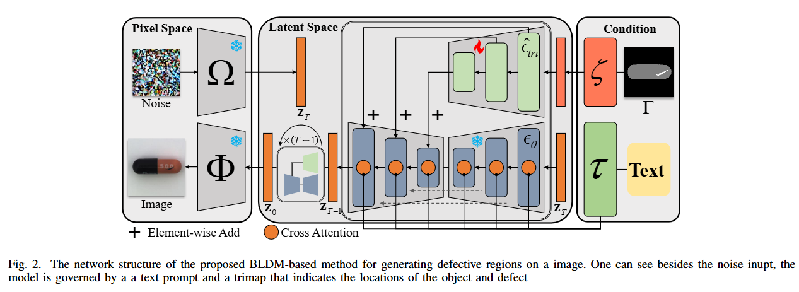
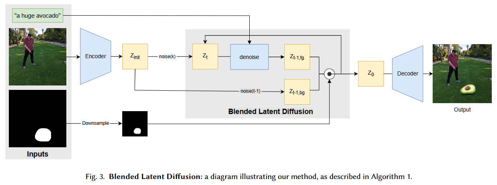
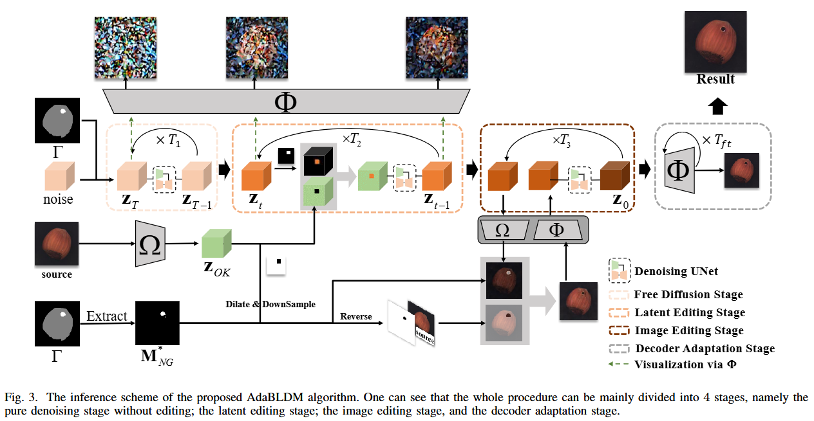
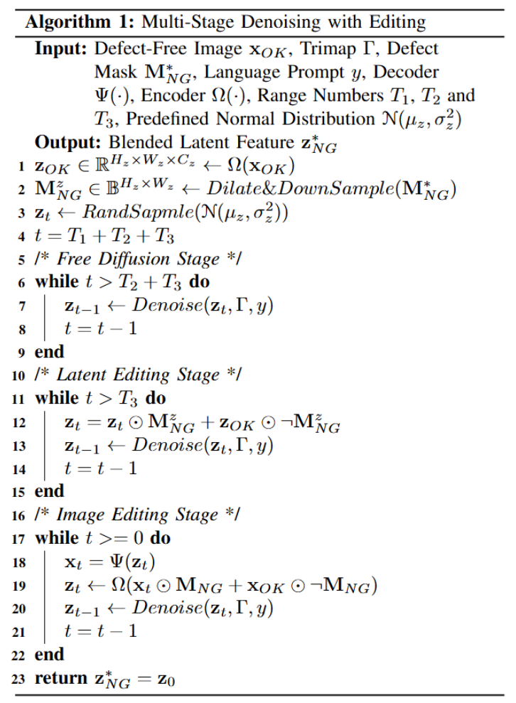

-----

| Title     | paper AdaBLDM                                         |
| --------- | ----------------------------------------------------- |
| Created @ | `2025-04-10T07:20:03Z`                                |
| Updated @ | `2025-04-16T03:51:11Z`                                |
| Labels    | \`\`                                                  |
| Edit @    | [here](https://github.com/junxnone/aiwiki/issues/510) |

-----

# AdaBLDM

  - 论文主要介绍了一种用于生成工业缺陷样本的新算法
  - 此前方法的不足:
      - 缺陷模式单一
      - 生成区域对齐不准确
      - copy-paste 过拟合问题
  - 基于 BLDM 提出定制的混合潜在扩散模型（AdaBLDM），通过扩散模型在潜在空间生成缺陷样本，利用 “trimap”
    掩码和文本提示进行特征编辑。
  - 利用 [BLDM - Blended Latent
    Diffusion](https://arxiv.org/abs/2206.02779) 局部编辑图像的能力
  - 该模型的图像生成推理过程分为自由扩散、编辑扩散和在线解码器自适应三个阶段。
  - **trimap:** 图片背景 + 目标物体掩码 + 缺陷掩码

**此前的一些方法**

## Arch

> \[\!NOTE\]
>  参考: BLDM
> 架构图

1.  **纯去噪阶段（without
    editing）**：这个阶段不进行编辑操作，主要是对输入的噪声进行单纯的去噪处理。在这个过程中，算法按照一定的规则和模型结构，对噪声数据进行处理，逐步去除噪声，为后续的编辑和图像生成奠定基础。此时模型专注于对输入数据的初步处理，以得到相对干净的潜在表示，还未涉及到对缺陷等特定特征的编辑操作。
2.  **潜在编辑阶段（latent editing
    stage）**：在这个阶段，算法开始对前一阶段得到的潜在表示进行编辑。通过使用控制三值图（trimap）和文本提示等信息，对潜在空间中的特征进行调整和修改。具体来说，会将trimap嵌入并提取特征，然后将这些特征注入到去噪解码器的相应层中，引导潜在表示朝着期望的缺陷模式进行变化，从而在潜在空间中生成具有特定缺陷特征的表示。
3.  **图像编辑阶段（image editing
    stage）**：经过潜在编辑阶段后，得到了包含所需缺陷特征的潜在表示。在图像编辑阶段，将潜在表示转换为图像形式，并进一步对图像进行编辑。这个阶段会根据潜在表示中的信息，在图像上精确地生成缺陷区域，使得生成的图像符合文本提示和trimap所指示的物体和缺陷位置及特征要求，从而得到初步的合成缺陷图像。
4.  **解码器自适应阶段（decoder adaptation
    stage）**：这个阶段主要是对解码器进行自适应调整。在前面的阶段中，虽然已经生成了包含缺陷的图像，但为了进一步提高图像的质量和准确性，需要对解码器进行微调。通过自适应调整，使得解码器能够更好地适应生成的潜在表示，从而生成更高质量的合成缺陷样本，以满足工业异常检测对样本质量的要求。

### 多阶段去噪编辑算法

1.  **输入与初始化**：算法的输入包括无缺陷图像 $x\_{OK}$ 、三值图 $\\Gamma$ 、缺陷掩码 $M^\*\_{NG}$
    、语言提示 $y$ 、解码器 $\\Psi(·)$ 、编码器 $\\Omega(·)$ 、范围数字 $T1$ 、 $T2$ 和
    $T3$ 以及预定义的正态分布 $N(\\mu\_z, \\sigma^2\_z)$ 。

<!-- end list -->

  - 首先，通过编码器 $\\Omega$ 将无缺陷图像 $x\_{OK}$ 转换到潜在空间，得到 $z\_{OK}$ ；
  - 对缺陷掩码 $M^\*\_{NG}$ 进行膨胀和下采样操作
  - \--\> 得到 $M\_{z\_{NG}}$ ；
  - 从预定义的正态分布 $N(\\mu\_z, \\sigma^2\_z)$ 中随机采样，得到初始的潜在向量 $z\_t$
    。同时，设置总步数 $t = T1 + T2 + T3$ 。

<!-- end list -->

2.  **自由扩散阶段（Free Diffusion Stage）**：在这个阶段，当 $t \> T2 + T3$ 时，不断对当前的潜在向量
    $z\_t$ 进行去噪操作，使用的函数是 $Denoise(zt, \\Gamma, y)$ ，这个函数可能结合了三值图
    $\\Gamma$ 和语言提示 $y$ 的信息来指导去噪过程。每次去噪后更新 $t$ ，逐步减少步数，直到 $t$ 不大于 $T2 +
    T3$ 。这一阶段主要是对初始噪声进行初步处理，为后续编辑做准备。
3.  **潜在编辑阶段（Latent Editing Stage）**：当 $t \> T3$
    时，进入潜在编辑阶段。在这个阶段，通过将当前潜在向量
    $z\_t$ 与缺陷掩码 $M\_{z\_{NG}}$ 以及 $z\_{OK}$ 进行运算（ $z\_t = z\_t \\odot
    M\_{z\_{NG}} + z\_{OK} \\odot \\neg M\_{z\_{NG}}$
    ），在潜在空间中引入缺陷信息。然后对修改后的 $z\_t$
    进行去噪操作 $Denoise(zt, \\Gamma, y)$ ，并更新 $t$
    。这个过程不断调整潜在向量，使缺陷信息在潜在空间中逐渐融入，同时通过去噪保持图像的合理性。
4.  **图像编辑阶段（Image Editing Stage）**：当 $t \\geq 0$ 时，进入图像编辑阶段。首先，使用解码器
    $\\Psi$ 将当前潜在向量 $z\_t$ 转换为图像空间的 $x\_t$ ；然后，通过编码器 $\\Omega$
    对融合了缺陷信息和原始图像信息的图像（ $x\_t \\odot M\_{NG} +
    x\_{OK} \\odot \\neg M\_{NG}$ ）进行编码，得到新的潜在向量 $z\_t$ ；接着对新的 $z\_t$
    进行去噪操作 $Denoise(zt, \\Gamma, y)$ ，并更新 $t$
    。这个阶段在图像空间和潜在空间之间不断转换和处理，进一步优化缺陷在图像中的表现。
5.  **输出**：当算法执行完所有步骤后，最终返回的 $z^\*\_{NG} = z\_0$ ，这个 $z\_0$
    就是经过多阶段去噪编辑后得到的融合了缺陷信息的潜在特征向量，可用于后续的图像生成或其他任务。这个算法通过多阶段的设计，逐步在潜在空间和图像空间中引入和优化缺陷信息，利用去噪操作保证图像质量，最终生成符合要求的带有缺陷的图像。

## Reference

  - [A Novel Approach to Industrial Defect Generation through Blended
    Latent Diffusion Model with Online
    Adaptation](https://arxiv.org/abs/2402.19330)
  - [Code](https://github.com/GrandpaXun242/AdaBLDM)
