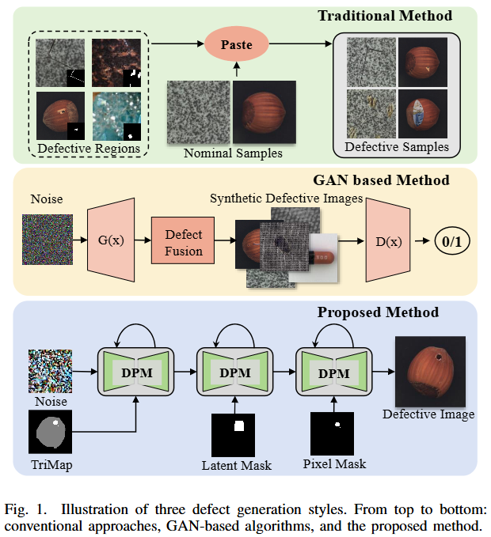

-----

| Title     | paper AdaBLDM                                         |
| --------- | ----------------------------------------------------- |
| Created @ | `2025-04-10T07:20:03Z`                                |
| Updated @ | `2025-04-10T07:20:03Z`                                |
| Labels    | \`\`                                                  |
| Edit @    | [here](https://github.com/junxnone/aiwiki/issues/510) |

-----

# AdaBLDM

  - 论文主要介绍了一种用于生成工业缺陷样本的新算法
  - 此前方法的不足:
      - 缺陷模式单一
      - 生成区域对齐不准确
      - copy-paste 过拟合问题
  - 提出定制的混合潜在扩散模型（AdaBLDM），通过扩散模型在潜在空间生成缺陷样本，利用 “trimap” 掩码和文本提示进行特征编辑。
  - 该模型的图像生成推理过程分为自由扩散、编辑扩散和在线解码器自适应三个阶段。

**此前的一些方法**

## Arch

## Reference

  - [A Novel Approach to Industrial Defect Generation through Blended
    Latent Diffusion Model with Online
    Adaptation](https://arxiv.org/abs/2402.19330)
  - [Code](https://github.com/GrandpaXun242/AdaBLDM)
