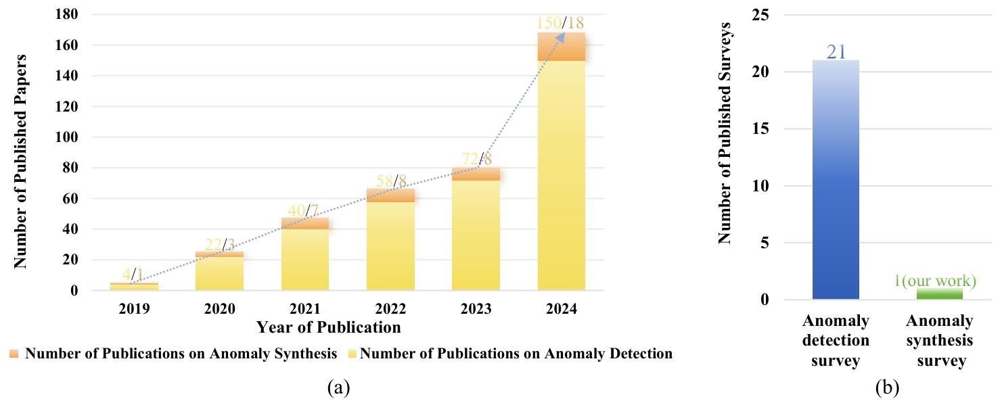

-----

| Title     | paper AnomaliesSynthesisSurvey                        |
| --------- | ----------------------------------------------------- |
| Created @ | `2025-04-11T07:39:36Z`                                |
| Updated @ | `2025-04-11T07:50:25Z`                                |
| Labels    | \`\`                                                  |
| Edit @    | [here](https://github.com/junxnone/aiwiki/issues/511) |

-----

# A Survey on Industrial Anomalies Synthesis

Xichen Xu1∗ , Yanshu Wang1∗ , Yawen Huang2∗ , Jiaqi Liu3 , Xiaoning Lei4
Guoyang Xie3,4† , Guannan Jiang4,† , Zhichao Lu3 1Shanghai Jiao Tong
University 2Jarvis Research Center, Tencent Youtu Lab 3City University
of Hong Kong 4Department of Intelligent Manufacturing, CATL

## 摘要

本文全面回顾了异常合成的方法。现有的相关研究综述聚焦于有限的技术，缺乏对该领域的整体认识，也没有梳理出不同方法之间的联系。相比之下，我们的研究提供了一个统一的综述，涵盖了大约40种具有代表性的方法，这些方法涉及**手工合成、基于分布假设的合成、基于生成模型（GM）的合成以及基于视觉语言模型（VLM）的合成**。我们引入了首个工业异常合成（IAS）分类法。先前的研究缺乏正式的分类，或者使用的分类方法过于简单，这阻碍了对方法进行系统性的比较以及对发展趋势的识别。我们的分类法提供了一个细粒度的框架，该框架反映了方法上的进展以及实际应用意义，为未来的研究奠定了基础。此外，我们还探索了跨模态合成和大规模视觉语言模型。之前的相关综述在异常合成方面忽视了多模态数据和视觉语言模型，这限制了人们对其优势的理解。我们的综述分析了它们的整合方式、优势、面临的挑战以及前景，为通过多模态学习推动工业异常合成的发展提供了一个路线图。更多相关资源可访问
<https://github.com/M-3LAB/awesome-anomalysynthesis> 获取。

## 引言

图像异常检测在制造业中起着至关重要的作用，主要侧重于识别产品的异常情况，从而确保产品质量。在实际应用中，图像异常检测系统通常需要大量高质量的已标注异常样本用于训练。然而，获取高质量的已标注异常样本会产生极高的成本。其困难总结如下：

1.  低缺陷率是一项根本性挑战。在大规模制造场景中，合格产品的比例远远超过异常产品的比例。
2.  需要专门设备，这大幅增加了成本。许多工业异常情况，诸如微观裂纹、细微划痕或隐藏的污染物等，都需要通过高精度仪器（如高倍显微镜和X射线检测系统）来进行检测。这些高精度设备增加了技术基础设施方面的投资。
3.  对异常样本进行标注需要具备领域专业知识并进行细致的分析，这导致标注过程耗时很长。准确的标注需要熟练的专业人员，而这类人员数量有限，这就增加了人力成本。此外，某些异常情况需要使用先进的成像技术进行多模态验证，这进一步加重了时间和资源负担。

为了解决这些局限性，已经开发出了各种图像异常合成算法来生成异常样本，旨在缓解真实异常样本的稀缺问题，并提高下游的检测性能。然而，现有的异常合成算法无法满足工业制造的需求。所面临的挑战如下：

1.  异常分布的有限采样
    针对特定异常类型的异常样本数量有限，这相当于从潜在的异常分布中进行了稀疏采样，无法捕捉到全部的变异性。这种限制迫使算法不得不提高其复杂程度，以满足对多样性的要求。
2.  真实异常情况的合成
    实际中的异常情况极为复杂（例如，裂纹、划痕、污染物、穿孔等），并且与背景纹理相比，存在很大的分布差异。不同异常类型的出现概率各不相同，这给建模过程增添了极大的复杂性。这可能会导致合成的异常情况无法准确呈现现实世界中异常情况的真实特征，进而出现特征缺失或特征不真实的情况。
3.  多模态信息未得到充分利用
    尽管多模态线索（例如用于异常合成的文本提示）越来越多，但如何有效地整合这些信息以合成逼真的异常模式，仍然是一个有待解决的难题。

因此，对当前的工业异常合成（IAS）进行系统分析和全面回顾已势在必行。如图1所示，近年来发表的关于异常检测的论文数量大幅激增，这凸显了工业界和学术界对该领域日益增长的关注。相应地，关于异常合成的研究也显著增多，这反映出人们愈发认识到它在缓解真实异常样本稀缺问题方面的重要性。尽管呈现出这种上升趋势，但现有的异常合成方法仍面临着一些根本性的挑战，这些挑战阻碍了它们在工业制造中的实际应用。通过批判性地审视这些挑战，我们不仅能够明确当前研究的优势与局限，还能为未来的算法开发制定清晰的指导方针。这样的分析将为推进异常合成技术的发展，并优化其在现实场景中的适用性提供基础性的见解。

> \! 图1：(a)
> 2019年至2024年与异常检测和异常合成相关的论文数量趋势。异常检测领域的论文发表数量呈现出稳定增长的态势，而近年来异常合成受到了越来越多的关注，尤其是在2024年出现了显著的激增。(b)
> 关于异常检测和异常合成的综述性论文对比。尽管存在大量关于异常检测的综述，但异常合成仍是一个新兴领域，截至目前还没有专门针对它的综述。我们的研究首次填补了这一空白。数据来源为<https://github.com/M-3LAB/awesome-industrial-anomaly-detection>
> 。

**与现有综述的对比**：因此，我们提出了一项全面的综述，它不仅弥补了现有研究的不足，还为工业异常合成（IAS）的系统分析建立了一个全新的框架。尽管已有一些综述对工业异常合成进行了简要讨论，但它们存在一些具体的局限性，如表1所示，这些局限性也可归类如下：

1.  合成方法的涵盖范围有限。现有的综述往往将其范围局限于特定的合成方法，无法从整体上对该领域进行全面的阐述。例如，陈等人强调了数据增强策略，但却忽视了更先进的合成方法在生成更具判别性的缺陷表征方面的潜力。同样地，夏等人专注于基于生成对抗网络（GAN）的模型在异常检测和合成方面的性能，却没有探索其他新兴生成范式的潜力。这种碎片化的视角限制了人们对于不同方法在应对实际挑战时如何相互补充的理解。
2.  缺乏专门的分类体系：现有的与异常相关的综述主要聚焦于异常检测，常常把异常合成当作一个次要方面，且没有进行系统的分类。例如，刘等人将异常检测方法宽泛地分为有监督和无监督两类，这无法体现出异常合成方法的多样性。据我们所知，我们的综述是首部专门对工业异常合成（IAS）方法进行系统分类的研究。通过填补这一空白，我们引入了一个专门为异常合成量身定制的结构化分类法，为理解和比较不同的合成方法提供了更全面的基础。
3.  对跨模态合成的重视不足。尽管现有研究认识到利用多种模态的重要性，但许多综述论文并未深入探究诸如大规模视觉语言模型（VLM）这类新兴技术是如何革新异常合成领域的。曹等人提出使用视觉语言模型进行跨模态异常合成。然而，目前迫切需要对其适用性和当前存在的局限性进行系统分析，而这方面的缺失阻碍了人们探索先进方法如何与工业实际需求相契合。

|                          | Liu et al. | Chen et al. | Xia et al. | Cao et al. | Our       |
| ------------------------ | ---------- | ----------- | ---------- | ---------- | --------- |
| Perspective              | Detection  | Detection   | Detection  | Detection  | Synthesis |
| Number of IAS Categories | 2          | 0           | 4          | 4          | 10        |
| Multimodal Interaction   | ✗          | ✗           | ✗          | ✗          | ✓         |

> \! 表1：先前的综述与我们的综述的对比。

**贡献**：这篇综述性论文的主要贡献可总结如下：

1.  我们的综述对异常合成进行了统一且系统的回顾，涵盖了不同范式下近40种具有代表性的方法。通过探究手工合成、基于分布假设的合成、基于生成模型（GM）的合成以及基于视觉语言模型（VLM）的合成，我们给出了一个全面的概述，囊括了该领域现有的全部技术范畴。
2.  我们提出了首个专门针对工业异常合成（IAS）的分类体系，提供了一个结构化且精细的分类框架，该框架反映了方法上的进步以及实际应用意义，从而为工业异常合成领域未来的研究与创新奠定了基础。
3.  这项工作深入研究了在异常合成中多模态线索与大规模视觉语言模型（VLM）的整合，探讨了其潜在的益处、面临的挑战以及未来的机遇。我们的探究为利用多模态学习提供了一个全面的框架，提高了异常合成在工业应用中的有效性。

**文章结构**：本文的其余部分结构如下：第2节介绍了工业异常合成（IAS）的系统分类体系，引入了关键范式及其方法上的差异。第3节至第6节对工业异常合成的四大主要类别进行了深入分析，研究了它们的理论基础、实施策略和实际应用。具体而言，这些章节涵盖了手工合成、基于分布假设的合成、基于生成模型（GM）的合成，以及最近新兴的基于视觉语言模型（VLM）的合成。最后，第7节和第8节总结了本次综述的关键要点，批判性地评估了当前方法的局限性，并概述了有望推动工业异常合成领域发展的未来研究方向。
