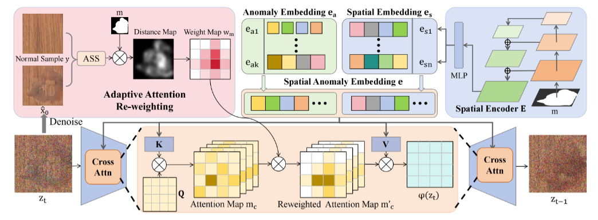

-----

| Title     | paper AnomalyDiffusion                                |
| --------- | ----------------------------------------------------- |
| Created @ | `2025-04-15T09:15:27Z`                                |
| Updated @ | `2025-04-15T09:18:33Z`                                |
| Labels    | \`\`                                                  |
| Edit @    | [here](https://github.com/junxnone/aiwiki/issues/513) |

-----

# AnomalyDiffusion

## Arch

  - AnomalyDiffusion 的总体框架：
      - 空间异常嵌入 $e$，由异常嵌入 $e\_{a}$ （一种通过学习得到的用于表示异常外观类型的文本嵌入）和空间嵌入
        $e\_{s}$ （由输入的异常掩码 $m$ 编码得到，用于指示异常位置）组成，它作为文本条件来引导异常生成过程；
      - 自适应注意力重加权机制根据去噪图像 $\\hat{x}\_{0}$ 与输入的正常样本 y 之间的差异来计算权重图 $w\_m$
        , 并通过权重图 $w\_m$ 对交叉注意力图 $m\_c$
        进行自适应重加权，以便在去噪过程中帮助模型更多地关注不太明显的异常区域。

## 评估标准

  - 采用与给定的异常数据无关的初始得分（Inception Score - IS），来直接评估生成质量；
  - 还引入了簇内成对的感知损失距离 \[ntra-cluster pairwise LPIPS
    distance\]（IC-LPIPS）（奥哈等人，2021年），以衡量生成的多样性。

## Reference

  - \[[project
    page](https://sjtuplayer.github.io/anomalydiffusion-page/)\] -
    \[[code](https://github.com/sjtuplayer/anomalydiffusion)\]
  - [paper - AnomalyDiffusion: Few-Shot Anomaly Image Generation with
    Diffusion Model](https://arxiv.org/abs/2312.05767)
