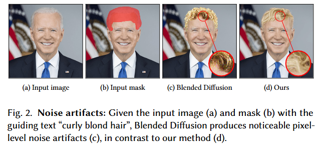
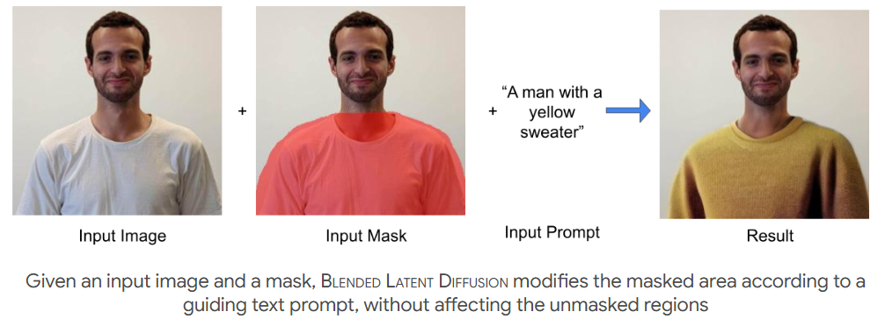
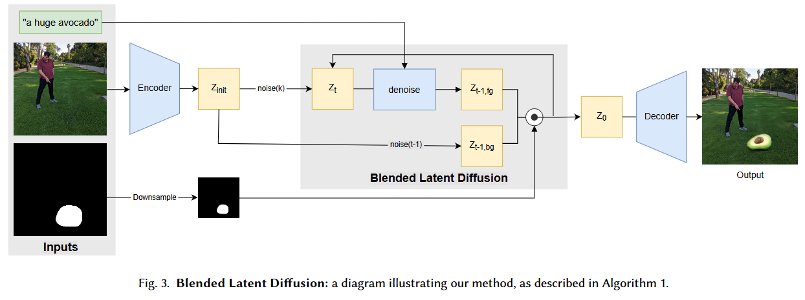
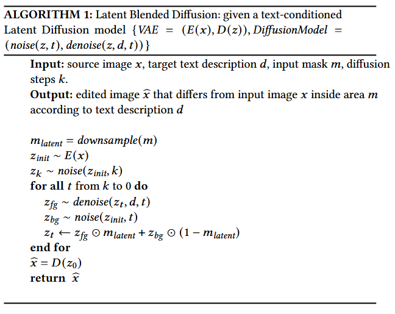

-----

| Title     | x DM BLDM                                             |
| --------- | ----------------------------------------------------- |
| Created @ | `2025-04-16T07:37:59Z`                                |
| Updated @ | `2025-04-16T07:37:59Z`                                |
| Labels    | \`\`                                                  |
| Edit @    | [here](https://github.com/junxnone/aiwiki/issues/514) |

-----

# BLDM

  - **Blended Latent Diffusion**

|  |
| ------------------------------------------------------------ |
|  |

## Arch

## Algos

### 输入与初始化

  - **输入**：算法的输入包括源图像 $x$ 、目标文本描述 $d$ 、输入掩码 $m$ 以及扩散步数 $k$
    。源图像是待编辑的原始图像；目标文本描述用于指明期望的编辑效果；输入掩码 $m$
    界定了图像中需要依据文本描述进行编辑的区域；扩散步数 $k$ 决定了迭代过程的步数。
  - **掩码处理与初始潜在向量生成**：
      - 首先将输入掩码 $m$ 进行下采样得到 $m\_{\\text{latent}}$
        ，下采样操作是为了使其与潜在空间的维度相适配。
      - 通过变分自编码器（VAE）的编码器 $E$ 对源图像 $x$ 进行编码，得到初始潜在向量 $z\_{\\text{init}}$
        ，即 $z\_{\\text{init}} \\sim E(x)$ ，这里的 $z\_{\\text{init}}$
        代表源图像在潜在空间的表示。
      - 对初始潜在向量 $z\_{\\text{init}}$ 添加噪声，得到 $z\_{k}$ ，即 $z\_{k} \\sim
        \\text{noise}(z\_{\\text{init}}, k)$ ，这个带噪声的向量将作为后续迭代过程的起始点。

### 迭代扩散过程

从扩散步数 $k$ 开始，逐步递减到 $0$ 进行迭代：

  - 在每一步 $t$ ：
      - 利用去噪函数 $\\text{denoise}$ ，结合当前潜在向量 $z\_{t}$ 、目标文本描述 $d$ 以及当前步数
        $t$ ，得到前景潜在向量 $z\_{\\text{fg}}$ ，即 $z\_{\\text{fg}} \\sim
        \\text{denoise}(z\_{t}, d, t)$ 。 $z\_{\\text{fg}}$
        包含了依据文本描述在当前步骤下对图像前景部分的编辑信息。
      - 对初始潜在向量 $z\_{\\text{init}}$ 添加与当前步数 $t$ 相关的噪声，得到背景潜在向量
        $z\_{\\text{bg}}$ ，即 $z\_{\\text{bg}} \\sim
        \\text{noise}(z\_{\\text{init}}, t)$ 。 $z\_{\\text{bg}}$
        主要保留了源图像背景部分的信息，并融入了当前步骤的噪声。
      - 根据掩码 $m\_{\\text{latent}}$ ，对前景和背景潜在向量进行混合，更新当前潜在向量 $z\_{t}$
        ，公式为 $z\_{t} \\leftarrow z\_{\\text{fg}} \\odot
        m\_{\\text{latent}} + z\_{\\text{bg}} \\odot (1 -
        m\_{\\text{latent}})$ 。其中 $\\odot$ 表示逐元素相乘，在掩码区域内（
        $m\_{\\text{latent}}$ 值为 $1$ ）主要采用前景潜在向量 $z\_{\\text{fg}}$
        ，非掩码区域（ $m\_{\\text{latent}}$ 值为 $0$ ）主要采用背景潜在向量
        $z\_{\\text{bg}}$ ，从而实现对图像指定区域的编辑。

### 输出编辑后图像

迭代结束后（即 $t = 0$ ） ，得到最终的潜在向量 $z\_{0}$ ，通过变分自编码器（VAE）的解码器 $D$ 对 $z\_{0}$
进行解码，得到编辑后的图像 $\\tilde{x}$ ，即 $\\tilde{x} = D(z\_{0})$ ，并将其作为算法的输出返回。
整个算法通过在潜在空间对前景和背景信息进行混合处理，实现基于文本条件的图像局部编辑。

## Reference

  - [Blended Latent Diffusion](https://arxiv.org/abs/2206.02779)
  - [Project
    Page](https://omriavrahami.com/blended-latent-diffusion-page/)
  - [Code](https://github.com/omriav/blended-latent-diffusion)
