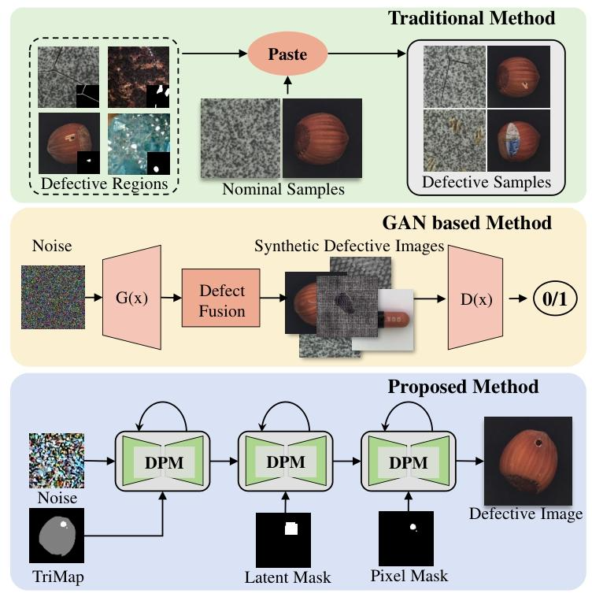

-----

| Title     | paper AdaBLDM cn                                      |
| --------- | ----------------------------------------------------- |
| Created @ | `2025-05-08T07:10:33Z`                                |
| Updated @ | `2025-05-08T08:39:17Z`                                |
| Labels    | \`\`                                                  |
| Edit @    | [here](https://github.com/junxnone/aiwiki/issues/515) |

-----

# AdaBLDM 译文

> 一种通过具有在线自适应功能的混合潜在扩散模型进行工业缺陷生成的新方法

Hanxi Li1,2,†, Zhengxun Zhang1,2,†, Hao Chen2, ⋆, Lin Wu Senior Member,
IEEE3, ⋆, Bo Li4, Deyin Liu5, and Mingwen Wang1 1Jiangxi Normal
University, Jiangxi, China 2Zhejiang University, Zhejiang, China
3Department of Computer Science, Swansea University, SA1 8EN, United
Kingdom 4Northwestern Polytechnical University, Shannxi, China
5Zhengzhou University, Henan, China †These authors contributed equally
to this work ⋆Corresponding author

## 摘要

要有效应对工业异常检测（AD）所面临的挑战，需要充足的有缺陷样本，但在工业环境中，样本稀缺这一限制因素常常阻碍了这一需求的满足。本文介绍了一种新颖的算法，旨在扩充有缺陷样本，从而提升异常检测的性能。所提出的方法对混合潜在扩散模型进行定制，以生成缺陷样本，采用扩散模型在潜在空间中生成有缺陷样本。由
“三值图”
掩码和文本提示控制的特征编辑过程对生成的样本进行优化。图像生成推理过程分为三个阶段：自由扩散阶段、编辑扩散阶段和在线解码器自适应阶段。这种复杂的推理策略生成了具有多样模式变化的高质量合成缺陷样本，基于扩充后的训练集，显著提高了异常检测的准确率。具体而言，在广泛认可的MVTec
AD数据集上，所提出的方法分别将基于扩充数据的异常检测的最先进（SOTA）性能在异常检测指标AP、IAP和IAP90上提升了1.5%、1.9%和3.1%。这项工作的实现代码可在GitHub仓库
<https://github.com/GrandpaXun242/AdaBLDM.git> 获取。

**关键词——异常检测，混合潜在扩散模型，在线自适应。**

## 1 引言

在实际的制造工作流程中，获取有缺陷的样本比获取无缺陷的样本要困难得多。因此，最近提出的大多数用于工业缺陷检测的算法，如文献\[1\]至\[10\]中的算法，都将该问题视为异常检测（AD）问题，这是机器学习领域中一个公认的具有挑战性的问题\[11,12\]。在这些工业异常检测算法中，假定所有无异常样本，无论是完整图像还是图像补丁，都属于单一分布，同时将有缺陷的样本识别为“离群值”。选择采用异常检测方法进行工业缺陷检测的策略原因很明显：在训练阶段无需有缺陷的样本，这使得这些基于异常检测的算法本质上与实际制造场景相适配。

然而，实现这种兼容性是以数据分布极不平衡为代价的，在大多数判别算法的情境中，这种特征是不可接受的。因此，一些研究人员建议使用传统方法\[1,3,5\]生成人工缺陷模式，以助力后续的判别学习过程。最近，最先进的（SOTA）算法\[13-15\]表明，在训练阶段纳入一些真实的异常样本，若将这些样本与合成样本相结合，可显著提升异常检测的准确性。例如，一些开创性的研究\[16,17\]证明了使用更复杂的方法生成这些“栩栩如生”的缺陷所带来的益处。图1的前两行展示了两种不同类型的缺陷生成情况。

> \[\!NOTE\] 图1. 三种缺陷生成风格的图示。从上到下分别为：传统方法、基于生成对抗网络（GAN）的算法以及所提出的方法。

在本文中，我们提议将前沿的人工智能生成算法，即扩散概率模型（DPM）\[18\]，融入到缺陷生成领域。具体而言，我们利用混合潜在扩散模型\[19\]-\[21\]来构建我们的框架。为了改进有缺陷样本的生成，我们通过三个模块对混合潜在扩散模型（BLDM）\[21\]进行创新。首先，我们设计了一种新颖的
“缺陷三值图”，用于在生成的图像上描绘目标物体掩码和缺陷区域，并将其作为一种新的控制信息形式，与稳定扩散模型中的文本提示一起使用。其次，为确保生成样本的真实性，在潜在空间和像素空间中，将一个级联的
“编辑”
阶段引入到混合潜在扩散模型中。最后，提出一种创新性的图像编码器在线自适应方法，以提升生成图像的质量。因此，经过定制的混合潜在扩散模型算法（本文中称为AdaBLDM）能够生成具有模式变化的更高质量的有缺陷样本。图1的第三行简要展示了所提出的基于混合潜在扩散模型的方法。总之，本文的贡献主要有以下三个方面，概述如下。

  - 据我们所知，这是首次将扩散模型应用于工业缺陷生成任务。与最先进的方法相比，混合潜在扩散模型（BLDM）具有生成稳定性、高图像质量和内容可控等优点，这些优点有助于实现更好的缺陷生成器。
  - 为了使混合潜在扩散模型算法适用于缺陷生成场景，我们分别在控制信息、预热阶段和在线自适应方面对其进行了调整。经过努力，我们提出了名为AdaBLDM的算法，与现有最先进的方法生成的合成样本相比，该算法生成的有缺陷样本有了显著改进。
  - 利用我们所提出的方法生成的缺陷样本，我们在MVTec
    AD数据集\[22\]上取得了新的最先进（SOTA）的性能。具体而言，所提出的AdaBLDM算法在异常检测指标AP、IAP和IAP90上，分别比当前最优方法DeSTseg\[6\]高出1.5%、1.9%和3.1%。

本文的其余部分安排如下。在第二节中，我们将讨论文献中的相关工作。第三节将详细介绍所提出的方法。第四节将阐述实验结果和消融研究。我们将在第五节对本文进行总结。

## 2 相关工作

### A. 合成缺陷生成

由于有缺陷样本的稀缺性，生成合成有缺陷样本已成为研究人员获得令人满意性能的常用方法（文献\[1\]至\[3\]、\[5\]、\[6\]、\[23\]）。一种类似于数据增强的简单方法是通过在正常图像上“粘贴”异常像素来模拟缺陷。例如，文献\[1\]、\[24\]、\[25\]中的方法从正常图像中随机裁剪区域，并将它们粘贴到“错误”的位置，以此作为人工缺陷。“裁剪与粘贴”（Crop\&Paste）\[26\]和“伪缺陷生成网络”（PRN）\[27\]从真实的有缺陷图像中裁剪缺陷区域，并将它们粘贴到无缺陷图像上。尽管这些算法与标准的单类异常检测方法相比，实现了更好的异常检测性能，但它们无法创建新的缺陷模式，因此很可能会导致过拟合问题。为了增加异常的多样性，“深度残差自动编码器异常模型”（DRAEM）\[3\]、“缺陷分割Transformer模型”（DeSTseg）\[6\]、“多尺度特征融合语义分割模型”（MegSeg）\[5\]和“重合成检测”（ReSynthDetect）\[28\]采用额外的数据集，并结合柏林噪声来制造缺陷。然而，在这些情况下，所制造的缺陷分布与真实缺陷分布不同，因此无法保证性能提升。

受基于生成对抗网络（GAN）的算法\[29\]-\[31\]和基于扩散模型的算法\[32\]等强大的人工智能生成内容（AIGC）方法的启发，一些研究尝试致力于生成看起来更自然的模拟缺陷。具体来说，基于生成对抗网络的钢表面缺陷检测方法（SDGAN）\[30\]使用两个生成器来切换样本图像的有缺陷和无缺陷状态。因此，SDGAN\[30\]能够生成包含有缺陷和无缺陷图像的高质量、多样化的钢表面数据集。与SDGAN\[30\]类似，缺陷生成对抗网络（Defect-GAN）\[33\]将无缺陷图像转换为有缺陷图像，以增强缺陷分类器的学习过程。然而，上述两种基于生成对抗网络的生成算法无法生成精确符合要求的缺陷区域。尽管它们能够提高缺陷分类的性能，但无法提升在许多实际应用中至关重要的缺陷分割精度。

最近，文献\[16\]和\[17\]提出生成合成的有缺陷图像以及相应的像素级标签。具体而言，深度条件生成对抗网络（DCDGANc）算法\[16\]设计了一种新颖的基于生成对抗网络的方法来模拟真实缺陷，该方法可以通过一种改进的泊松融合算法与无缺陷图像进行融合。同时，文献\[17\]引入了基于风格生成对抗网络第二版（StyleGANv2）\[34\]的缺陷特征生成对抗网络（DFMGAN），利用所提出的缺陷感知残差块来生成有缺陷的图像和缺陷掩码。尽管上述两种基于生成对抗网络的方法能够生成带有缺陷的高质量图像，但它们在生成与图像上的缺陷像素严格对齐的缺陷区域方面存在不足。这种不对齐归因于特定于图像的生成方法与异常检测的具有挑战性的场景之间的差异，因此会严重误导异常检测中的缺陷分割模型。相比之下，在本文中，我们提出了一种基于扩散模型的新颖缺陷生成方法。我们通过一系列新颖的改进，利用这种通用算法来生成多样、逼真且可精确控制的有缺陷图像样本。

### B. 用于图像编辑的扩散概率模型

在过去几年里，研究人员提出了各种实现高质量图像生成的方法。现成的工具包括生成对抗网络（GANs）\[35\]、变分自动编码器（VAEs）\[36\]、基于流的算法\[37\]以及扩散概率模型（DPMs）\[18\]、\[38\]-\[40\]。具体来说，扩散概率模型展示出了合成图像更高的质量以及令人印象深刻的训练稳定性。相应地，基于扩散概率模型的方法，如稳定扩散模型（Stability
AI）\[19\]、DALL-E2（OpenAI）\[41\]和Imagen（谷歌）\[42\]，在内容生成任务中取得了最先进的性能。

基于扩散概率模型（DPM）的方法在图像编辑领域也发挥着重要作用。特别是潜在扩散模型 \[19\]
在低维潜在空间中进行图像生成或编辑，因此能够实现更高的效率；重绘模型（RePaint）
\[43\] 充分利用预训练的去噪扩散概率模型（DDPM）
\[39\]，在反向扩散阶段通过对给定像素进行采样来执行图像编辑；深度卷积人脸模型（DCFace）
\[44\] 使用两个特征编码器来控制扩散模型，以方便进行人脸图像编辑；\[45\] 提出 “控制网络（ControlNet）”
来控制现有的扩散模型，以实现更好的可控合成；\[20\]、\[21\]
通过在像素空间或特征空间中进行修改来实现图像编辑；\[46\]
提出 “双循环扩散”
来生成无偏差的掩码以指导图像编辑。尽管这些方法在一般的图像编辑任务中展现出了最先进（SOTA）的性能，但由于反向扩散过程本质上具有模糊性，它们很难生成在像素级别精确对齐的图像区域。这种困扰可能会降低异常检测中的分割能力。

在本文中，我们对前沿的混合潜在扩散模型（BLDM）\[21\]进行了定制，以生成精确对齐的合成区域，用于工业缺陷检测和定位。需要注意的是，这项工作使用扩散模型来生成合成图像或图像区域，这与为一般编辑任务所提出的开创性工作\[18\]、\[47\]类似。我们的方法与那些使用扩散概率模型（DPM）直接在测试图像上预测异常区域的算法\[48\]-\[51\]无关。

## 3 所提出的方法

### A. 任务定义和预备知识

遵循异常检测的常规设置，一个无异常（正常）样本集 $x\_{OK}={x\_{OK}^{i} \\in \\mathbb{R}^{H\_{x}
\\times W\_{x} \\times 3}, i = 1,2, \\ldots, N\_{OK}}$
可用于训练。此外，正如在第一节中所介绍的，一些有缺陷（异常）样本
$x\_{NG}={x\_{NG}^{i} \\in \\mathbb{R}^{H\_{x} \\times W\_{x} \\times 3}
| i = 1,2, \\ldots, N\_{NG}}$ 以及相应的异常掩码 $M\_{NG}={M\_{NG}^{i} \\in
\\mathbb{B}^{H\_{x} \\times W\_{x}} | i = 1,2, \\ldots, N\_{NG}}$
被作为缺陷生成的 “种子”，并且通常 $N\_{NG} \\ll N\_{OK}$
。所提出方法的目标是生成一些带有合成缺陷区域的训练样本，即

${x\_{OK}, x\_{NG}, M\_{NG}} \\stackrel{Defect \\ Generator}{\\to}
{X\_{NG}^{ \*}, M\_{NG}^{ \*}}, (1)$

其中 $X\_{NG}^{\* }={x\_{NG}^{\* i} \\in \\mathbb{R}^{H\_x \\times W\_x
\\times 3} | i = 1,2, \\ldots, N\_{NG}^{\* }}$ 且 $M\_{NG}^{\*
}={M\_{NG}^{\* i} \\in \\mathbb{B}^{H\_x \\times W\_x} | i = 1,2,
\\ldots, N\_{NG}^{\* }}$ 分别包含所获得的合成样本和相应的缺陷掩码。此外，通常我们设置 $N\_{NG}^{\*}
\\gg N\_{NG}$ 以确保生成的样本具有高度的模式变化。

在本文中，我们提议使用扩散模型来生成合成样本。对于扩散模型\[18, 38\]而言，将生成目标视为无噪声变量 $x\_0$
是很常见的，并且将“正向扩散过程”定义如下：

$$\\large \\begin{aligned} & q\\left(x\_{t} |
x\_{t-1}\\right)=\\mathcal{N}\\left(x\_{t} ; \\sqrt{1-\\beta\_{t}}
x\_{t-1}, \\beta\_{t} I\\right) \\ & q\\left(x\_{1: T} |
x\_{0}\\right)=\\prod\_{t=1}^{T} q\\left(x\_{t} | x\_{t-1}\\right),
\\end{aligned}$$

其中 ${\\beta\_{t} \\in(0,1)}\_{t = 1}^{T}$ 表示预定义的方差调度， $I$ 是单位矩阵。当 $T$
足够大时，扩散过程可以将一张正常图像转换为随机噪声 $x\_T$ 。相反，“反向扩散过程”定义为：

$$\\large \\begin{aligned} & p\_{\\theta}\\left(x\_{t-1} |
x\_{t}\\right)=\\mathcal{N}\\left(x\_{t-1} ;
\\mu\_{\\theta}\\left(x\_{t}, t\\right), \\sum\_{\\theta}\\left(x\_{t},
t\\right)\\right) \\ & p\_{\\theta}\\left(x\_{0:
T}\\right)=p\\left(x\_{T}\\right) \\prod\_{t=1}^{T}
p\_{\\theta}\\left(x\_{t-1} | x\_{t}\\right), \\end{aligned}$$

其中 $\\mu\_{\\theta}(\\cdot)$ 和 $\\sum\_{\\theta}(\\cdot)$
是两个未知函数，通常用深度模型来近似表示。在测试阶段，给定不同的随机高斯噪声样本
$x\_{T}^{\\bar{i}}$ ， $i = 1, \\ldots, N\_{t s t}$
，人们可以从与训练样本相同的域中获得高质量且多样的样本
$x\_{0}^{i}$ ，对于所有的 $i$ （通常是RGB图像）。与上述扩散过程类似，我们也可以基于一个在样本集 $x\_{OK}$ 和
$x\_{NG}$ 上已经学习得很好的扩散模型，在 $x\_{NG}^{\*}$ 中生成逼真的异常图像。

### B. 潜在扩散模型与跨模态提示

### C. 损失函数和训练方案

### D. 结合内容编辑的多阶段去噪

### E. 在线解码器自适应

### F. 实现细节

## 4 实验

### A. 实验设置

### B. 定量结果

### C. 定性结果

### D. 消融研究

## 五、结论与未来工作

在本文中，我们提出了一种先进的方法，用于生成逼真的有缺陷样本，以用于工业异常检测和定位。受扩散模型的启发，我们对混合潜在扩散模型（BLDM）进行定制，使其能很好地适用于这一特定任务。所提出的算法，称为AdaBLDM（自适应混合潜在扩散模型），与现有的基于传统“剪切粘贴”方案或生成对抗网络（GANs）的方法相比，能够生成更好的合成样本。通过将AdaBLDM应用于异常检测的数据增强中，由于对像素级对齐的有缺陷区域进行了良好控制，我们实现了异常检测（AD）方面的先进性能。在未来，我们将通过引入更精细的控制信号（例如描述所需缺陷的形状、大小等细节的语言提示）来探索生成高质量的合成缺陷样本。未来工作的另一个有吸引力的方向是加快扩散模型的去噪过程，以便在有限的时间预算内生成更多的缺陷样本，这在大多数实际场景中是一个关键约束。
