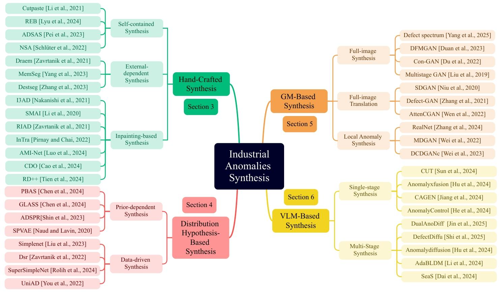
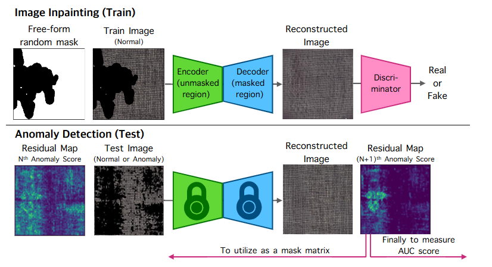
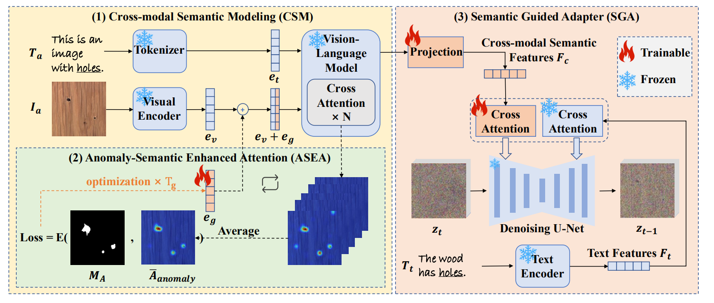

-----

| Title     | ML Tasks Image Anomaly Synthesis                      |
| --------- | ----------------------------------------------------- |
| Created @ | `2025-05-19T01:22:49Z`                                |
| Updated @ | `2025-05-19T01:22:49Z`                                |
| Labels    | \`\`                                                  |
| Edit @    | [here](https://github.com/junxnone/aiwiki/issues/517) |

-----

# 异常缺陷生成

## 参考 Survey 看整个异常缺陷生成发展趋势

  - [A Survey on Industrial Anomalies
    Synthesis](https://arxiv.org/abs/2502.16412) - 2025.02 - \[[papers
    list](https://github.com/M-3LAB/awesome-anomaly-synthesis)\]
  - 如下图为近些年异常检测和异常合成的方法增长趋势：

  - 综述将异常生成分了 4 个大类别，分别为:
      - ① **手动合成**
      - ② **基于分布假设的合成**
      - ③ **基于生成模型的合成**
      - ④ **基于 VLM 的合成**

### 各方向的发展趋势

  - 如图为几种类别的发展趋势：

  - 各种类型都有新的论文在跟进
  - 2024年 随着大模型的发展，VLM-Based 方法被大量提出，占了半壁江山。

## 分类

### 手动合成

  - 依赖于人工设计的规则来模拟异常情况

#### Self-Contained synthesis

  - 直接操作图像区域来实现，比如裁剪、重新排列或扰动图像的某些部分，从而合成完全源自原始图像的新异常情况。
  - **Pipleline**: 随机裁剪 =\> 处理变换 =\> 随机黏贴(衔接处处理)

##### Example - CutPaste

  - a: 正常样本
  - b: 异常样本
  - c：遮挡法（Cutout）
  - d：疤痕法（Scar）
  - e: 切割粘贴法（CutPaste）
  - f: 切割粘贴法（疤痕）\[CutPaste (Scar)\]

> \[\!NOTE\] **标准CutPaste操作**
> 
> 1.  **裁剪（Cut）** -
>     从一张正常的训练图像里随机选取一个矩形区域。该矩形区域的尺寸和位置完全随机，尺寸范围通常可在一定比例内变动，像选取图像面积
>     10% - 50% 大小的矩形区域，以保证模型能学习到不同规模的特征。
> 2.  **处理** - 此步骤为可选步骤。裁剪下来的矩形区域可经过一些处理，比如随机旋转角度（像 90 度、180 度、270
>     度等）或者对像素值进行随机抖动。像素值抖动是在一定数值范围内改变像素颜色值，以此模拟图像的自然变化。
> 3.  **粘贴（Paste）** -
>     把处理后的矩形区域随机粘贴回原图像的某个位置。粘贴位置的随机性能够让模型学习到图像不同位置的异常特征。这样，一张经过增强处理的图像就生成了，可用于后续模型训练。
> 
> **CutPaste-Scar（变体）操作**
> 
> 1.  **裁剪（Cut）** - 与标准 CutPaste
>     不同，这里使用细长的矩形框（类似疤痕形状）从正常图像中裁剪出一个区域。这种细长形状的设计是为了模拟实际中常见的细长缺陷，如划痕等。
> 2.  **处理** - 同样可对裁剪区域进行随机旋转、像素值抖动等处理，增加数据的多样性。
> 3.  **粘贴（Paste）** - 将处理后的细长矩形区域随机粘贴到原图像的某个位置，生成模拟有细长缺陷的增强图像。

##### Example - REB - DefectMaker

> \[\!NOTE\]
> 
> 1.  **生成缺陷形状**：摒弃简单的矩形，采用**贝塞尔曲线**生成多种形状。定义了Bézier-scar和Bézier-clump两种形状，Bézier-scar形状类似真实划痕，由贝塞尔算法生成并受矩形-scar限制；Bézier-clump形状则是贝塞尔算法生成的曲线经侵蚀和分割后形成的一团缺陷，让生成的缺陷更贴近真实情况。
> 2.  **生成缺陷填充**：产生两种不同分布的填充。一种是**随机噪声填充**，通过控制均值和波动范围，在数字信号或图像中添加随机噪声，这是机器学习常用的数据增强方法；另一种是**Cutpaste填充**，从同一数据集中的其他图像剪切区域作为填充，增加学习任务难度，提升模型判别能力。
> 3.  **合成缺陷图像**：利用无监督显著性模型（EDN模型）识别图像中的显著区域，以此约束缺陷区域。对于纹理图像，默认整个图像区域为显著区域。采用粘贴和融合两种融合方式，粘贴直接将目标区域粘贴到图像上，会产生明显边界；融合则通过加权组合使缺陷与背景更自然地融合。两种方式同时使用，增加了合成样本的多样性。

#### External-dependent synthesis

  - 通过融入来自外部数据（如纹理库）的纹理来合成异常情况的方法。

##### Example - DRAEM

  - 二值异常掩模 $M\_{a}$ 由柏林噪声 $P$ 生成。根据 $M\_{a}$ 从 $A$ 中采样异常区域，并将其放置在无异常图像
    $I$ 上，以生成异常图像 $I\_{a}$ 。

> \[\!NOTE\]
> 
> 1.  **生成噪声图像与二值化**：利用Perlin噪声生成器产生噪声图像，以此捕捉各种异常形状，随后通过均匀随机采样的阈值将其进行二值化操作，最终得到异常掩模
>     $M\_{a}$ 。在这个过程中，Perlin噪声能够为异常形状提供多样化的可能，随机阈值则进一步决定了异常区域在图像中的分布。
> 2.  **采样异常纹理**：从与输入图像分布无关的异常源图像数据集里采样异常纹理源图像A。这一操作确保了生成的异常纹理具有多样性，避免了与正常图像纹理的过度相似，使得模型在训练过程中能够更好地学习到异常的特征。
> 3.  **随机增强采样**：借鉴RandAugment的思路，从{posterize, sharpness, solarize,
>     equalize, brightness change, color change, auto -
>     contrast}这一组随机增强函数中选取3个对异常纹理源图像A进行随机增强操作。这种随机增强的方式进一步增加了异常图像的多样性，使模型在训练时能够接触到更丰富的异常变化，提高模型的泛化能力。
> 4.  **融合生成异常图像**：将经过增强的纹理图像A，使用之前生成的异常掩模 $M\_{a}$
>     进行掩模操作，之后再与原始的无异常图像I进行融合。融合公式为:
>     $I\_{a}=\\overline{M}\_{a} \\odot I+(1-\\beta)\\left(M\_a \\odot
>     I\\right)+\\beta\\left(M\_a \\odot A\\right)$  
>     其中 $\\bar{M}\_a$ 是 $M\_a$ 的逆， $\\odot$ 是逐元素乘法运算， $\\beta$
>     是融合时的不透明度参数，其在\[0.1,1.0\]区间内均匀采样。通过这样的融合方式，能够生成偏离正常分布的异常图像，有助于训练网络收紧正常与异常之间的决策边界，提升模型对异常的识别能力。

> \[\!IMPORTANT\] `DeSTSeg` 生成算法同 `DRAEM`

##### Example - MemSeg

> \[\!NOTE\]
> 
>   - 第一步，利用柏林噪声（Perlin噪声）和目标前景生成掩码图像M；
>   - 第二步，提取噪声图像 $I\_n$ 中由 $M$ 定义的感兴趣区域（ROI），以生成噪声前景图像；
>   - 第三步，将噪声前景图像叠加到原始图像上，从而得到模拟异常图像 $I\_A$ 。

#### Inpainting-based synthesis

  - 通过有选择地遮盖原始图像的区域来合成异常情况，通常是通过将区域涂黑或填充噪声来实现
  - Pipeline: 重建图像，对比图像重建前后的相似度来检测异常区域
  - 随机掩码 =\> 自适应掩码/定量掩码/...

##### Example - SAMI

  - 随机掩蔽超像素分割的结果，然后对其进行重建，以此来训练图像修复模块。

  - 在超像素分割结果上逐一掩蔽超像素块并对其进行重建，然后根据掩蔽区域重建前后的结构相似性指数（SSIM）或(L\_{2})值得到异常图。

##### Example - I3AD

  - 大体方法同 SAMI：掩蔽部分图像，重建，计算相似度获取异常区域

### 基于分布假设的 - Distribution Hypothesis-Based

#### Prior-Dependent

  - 假定正常数据的潜在空间映射在一个已定义的区域内，通常是一个流形或超球面，而异常数据则落在这个边界之外。
  - 通过对正常特征分布进行建模，并应用可控的扰动，合成的异常数据处于这些边界上或超出这些边界，从而有效地模拟真实的异常特征

##### Examle - PBAS

> \[\!NOTE\]
> 
>   - 近似边界学习（ABL）通过改进的中心约束学习正常特征的近似边界。
>   - 异常特征合成（AFS）基于近似边界学习（ABL）输出的超球体分布来合成异常特征。
>   - 精炼边界优化（RBO）通过对异常特征合成（AFS）输出的判别性学习，进一步精炼边界。

##### Example GLASS

> \[\!NOTE\]
> 
>   - 正常分支通过特征提取器和特征适配器获取适配的正常特征。
>   - 全局异常合成（GAS）分支基于梯度引导，分三个步骤从正常特征中合成全局异常特征。
>   - 局部异常合成（LAS）分支基于纹理叠加，分三个步骤从正常图像中合成局部异常图像。

> \[\!NOTE\]
> 
> 不同假设下全局异常合成（GAS）的示意图。
> 
>   - 假设 $r\_{m}$ 或 $r\_{h}$ 分别表示到流形中心或超球体中心的 $L\_{2}$ 距离。
>   - 绿色圆圈（ $r\_{m}\<r\_{1}$ 或 $r\_{h}\<r\_{1}'$ ）表示正常特征
>   - 灰色三角形（ $r\_{m}\>r\_{2}$ 或 $r\_{2}'\<r\_{h}\<r\_{3}'$ ）表示局部异常特征
>   - 粉色菱形表示通过对正常特征添加高斯噪声得到的高斯异常特征
>   - 蓝色正方形（ $r\_{1}\<r\_{m}\<r\_{2}$ 或 $r\_{1}'\<r\_{h}\<r\_{2}'$
>     ）表示通过对高斯异常特征进行梯度上升和截断投影得到的全局异常特征。

> \[\!NOTE\]
> 
> 局部异常合成（LAS）的流程图
> 
>   - I 异常掩码
>   - II 异常纹理
>   - III 叠加融合

#### Data-Driven

  - 通过直接操控正常数据的潜在表征来合成异常
  - 使用诸如自动编码器之类的模型提取潜在特征，然后引入可控的扰动，比如高斯噪声或其他适应数据的约束条件
  - 这种灵活的策略利用了数据的内在统计特性，生成的异常情况能够紧密反映异常特征的分布。

##### Example - SimpleNet

> \[\!NOTE\]
> 
> 1.  **基于特征空间添加噪声**：异常特征生成器的核心操作是在正常特征上添加高斯噪声。在SimpleNet的流程里，正常样本先经过预训练的特征提取器，再通过特征适配器将预训练特征转换到目标域，得到适应目标域的正常特征
>     $q\_{h,w}^{i} \\in \\mathbb{R}^{C}$ 。随后，从符合独立同分布的高斯分布 $N(\\mu,
>     \\sigma^{2})$ 中采样一个噪声向量 $\\epsilon \\in \\mathbb{R}^{C}$
>     ，每个维度的噪声相互独立。将该噪声向量与正常特征相加，就得到了异常特征
>     $q\_{h,w}^{i-}$ ，公式为 $q\_{h,w}^{i-}=q\_{h,w}^{i}+\\epsilon$ 。
> 2.  **对特征空间的影响**：添加高斯噪声的操作会使特征空间发生变化。从实验结果可知，在训练过程中，使用这样生成的异常特征能让适应后的特征空间变得更加紧凑。以MVTec
>     AD中不同类别的数据为例，添加噪声生成异常特征后，特征的标准差在各个维度上趋于一致，使得在区分异常特征和正常特征时，特征空间的界限更加分明，更有利于后续判别器区分正常和异常样本。
> 3.  **训练与应用**：在训练阶段，生成的异常特征与正常特征一起作为正负样本，被送入判别器进行训练。判别器经过训练，学习到正常特征和异常特征的差异模式，从而能够在后续的推理过程中判断输入特征的正常与否。在推理时，异常特征生成器不再参与，模型仅通过其他模块处理输入数据。

> \[\!IMPORTANT\] `SuperSimpleNet` 异常生成方法基本同 `SimpleNet`
> 针对监督学习去除了真实异常区域。

##### Example - UniAD

> \[\!NOTE\] NME 为 LQD 提供了经过处理且避免了信息泄露的特征表示，LQD 在此基础上进一步对这些特征进行重建和建模。
> 将输入特征和重建特征进行比较获取异常图

##### Example - DSR

> \[\!NOTE\] 对正常样本的编码生成潜在空间特征 通过柏林噪声采样生成异常掩码

### GM-Based

#### Full-Image Synthesis

  - 利用生成对抗网络（GAN）和扩散模型等生成模型，构建一种独特的映射关系，将高斯噪声转化为异常样本，从而有效地逼近真实异常情况的分布。

##### Example - DFMGAN

> \[\!NOTE\]
> 
>   - 1 使用 StyleGAN2 在 正常图像上训练
>   - 2 冻结骨干网络权重，添加 Defect-aware module 生成缺陷图像和缺陷掩码

##### Example - Defect Spectrum

> \[\!NOTE\] 使用了两阶段扩散模型 文中使用的扩散模型是两阶段扩散模型，由大型模型 $p\_{\\theta}$ 和小型模型
> $p\_{\\phi}$ 组成。  
> 首先将高斯噪声输入到大型模型 $p\_{\\theta}$ 中，当达到最优步骤后，将产生的包含全局信息的中间结果作为小型模型
> $p\_{\\phi}$ 的输入，最终生成带有相应标签的缺陷图像 - 掩模对，以解决缺陷样本稀缺的问题，并生成具有多样性和高质量的缺陷数据。

#### Full-Image Translation

  - 过诸如循环生成对抗网络（CycleGAN）和图像到图像生成对抗网络（Pix2PixGAN）等域转换技术对正常图像进行变换，从而合成异常情况。全图转换学习正常域和异常域之间的映射关系，在保留结构完整性的同时引入有针对性的修改

##### Example - Defect-GAN

> \[\!NOTE\] 采用编码器-解码器结构，通过模拟污损和修复过程来从正常图片合成缺陷。
> 由类别向量生成的空间与类别控制图，用于控制在给定的正常样本中生成缺陷的位置以及缺陷的种类。
> 自适应噪声注入将随机变化引入到生成的缺陷中，以提高所生成缺陷的多样性。
> 此外，缺陷生成对抗网络（Defect-GAN）采用了逐层组合策略，该策略根据相应的空间分布图生成缺陷前景和重绘前景。这有助于保留正常样本的风格和外观，并在缺陷合成方面实现卓越的真实感。

#### Local Anomaly Synthesis

  - 利用生成对抗网络（GAN）和扩散模型等生成模型，构建一种独特的映射关系，将高斯噪声转化为异常样本，从而有效地逼近真实异常情况的分布。

##### Example - DCDGANc

> \[\!NOTE\] 该流程图展示了基于DCDGANc的工业缺陷合成及应用流程，具体如下：
> 
>   - **数据准备与缺陷生成**  
>     1\. 从少量真实缺陷样本中提取数据组成训练集，真实样本带有类别标签（如 $c\_1$ 、 $c\_2$ ） 。  
>     2\. 从标准正态分布 $\\mathcal{N}(0, I)$ 中采样 $z$
>     ，结合给定的类别标签输入到DCDGANc中。DCDGANc基于输入生成多样化的缺陷样本图像，这些图像带有纯色背景。
>   - **缺陷融合与数据集构建（提升检测性能部分 ）**  
>     1\. 对生成的缺陷内容图像获取二值掩模。  
>     2\. 将正常背景图像与生成的缺陷图像通过改进的泊松融合（Improved Poisson
>     Blending）方法进行融合，得到融合结果和精细二值掩模。  
>     3\. 经过图像处理构建带有精细掩模的合成数据集，用于训练分割模型（Segmentation Models），以此提升检测性能。
>   - **缺陷迁移与零样本检测部分**  
>     1\. 同样利用生成的缺陷图像及其二值掩模。  
>     2\. 将生成的缺陷迁移（Transfer）到新的背景（如瓷砖背景 ）上，得到迁移结果和相应精细二值掩模。  
>     3\. 构建的数据集用于训练分割模型，实现零样本检测，即无需新背景下的真实缺陷样本就能训练检测网络。

##### Example - RealNet - SDAS

> \[\!NOTE\]
> 
>   - 通过调整方差引入了异常强度 $s$ 的控制，使得生成的样本更接近或远离正常图像分布，从而实现异常图像的生成 。
>   - 当 $s = 0$ 时，采样分布等同于正常图像的反向扩散采样分布；
>   - 当 $s \> 0$ 时，方差增大，采样得到的样本更有可能落在低密度区域，即更有可能是异常样本。
>     在生成异常图像时，还利用Perlin噪声发生器捕获各种异常形状，并将其二值化为异常掩码
>     $M$ ，然后通过图像融合的方式将生成的异常图像与正常图像融合，得到带有局部异常的图像 $A$ ，公式为 $A = M \\odot
>     P+\\bar{M} \\odot I$ ，其中 $I$ 是正常图像， $P$ 是由SDAS生成的异常图像， $\\bar{M} =
>     1 - M$ 表示逐元素乘法操作， $\\delta$
>     是图像融合时的不透明度。为确保生成的异常区域位于前景，采用了基于自适应阈值的二值化方法进行前景分割。

### VLM-Based

#### One-Stage Generation

##### Example - AnomalyAny

> \[\!NOTE\] **整体流程概述**
> 整体基于潜在扩散模型（LDM），通过一系列步骤对正常样本进行处理，生成异常样本，主要分为测试时正常样本条件设定、注意力引导异常优化、提示引导异常细化三个关键部分
> 。
> 
>   - 1 **测试时正常样本条件设定** - 从正常样本开始，经过VAE（变分自编码器）编码得到潜在表示，添加噪声后得到带噪样本，如
>     $z\_{t\_{start}}$ 。 - 带噪样本依次经过多个去噪UNet模块（Denoising UNet）逐步去噪，如从
>     $z\_{t\_{start}}$ 到 $z\_t$ 再到 $z\_1$ ，最终得到接近正常样本的 $z\_0$ 。其中，
>     $z\_{t\_{start}}$
>     等带噪样本会参与后续处理，部分模块带有可训练（Trainable）标识，表明在反向传播（Backward
>     Pass of LDM）过程中可优化。
>   - 2 **注意力引导异常优化**  
>     \- 中间步骤得到的潜在表示 $z\_t$ 输入到注意力引导优化模块。  
>     \- 通过计算注意力图（如 $A^1\_t$ 、 $A^2\_t$ 等 ），利用注意力机制（Q、KV）聚合注意力信息。  
>     \- 计算注意力损失 $\\mathcal{L}\_{att}$
>     ，优化潜在表示，使生成过程更关注异常语义，逐步将异常语义融入生成图像。
>   - 3 **提示引导异常细化**  
>     \- 利用GPT - 4生成详细提示，如从“A bottle that is damaged” 细化为“A bottle that
>     has a damaged area with rugged, uneven texture” 。  
>     \- 提示信息经过文本编码器（Text Encoder）得到编码表示 $\\tau(c)$ 、 $\\tau(c')$ 。  
>     \- 潜在表示 $z\_t$ 经VAE解码器（VAE Decoder）得到图像 $\\tilde{x}*t$
>     ，结合文本编码和图像通过CLIP模型计算图像损失
>     $\\mathcal{L}*{img}$ ，同时计算提示损失 $\\mathcal{L}\_{prompt}$ 。  
>     \- 通过联合优化这些损失，使生成的异常样本更符合详细提示描述，实现异常样本的细化生成。

##### Example - AnomalyXFusion

> \[\!NOTE\]
> 
>   - 1 **多模态信息提取与融合（MIF模块）**  
>     \- **语义嵌入**：利用预训练的CLIP文本编码器，对异常图像的文本描述（如“cable with black
>     hole”）进行特征提取，得到语义嵌入。之后对其进行标准化和L2归一化处理，在训练时CLIP文本编码器权重保持不变。  
>     \-
>     **位置嵌入**：借助预训练的掩码编码器提取异常位置掩码的特征，再通过一层CNN调整维度，得到位置嵌入。训练时掩码编码器和CNN都要进行微调。  
>     \-
>     **纹理嵌入**：使用CLIP的图像编码器，对带有缺陷的图像进行纹理特征提取。在提取时通过掩码引导注意力机制，让提取的特征集中在异常区域，随后用这些特征初始化文本嵌入。  
>     \-
>     **X-Embedding生成**：将语义、位置和纹理嵌入按顺序连接起来，形成统一的多模态嵌入。再经过一个采用自注意力机制和多层感知器（MLP）的多模态聚合器处理，得到最终的X-Embedding。
>   - 2 **动态扩散过程（DDF模块）**  
>     \-
>     **正向扩散**：逐步向训练数据集中的图像添加噪声，使图像逐渐偏离原始状态。这个过程用马尔可夫链建模，噪声添加遵循高斯分布。利用重参数化技术，可在任意时间步采样得到加噪后的图像。  
>     \-
>     **反向扩散**：目标是设计一个有限时间的反向策略，逆转正向扩散过程。在反向扩散的每个离散时间步，由神经网络估计参数。反向扩散从正向过程的终点（时间步T）开始，此时数据分布已近似为各向同性高斯分布。  
>     \-
>     **动态调整X-Embedding**：为了在每个时间步更好地融合多模态信息，根据时间步自适应调整X-Embedding。通过一个条件MLP实现动态调整，将调整后的结果用于确定反向扩散过程中的均值和协方差。同时，利用交叉注意力机制，将输入图像和相应掩码融入训练过程，以增强对异常区域的关注。最后，根据设定的损失函数对AnomalyXFusion框架进行整体训练。

##### Example - AnomalyControl

> \[\!NOTE\]
> 
>   - 1 **输入准备**：将文本 - 图像参考提示作为输入，其中包含视觉异常描述符 $I\_{a}$ 和文本异常描述符 $T\_{a}$
>     。 $I\_{a}$ 定义了特定的异常模式，提供视觉参考； $T\_{a}$
>     由异常特定关键词和模板组合而成，给予语义引导，二者仅关注异常区域信息，为后续生成过程提供基础线索。
>   - 2 **跨模态语义建模（CSM）**：利用带有交叉注意力层的冻结视觉语言模型（VLM），对 $I\_{a}$ 和 $T\_{a}$
>     进行处理。VLM强大的多模态集成能力将参考图像和文本融合，得到统一的异常跨模态语义特征，这一特征作为后续扩散过程的先验信息，对生成与描述相符的异常样本起到关键作用。
>   - 3 **异常语义增强注意力（ASEA）优化**：为使模型聚焦于异常区域，ASEA机制开始发挥作用。首先根据 $T\_a$
>     结构，通过VLM的交叉注意力层生成注意力图 $A$ ，并提取与异常相关的注意力值 $A\_{anomaly}$
>     ，计算平均注意力图 $\\bar{A}\_{anomaly}$ 以稳定聚焦。接着应用异常区域掩码 $M\_A$
>     ，并引入可训练的注意力引导变量 $e\_g$ ，通过能量函数 $E$ 对 $e\_g$ 进行
>     $T\_g$ 步的梯度下降优化。在优化过程中， $e\_g$
>     不断调整，使模型注意力精准对齐异常区域，有效捕捉异常特定细节，提升生成异常的真实感。
>   - 4
>     **语义引导适配器（SGA）参与扩散过程**：SGA基于解耦的交叉注意力机制，将CSM生成的跨模态语义特征引入。在训练时，为实现无分类器引导，采用随机失活策略，偶尔将跨模态语义特征设为零，让模型学习条件和无条件提示。通过特定的增强交叉注意力机制公式，SGA将文本和跨模态语义特征有效整合，在生成过程中，仅优化SGA和
>     $e\_{g}$
>     的参数，而预训练的扩散模型和VLM参数保持不变。最终，SGA将整合后的异常特定语义信号融入扩散过程，实现高质量、可控的异常合成。

##### Example - SeaS

> \[\!NOTE\]
> 
>   - **图像输入部分**
>       - **异常图像（Anomaly images）**：作为训练数据来源之一，提供带有异常的图像样本，用于让模型学习异常特征。
>       - **正常图像（Normal images）**：另一训练数据来源，为模型提供正常产品图像样本，帮助模型区分正常与异常情况。
>   - **文本编码部分**
>       - 通过文本编码器（Text Encoder），将描述产品和异常的文本提示（如“a <ob> with
>         <df1>,<df2>,…,<dfN>” ，<ob>代表产品标记，<dfN>代表异常标记 ）转化为嵌入向量
>         $e\_{df}$ （异常标记嵌入）和 $e\_{ob}$ （产品标记嵌入） ，为后续模型训练提供语义信息指引。
>   - **扩散模型前向过程（Diffusion Forward）**
>       - 对输入图像（包括异常图像和正常图像）添加噪声，将图像转化为噪声潜在表示，这是基于扩散模型的常见操作，目的是为后续去噪过程学习图像特征。
>   - **U - Net 模型部分** U - Net 作为核心可学习模型：
>       - 接收噪声潜在表示以及异常标记嵌入 $e\_{df}$ 和产品标记嵌入 $e\_{ob}$ ，通过内部的注意力机制模块（如
>         $Q$ 、 $K$ 、 $V$ 相关模块 ）进行特征处理和计算。
>       - 计算解耦异常对齐（DA）损失 $L\_{DA}$ ，其中 $L\_{df}$
>         用于使异常区域与异常标记对齐，避免产品标记误对齐到异常区域
>         ；同时计算正常图像对齐（NA）损失 $L\_{ob}$ ，使模型学习产品关键特征，保证生成产品的全局一致性
>         。最终输出预测噪声 $\\epsilon\_{\\theta}$ 。
>   - **精细掩码预测（RMP）部分**
>       - RMP分支结合U - Net解码器特征和变分自编码器（VAE）特征
>         ，通过掩码细化模块（MRM）逐步优化，生成与异常匹配的精准掩码。训练时使用焦点损失
>         $L\_{M}$ 计算损失值 ，对掩码预测过程进行监督。

#### Multi-Stage Generation

  - 集成了多个过程，包括异常合成和精确掩码生成。通过迭代优化全局上下文和局部异常区域，它提高了合成异常的真实性、多样性和上下文一致性，同时能更好地满足下游任务的要求。

##### Example - AnomalyDiffusion

> \[\!NOTE\]
> 
> 1.  **空间异常嵌入**：将异常信息分解为异常外观和位置信息，分别用异常嵌入和空间嵌入表示。异常嵌入是可学习的文本嵌入，代表异常的外观类型，通过掩码文本反演学习，只关注异常区域，初始化后用掩码扩散损失优化。空间嵌入由异常掩码编码得到，将掩码输入ResNet-50并通过特征金字塔网络融合特征，再经全连接网络映射到文本嵌入空间，包含异常位置信息。两者结合形成空间异常嵌入，作为文本条件输入扩散模型，引导异常生成
>     。
> 2.  **基于扩散模型的生成过程**：以正常样本和异常掩码为输入，利用预训练LDM的先验信息。在扩散模型的采样过程中，从高斯分布采样初始化
>     $x\_t$ ，将正常样本 $y$ 加噪到 $y\_t$ ，噪声图 $x\_t$ 去噪到 $`x’_{t - 1}`$ ，再用掩码
>     $m$ 融合 $y\_{t - 1}$ 与 $`x'_{t - 1}`$ 得到 $x\_{t - 1}$ ，重复该过程 $t$
>     步完成采样，得到异常图像。
> 3.  **自适应注意力重加权机制**：在去噪过程中，计算去噪后的图像 $`\hat{x}_{0}`$ 与正常样本 $y$
>     在掩码内的像素级差异，通过自适应缩放Softmax（ASS）操作得到权重图 $w\_{m}$
>     。对于与正常样本相似的区域（即生成异常不明显的区域），权重图会给这些区域分配更高权重。模型利用权重图 $w\_{m}$
>     自适应控制交叉注意力，将原始交叉注意力图 $m\_{c}$ 与权重图 $w\_{m}$ 相乘得到重加权后的注意力图
>     $m\_{c}'$ ，让模型在生成时更关注生成异常不明显的区域，使生成的异常图像与异常掩码更精确对齐。
> 4.  **异常掩码生成**：因真实异常掩码稀少且缺乏多样性，采用文本反演学习掩码嵌入 $e\_{m}$
>     ，将其作为文本条件引导扩散模型生成异常掩码。初始化掩码嵌入后，通过最小化特定损失进行训练，推理时用训练好的掩码嵌入引导去噪过程生成大量异常掩码。

##### Example - DefectDiffu

> \[\!NOTE\]
> 
>   - **条件模块（Condition Module）**
>       - 用文本描述产品、缺陷等条件，如 “a photo of {product name} object”
>         等。经文本编码器（Text
>         Encoder）将文本转化为嵌入向量（Embedding），为后续模块提供一致性条件，指导图像生成。
>   - **生成模块（Generation Module）**
>       - 1.  **图像编码**：先由图像编码器（Image Encoder）处理输入图像。
>     
>       - 2.  **背景生成**：经多个背景块（Background Block）依据产品一致性条件生成正常背景。
>     
>       - 3.  **缺陷生成**：缺陷块（Defect Block，共M个）依据缺陷一致性条件生成缺陷特征 ，含层归一化（Layer
>             Norm）、自注意力（Self Attention）等操作。
>     
>       - . **融合与输出**：融合块（Fusion Block，共K个）融合背景与缺陷特征，再经最终块（Final
>         Block）处理，由图像解码器（Image Decoder）输出缺陷图像。
>   - **掩码生成模块（Mask Generation Module）**
>       - 1.  **自适应损失比计算**：根据真实掩码，经缩放（Resize）、反转（Invert）等操作计算自适应损失比（Adaptive
>             Loss Ratio） ，调整模型对缺陷区域关注。
>     
>       - 2.  **掩码生成**：将处理后的特征拼接（Concat），经多个层（含层归一化等操作）处理，由图像解码器输出掩码，再二值化（Binarization）得到最终掩码。

##### Example - DualAnoDiff

> \[\!NOTE\]
> 
>   - **输入与初始处理**
>   - 1 **原始图像及相关处理**：原始图像 $I$ 输入模型，通过 $U^{2}$ -Net分割得到对象掩码 $M\_{f}$
>     ，进而得到背景图像 $`I_{b}= $1 - M_{f}$ ×I`$ 。这里 $U^{2}$
>     -Net用于图像分割，帮助分离出图像中的对象和背景部分，为后续处理做准备。
>   - 2 **真实值（GT）与异常掩码**：输入的真实值（GT）用来确定异常掩码 $M\_{a}$ ，进而得到异常部分图像
>     $I\_{a}$ 。这一步明确了图像中异常的具体位置和范围。
>   - **双扩散模型处理**
>       - 1 **整体异常图像生成（SD）**：
>           - 原始图像 $I$ 进入 $SD$ （稳定扩散模型）。在 $SD$ 中，图像信息通过自注意力（self -
>             att）机制处理，涉及 $Q$ （查询向量）、 $K$ （键向量）、 $V$ （值向量）的计算。
>           - 背景图像 $I\_{b}$ 也参与进来，其信息经多层感知机（MLP）处理后，注入到 $SD$ 的 $K$ 和 $V$
>             中，帮助模型更好地学习对象形状，避免异常与背景耦合 。这一过程体现了背景补偿模块的作用。
>           - 同时，文本编码器CLIP根据提示词“a vfx with sks”对文本信息进行编码，辅助 $SD$
>             生成整体异常图像 $I$ 。
>       - 2 **局部异常图像生成（ $SD^{\*}$ ）**：
>           - 异常部分图像 $I\_{a}$ 进入 $SD^{\*}$ ，同样通过自注意力机制处理 $Q$ 、 $K$ 、 $V$
>             。
>           - 文本编码器CLIP依据提示词“sks”对文本编码，引导 $SD^{\*}$ 生成局部异常图像 $I\_{a}$ 。
>   - **自注意力交互模块（SAIM）**
>       - 1 **信息交互**： $SD$ 和 $SD^{\*}$
>         之间通过SAIM进行信息交互。在Unet的每次注意力计算后，SAIM对两个模型的中间表示进行处理，实现信息共享。具体来说，先对中间表示进行重排、拼接，然后进行自注意力计算，再拆分回各自的表示，使得两个模型在生成过程中能够相互借鉴信息，保证生成图像的一致性。
>       - 2 **输出结果**：经过上述过程，最终生成整体异常图像 $I$ 和局部异常图像 $I\_{a}$ 及其对应的异常掩码
>         $M\_{a}$ ，用于后续的工业异常检测等任务。

##### Example - AdaBLDM [note](/0510_paper_AdaBLDM)

> \[\!NOTE\]
> 
>   - 1 **准备工作**：获取无缺陷样本集 $x\_{OK}$ 、少量有缺陷样本 $x\_{NG}$ 及相应的异常掩码
>     $M\_{NG}$ 。以扩散模型为基础，通过正向扩散过程将正常图像转化为随机噪声，反向扩散过程则从噪声生成图像。
>   - 2 **引入控制信息**
>       - **语言提示**：按照 “{obj}, a {obj} with a {def}” 模板设定关键词，得到语言提示 $y$
>         ，经CLIP模型的文本编码器 $\\tau(\\cdot)$ 处理后，输入生成模型
>         $\\epsilon\_{\\theta}(\\cdot)$ ，利用KQ-V注意力机制控制生成过程。
>       - **缺陷trimap提示**：基于无缺陷样本估计前景区域，得到前景掩码 $F$
>         ；从真实异常掩码中随机选择并进行仿射变换、调整位置和比例，得到合成异常掩码
>         $M\_{NG}^{\*}$ 。根据 $M\_{NG}^{\*}$ 和 $F$ 生成“trimap” $\\Gamma$ ，
>         $\\Gamma$ 经卷积块嵌入和特定编码器处理后，其特征注入到
>         $\\epsilon\_{\\theta}(\\cdot)$ 的相应层，以此指定生成对象和缺陷的位置。
>   - 3 **模型训练**：模型的学习目标由损失函数 $L\_{LDM}$ 定义。其中，
>     $\\epsilon\_{\\theta}(\\cdot)$ 用领域数据集预训练并在各子类别学习时冻结；trimap特征编码器
>     $\\hat{\\epsilon}\_{tri }(\\cdot)$ 用原始LDM模型参数初始化并基于真实缺陷样本微调；卷积块
>     $\\zeta(\\cdot)$ 基于真实异常样本从头学习；图像编码器 $\\Omega(\\cdot)$ 和解码器
>     $\\Phi(\\cdot)$ 采用VQ-VAE算法的相应模块并在训练中固定；文本编码器 $\\tau(\\cdot)$
>     从CLIP复制并在训练时冻结。
>   - 4 **多阶段生成**
>       - **自由扩散阶段**：给定无缺陷图像 $x\_{OK}$ 、trimap $\\Gamma$ 和缺陷掩码
>         $M\_{NG}^{\*}$ 等，先进行 $T\_{1}$ 步常规去噪，不做内容编辑。
>       - **潜在编辑阶段**：接着进行 $T\_{2}$ 步操作，在扩张的缺陷掩码 $M\_{NG}^{\*}$ 引导下，将输入特征
>         $z\_{t}$ 与 $x\_{OK}$ 的特征合并。
>       - **图像编辑阶段**：最后进行 $T\_{3}$
>         步操作，在像素空间进行内容融合，再将融合后的图像映射回潜在空间去噪，利用图像编码器
>         $\\Omega(\\cdot)$ 和解码器 $\\Phi(\\cdot)$ 在两个空间切换信息。
>   - 5 **在线解码器自适应**：考虑到图像解码器 $\\Phi(\\cdot)$
>     对合成缺陷样本图像质量影响大，使用算法对每个生成样本的解码器进行微调。根据生成的混合潜在特征
>     $z\_{NG}^{\*}$ 、缺陷掩码 $M\_{NG}$ 和源图像 $x\_{OK}$ ，通过在线更新算法调整
>     $\\Phi(\\cdot)$ ，平衡生成无缺陷像素和有缺陷像素的目标 。

## 常用来对比的方法/模型

  - DRAEM
  - FRN
  - DFMGAN
  - Copy\&Paste
  - CDC
  - DiffAug
  - SDGAN
  - Defect-GAN
  - DCDGANc-StarGAN
  - DCDGANc-StyleGAN
  - DESTSEG

## 评估生成质量的方法

### Inception Score

  - IS - `Inception Score` 由 [Improved Techniques for Training
    GANs](https://arxiv.org/pdf/1606.03498) 提出
  - 通过计算生成图像的边缘分布与由初始模型（Inception model）预测的类别标签的条件分布之间的 KL
    散度的负数的指数，来量化生成图像的质量和多样性。IS
    得分越高，表示生成质量和多样性越好。
  - 使用 Inception Model
    获取生成图像的**条件标签分布**，如果生成的图像中包含清晰、可识别的物体，那么对于这张图像，它属于某一特定类别的概率会相对集中，此时条件标签分布
    $p(y | x)$ 的熵就会比较低, 意味着图像内容有意义、质量较好
  - **边际分布**主要用于衡量生成图像的标签在整体上的分布情况，期望生成的图像具有多样性，所以该边际分布的熵应较高，即标签分布相对均匀，这样说明生成器能够生成多种不同类别的图像，而不是只集中在少数几个类别上。

### IC-LPIPS

  - **簇内成对 LPIPS 距离（Intra-cluster Pairwise LPIPS Distance -
    IC-LPIPS）** （奥哈等人，2021 年）：根据 LPIPS
    距离，将生成的图像基于与k个目标样本的距离聚成k组，然后计算每个簇内与相应目标样本的平均
    LPIPS 距离。IC-LPIPS 值越高，表明生成的多样性越好。

<!-- end list -->

1.  **提取特征统计量**：将真实图像和生成图像分别通过预训练的Inception模型，提取模型最后一个池化层的特征。分别计算这些特征的均值和协方差，得到真实图像的均值
    $m\_w$ 、协方差 $C\_w$ ，以及生成图像的均值 $m$ 、协方差 $C$ 。
2.  **计算FID值**：根据公式 $d^2((m, C),(m\_w, C\_w)) = \\left| m - m\_w
    \\right|\_2^2 + Tr(C + C\_w - 2(C C\_w)^{1 / 2})$ 进行计算。其中， $\\left|
    m - m\_w \\right|\_2^2$ 是计算两个均值向量之间的欧氏距离的平方，衡量均值差异； $Tr(C + C\_w -
    2(C C\_w)^{1 / 2})$ 是计算协方差矩阵之间的差异， $Tr$
    表示矩阵的迹，衡量协方差的差异。两部分相加得到的结果开平方，就是最终的FID值。FID值越小，说明生成图像与真实图像在特征分布上越相似。

> \[\!NOTE\] 数据来源 `AnomalyDiffusion`

### KID

  - **核 inception 距离 (Kernel Inception Distance -
    KID)**：用于衡量生成图像的真实性。KID
    值越低，表明生成图像与真实图像越相似，生成的真实性越高。在论文实验中，AdaBLDM
    在多数类别（除 Grid 和 Wood）及总体比较中，KID 性能最佳，说明其生成的缺陷样本在真实性方面表现出色 。
      - 1
        **基于Inception表示的MMD计算**：KID本质上是Inception表示之间的平方最大平均差异（MMD）。具体来说，先将图像通过Inception模型映射得到相应的表示。假设从生成模型中得到的样本经Inception模型映射后的表示为集合
        $X = {{x\_i}}^m\_{i = 1}$ ，从真实数据集中得到的样本经Inception模型映射后的表示为集合 $Y
        = {y\_j}^m\_{j = 1}$ 。
      - 2 **选择多项式内核**：使用多项式内核函数 $k(x, y)=(\\frac{1}{d} x^{\\top} y +
        1)^{3}$ 来计算MMD，其中 $d$ 是Inception表示的维度。这个内核的选择有两个重要作用，一是避免与MMD
        GAN的目标产生相关性，二是无需调整内核参数，方便计算。
      - 3
        **计算平方MMD**：根据MMD的计算方法，使用上述多项式内核计算样本表示之间的平方MMD。在论文中给出了MMD的无偏估计公式，即
        $MMD\_{u}^{2}(X, Y)=\\frac{1}{m(m - 1)}\\sum\_{i \\neq
        j}^{m}k(x\_{i}, x\_{j})+\\frac{1}{n(n - 1)}\\sum\_{i \\neq
        j}^{n}k(y\_{i}, y\_{j})-\\frac{2}{mn}\\sum\_{i = 1}^{m}\\sum\_{j
        = 1}^{n}k(x\_{i}, y\_{j})$ ，将 $X$ 和 $Y$ 以及多项式内核 $k$
        代入此公式，就能得到KID的值。

> \[\!NOTE\] 数据来源 `AdaBLDM`

  - 使用生成的数据训练简单模型，和其他异常检测模型对比 Image-Level/Pixel-Level 的
    Accuracy/AUROC/AP 等

### 相关工具

  - [PerceptualSimilarity](https://github.com/richzhang/PerceptualSimilarity)
    - DFMGAN/AdaBLDM
  - [torch-fidelity](https://github.com/toshas/torch-fidelity) -
    AnomalyDiffusion

## Reference

  - [awesome-anomaly-synthesis](https://github.com/M-3LAB/awesome-anomaly-synthesis)
  - \[[A Survey on Industrial Anomalies
    Synthesis](https://arxiv.org/abs/2502.16412)\]
