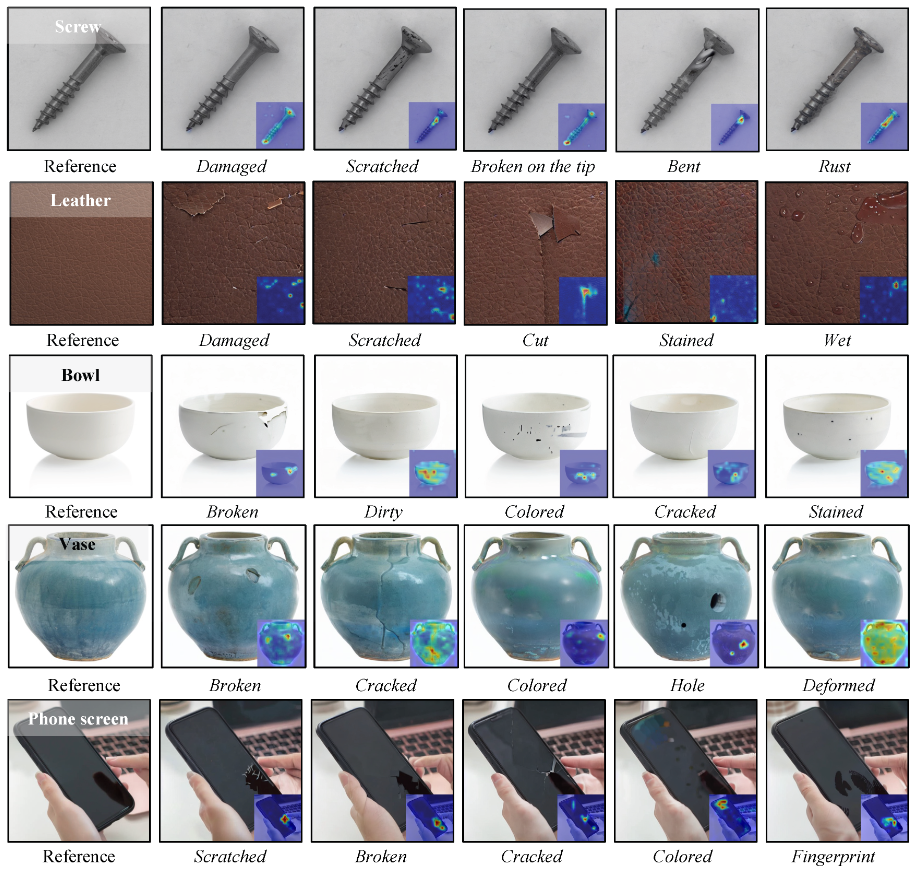
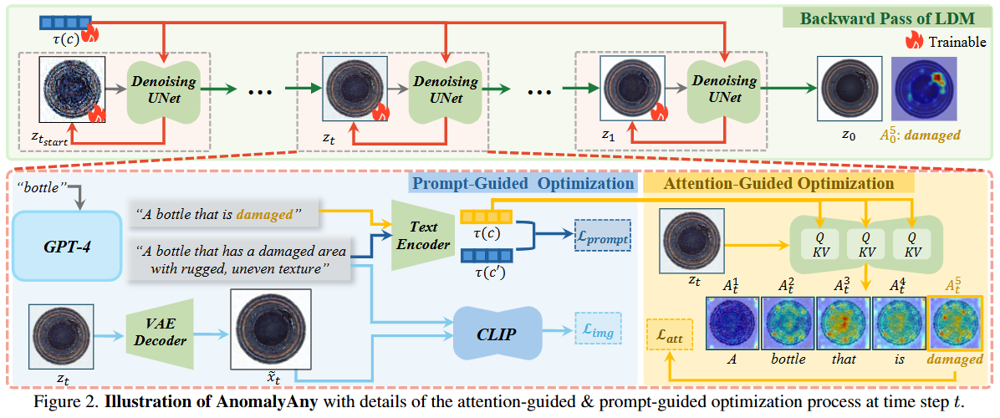

-----

| Title     | paper AnomalyAny                                      |
| --------- | ----------------------------------------------------- |
| Created @ | `2025-06-03T01:57:57Z`                                |
| Updated @ | `2025-06-03T01:59:13Z`                                |
| Labels    | \`\`                                                  |
| Edit @    | [here](https://github.com/junxnone/aiwiki/issues/519) |

-----

# AnomalyAny

  - Anomaly Anything

## Arch

## Reference

  - [paper - 2024.6 - Anomaly Anything: Promptable Unseen Visual Anomaly
    Generation](https://arxiv.org/abs/2406.01078)
  - [code](https://github.com/EPFL-IMOS/AnomalyAny)
