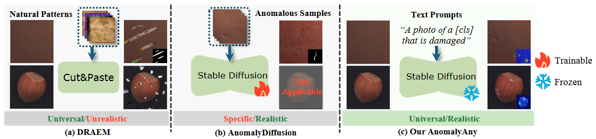
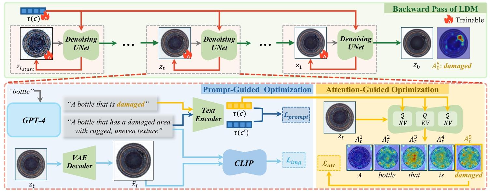
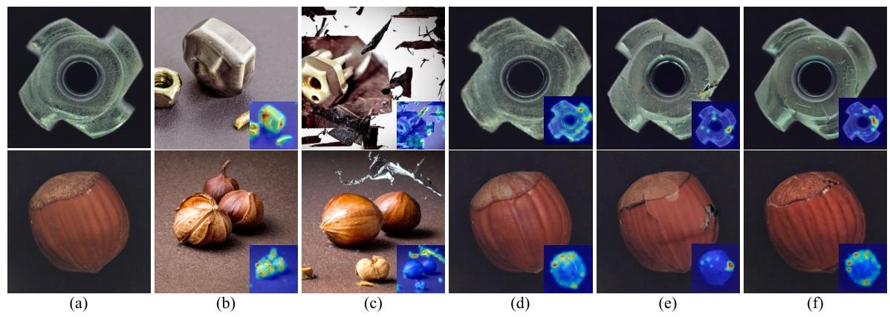
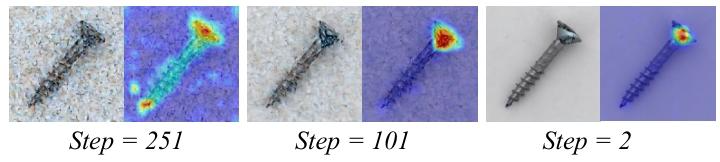
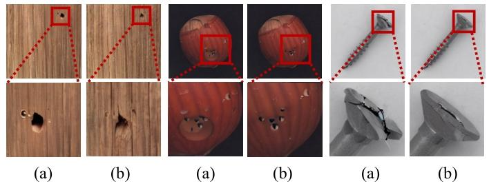
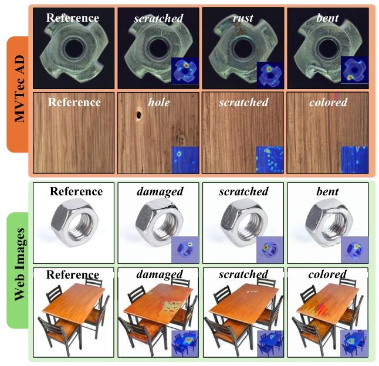

-----

| Title     | paper AnomalyAny cn                                   |
| --------- | ----------------------------------------------------- |
| Created @ | `2025-06-03T02:04:27Z`                                |
| Updated @ | `2025-06-03T03:25:11Z`                                |
| Labels    | \`\`                                                  |
| Edit @    | [here](https://github.com/junxnone/aiwiki/issues/520) |

-----

# AnomalyAny CN

  - 2024.6 **Anomaly Anything: Promptable Unseen Visual Anomaly
    Generation**

<!-- end list -->

``` 
Han Sun  EPFL, Switzerland  Yunkang Cao   HUST, China   Hao Dong  ETH Zurich, Switzerland  Olga Fink  EPFL, Switzerland

{han.sun, olga.fink}@epfl.ch, cyk hust@hust.edu.cn, hao.dong@ibk.baug.ethz.ch

```

## Abstract

由于异常数据样本的稀缺，视觉异常检测（AD）面临着巨大挑战。尽管已有许多工作致力于合成异常样本，但这些合成的异常往往缺乏真实性，或者需要大量的训练数据，这限制了它们在现实场景中的应用。在这项工作中，我们提出了Anomaly
Anything（AnomalyAny），这是一个新颖的框架，它利用Stable
Diffusion（SD）的图像生成能力来生成多样且逼真的未知异常。通过在测试时以单个正常样本为条件，AnomalyAny能够针对任意物体类型，结合文本描述生成未知的异常。在AnomalyAny框架内，我们**提出了注意力引导的异常优化方法，以引导SD将注意力集中在生成关键的异常概念上**。此外，我们还**引入了提示引导的异常细化方法，通过融入详细的描述来进一步提升生成质量**。在MVTec
AD和VisA数据集上进行的大量实验表明，AnomalyAny具备生成高质量未知异常的能力，并且在提升下游异常检测任务的性能方面效果显著。我们的演示和代码可在<https://hansunhayden.github.io/AnomalyAny.github.io/>
获取。

## 1 引言



**图 1. 不同视觉异常生成方法的对比。与现有方法相比，AnomalyAny 无需训练即可生成多样且逼真的未知异常。**

视觉异常检测（AD）\[5\]旨在识别图像数据中偏离特征正态分布的不寻常或意外模式，这在工业检测和质量控制等领域至关重要\[3\]。由于异常样本罕见且难以收集，大多数现有AD方法依赖仅使用正常样本的无监督学习\[12,22,32\]。尽管AD领域最近取得了进展，但用于训练的异常样本稀缺仍是一个长期存在的挑战。为解决这一问题，各种研究已探索视觉异常生成，如图1所示：一些方法\[33,35\]通过从其他数据集中的自然图案或图像本身裁剪粘贴随机图案来增强正常样本，虽能生成多样化异常样本且无需训练即可应用于未知物体，但样本真实性不足；另一种利用生成模型\[17\]的方法虽能产出更逼真图像，却需要充足且具代表性的正常与异常样本进行训练——这对AD任务而言通常难以实现。

鉴于异常的稀有性和可变性，收集代表性异常样本本身就极为困难，而工业场景中产品变体与配置的多样性更导致代表性正常样本匮乏\[18\]，双重限制加剧了两类样本的短缺。这使得生成模型在数据有限的现实应用中适用性较差，且易受少量训练样本的偏差影响。

鉴于现有视觉异常生成方法的局限性，我们旨在利用最少的正常数据（无需任何异常样本）生成多样且逼真的未知异常。这一目标促使我们探索 Stable
Diffusion（SD）\[27\]—— 一种潜在文本到图像扩散模型，其以跨多种领域生成多样化图像而闻名。尽管 SD
展现出令人印象深刻的图像生成能力，但其并非专门为视觉异常生成设计。因此，当直接用于异常生成时，SD
可能会产生偏离预期正态分布的图像，无法准确呈现真实异常模式（图 3（b））。先前方法 \[17,35\] 建议在可用正常或异常样本上微调
SD，但这种方法在数据稀缺场景中受到限制，且可能削弱 SD 对未知数据和异常类型的泛化能力。

在这项工作中，我们提出了Anomaly Anything（AnomalyAny）框架，用于生成逼真且多样化的未知视觉异常。我们利用Stable
Diffusion（SD）模型结合异常文本描述来生成未知视觉异常，这些文本描述可手动定义，或通过GPT-4\[24\]以物体类别为输入自动获取。不同于在正常数据上微调SD模型，我们引入了**测试时正常样本条件化**方法——通过单个正常样本引导生成过程。该方法保留了SD的多样性和泛化能力，使其能够针对新数据和新型异常类型生成异常样本。仅需一个模型，我们就能根据任意异常描述为任何新物体生成逼真且多样的异常样本。

我们发现，原始SD模型难以生成真实异常样本，主要受两个固有挑战制约：其一，SD训练数据中异常样本相对稀缺；其二，与常见物体和图案不同，异常图案通常仅占据图像的小区域，在生成过程中易被忽略。为解决这些问题，我们提出**注意力引导的异常优化方法**，通过最大化与异常标记相关的注意力值，强制模型聚焦于生成异常概念。为进一步引导和细化生成结果，我们还提出**提示引导的异常细化方法**，利用更详细的异常描述作为额外语义指导。我们的主要贡献包括：

  - 我们提出了AnomalyAny，这是一个用于生成未知异常的视觉异常生成框架。用户只需提供物体的任意正常图像和异常描述，即可生成逼真且多样化的异常样本。
  - 我们引入了**注意力引导的异常优化方法和提示引导的异常细化方法**，以克服Stable
    Diffusion（SD）在异常生成中的局限性。我们提出的方法无需额外训练或大量正常/异常数据样本，即可获得比现有方法更真实的生成结果。
  - 我们验证了所提出的AnomalyAny在生成质量和辅助下游异常检测模型训练两方面的有效性。

## 2 相关工作

### 2.1 异常生成

异常数据的稀缺性促使众多研究致力于合成异常样本\[10\]。一种方法是通过从测试集中的少量异常样本\[21,30\]、外部数据集的自然图案\[7,33\]或直接从正常图像本身\[19,29\]**裁剪粘贴**异常图案来增强正常训练样本。尽管这些方法简单有效，但生成的样本缺乏真实性和多样性。另一种方法采用**生成模型**（如生成对抗网络（GAN））来合成异常\[11,34\]。近年来，扩散模型\[14,17,31,35\]的发展使通过在异常数据上微调模型来生成更多样化、更逼真异常的方法成为可能。然而，这些方法通常需要大量正常和/或异常数据样本来学习特定数据集的分布，这在数据有限的场景中往往不切实际。此外，这些方法只能生成与训练集相似的样本（即已知异常），无法生成未知异常。但在实际应用中，假设已知所有可能的异常类型往往不现实，这凸显了对能够泛化到未知类型的方法的需求。为了生成未知但逼真的异常，AnomalyAny直接部署预训练的SD模型进行异常合成，无需额外训练，为跨任意物体的高质量异常生成提供了更灵活的解决方案。

### 2.2 异常检测

可用异常样本的稀缺性使得无监督异常检测（AD）\[4,9,28\]成为该领域的主流范式，其核心是对正常分布建模并将异常识别为离群值\[4,9,28\]。但这类方法依赖于足够数量的正常样本来充分表征潜在分布——而产品变体与工业配置的多样性导致代表性正常样本匮乏，促使小样本异常检测（few-shot
AD）\[22,32\]受到越来越多关注。现有小样本方法常借助CLIP\[25\]等在大规模数据集预训练的视觉-语言模型获取额外知识，通过计算数据样本与正常/异常文本提示的相似度实现检测\[13,18,20\]。然而，仅用正常样本训练AD模型仍面临关键挑战：模型缺乏对异常分布的认知，这凸显了借助逼真异常样本提升检测性能的必要性。

## 3\. 预备知识：Stable Diffusion

扩散模型。去噪扩散概率模型（DDPM）\[15\]通过定义长度为T的马尔可夫链来学习目标数据分布。前向过程中，该链逐步向给定数据样本
$x\_0$ 添加噪声，得到含噪样本序列 $x\_t$ （ $t \\in T$ ）。反向过程中，学习一个由θ参数化的模型
$\\epsilon\_{\\theta}$ ，用于预测每个时间步t添加的噪声。我们的方法基于Stable
Diffusion（SD）\[27\]，这是一种潜在扩散模型（LDM），它将去噪扩散过程应用于变分自编码器（VAE）潜在空间中x的潜在表示
$z$ ，其学习目标为预测每个时间步t添加的噪声，表达式为：

$$L\_{L D M}:=\\mathbb{E}*{\\mathcal{E}(x), \\epsilon \\sim
\\mathcal{N}(0,1), t}\\left\[\\left|
\\epsilon-\\epsilon*{\\theta}\\left(z\_{t}, t\\right)\\right|
\_{2}^{2}\\right\], \\quad(1)$$

其中 $z\_t$ 表示时间步t的含噪潜在表示。推理时，反向过程从随机噪声 $x\_T \\sim N(0, I)$
开始，按时间步从T到0逐步从噪声中生成图像样本。

文本条件。SD通过交叉注意力机制引入文本引导。SD潜在空间中的去噪UNet网络由自注意力层和分辨率为 $P \\in(64,32,16,8)$
的交叉注意力层组成。给定由N个token组成的文本提示c，通过CLIP文本编码器T\[26\]获得引导向量 $\\tau(c)$ 。随后，
$\\tau(c)$ 通过每个交叉注意力层映射到DDPM模型 $\\epsilon\_{\\theta}$ 的中间特征图，具体如下：

$$A = \\text{softmax}\\left(\\frac{QK^T}{\\sqrt{d}}\\right) \\cdot V,
\\quad A \\in \[P, P, N\],$$

$$Q = W\_Q^{(i)} \\cdot \\varphi\_i(z\_t), \\quad K = W\_K^{(i)} \\cdot
\\tau(c), \\quad V = W\_V^{(i)} \\cdot \\tau(c), \\quad (3)$$

其中 $\\varphi\_i(z\_t)$ 是UNet的中间特征，A、Q、K、V分别表示注意力矩阵、查询矩阵、键矩阵和值矩阵。
$W^{(i)}$ 表示可学习的投影矩阵。 在图像-文本对 ${x, c}$ 上，文本条件扩散模型可通过以下目标函数进行学习：

$$L\_{L D M}:=\\mathbb{E}*{\\mathcal{E}(x), c, \\epsilon \\sim
\\mathcal{N}(0,1), t}\\left\[\\left|
\\epsilon-\\epsilon*{\\theta}\\left(z\_{t}, t, \\tau(c)\\right)\\right|
\_{2}^{2}\\right\] . \\ (4)$$

## 4 方法

 **图2.
AnomalyAny框架示意图，展示了时间步t下注意力引导与提示引导优化过程的细节。**

 **图3.
生成的异常样本及损坏注意力图示例。图中展示了（a）正常引导图像，以及由（b）Stable
Diffusion、（c）不含正常样本条件化的本方法、（d）不含注意力引导优化的本方法、（e）不含提示引导优化的本方法和（f）我们提出的AnomalyAny生成的结果。**

在这项工作中，我们提出了AnomalyAny——一种用于在未知物体和异常类型上生成逼真的、可通过提示控制的异常的新型框架，如图2所示。该框架包含三个核心模块：首先通过测试时正常样本条件化（4.1节）基于单个正常样本引导生成过程，实现对新物体和异常类型的异常生成；生成阶段引入两阶段优化流程，注意力引导的异常优化（4.2节）先将生成焦点集中于复杂异常概念，再通过提示引导的异常细化（4.3节）利用详细文本描述进一步提升生成质量。

### 4.1. 测试时正常样本条件化

在这项工作中，我们利用Stable
Diffusion（SD）生成未知视觉异常。尽管SD在图像生成上表现出色，但其潜在分布的固有多样性会导致生成图像与特定异常检测（AD）数据集中的正常图像存在显著差异（如图3（b）所示）。为生成与目标正常分布一致的图像，我们未对SD进行微调，而是在生成过程中直接融入正常样本信息：给定正常样本
$x^{normal}$ 及其由变分自编码器（VAE）编码器得到的潜在表示 $z^{normal}=E(x^{normal})$
，通过DDPM噪声调度器控制逐步添加噪声，得到样本序列 $z\_{1}^{normal}$ 、
$z\_{2}^{normal}$ 、…、 $z\_{T}^{normal}$ 。推理过程不从头开始于 $z\_{T} \\sim N(0,
I)$ ，而是从 $t\_{start} = T \\cdot (1-\\gamma)$ 步骤开始，利用含噪潜在表示
$z\_{t\_{start}}^{normal}$ 传递来自引导正常图像 $x^{normal}$
的损坏特征，从而在测试时无需额外训练即可为新物体类型生成异常。参数γ控制起始步骤（即添加到引导数据样本的噪声尺度），实验中设
$\\gamma=0.25$ 以平衡与原始分布的相似度和促进多样化结果的推理步骤。

为了基于给定正常样本实现更精确的控制，我们将掩码输入作为可选约束，用于指定生成异常的位置。该掩码既可以作为前景掩码，将异常限制在目标物体上，也可以作为预定义的详细掩码，精确界定异常区域。对于时间步t的预测潜在表示
$z\_t$ ，我们执行以下操作：

$$z\_{t}=mask \\odot z\_{t}+(1- mask ) \\odot z\_{t}^{normal} . \\ (5)$$

这种公式化方法在掩码区域之外保留了正常引导样本的分布，确保修改仅局限于指定区域。

### 4.2. 注意力引导的异常优化

我们通过提供异常文本描述（如“一张损坏的\[cls\]（如瓶子）的照片”）来生成特定物体类型（标记为\[cls\]）的异常样本。如前所述，由于异常生成的复杂性，生成图像往往会忽略所需的异常语义（如图3（d）所示）。为解决这一挑战，我们引入注意力引导的异常优化机制，以强制生成这些关键但难以捕捉的异常概念。首先，我们聚合SD的注意力图用于后续优化：给定由N个token组成的文本提示c，在每个推理步骤t，获取与c对应的注意力图集合
$A\_t \\in P×P×N$ ，其中 $A\[:,:,i\]$ 表示分配给token $c\_i$
的概率。遵循文献\[6\]，对16×16分辨率的注意力图取平均（该分辨率语义信息最强），生成的
$\\bar{A}\_t$ 在token维度归一化并通过高斯函数平滑：

$$\\overline{A}*{t}=\\text{Gaussian}\\left(\\text{softmax}\\left(\\overline{A}*{t}\\right)\\right),
\\overline{A}\_{t} \\in 16 × 16 × N$$

在生成过程中，通过 $\\bar{A}*{t}$ 引导的优化强制图像传达异常类型token $c\_j$
（如“damaged”）的语义：每个时间步t，最大化与异常描述相关的注意力以优化中间潜在表示
$z\_t$ ，优化后去噪得到 $z*{t-1}$ （如图2所示）。具体而言，提取与 $c\_j$ 相关的注意力图
$\\bar{A}*{t}^{j}$ ，通过损失函数 $L*{att}$ 计算 $z\_t$
的梯度更新，并允许通过掩码限制优化区域。步骤t的优化公式为：

$$\\mathcal{L}*{att} = 1 - \\max(\\overline{A}*{t}^{j} \\odot
\\text{mask}), \\quad z\_{t} \\leftarrow z\_{t} - \\alpha\_{t} \\cdot
\\nabla\_{z\_{t}} \\mathcal{L}\_{att} \\odot \\text{mask}$$

其中 $\\alpha\_t$ 为步长，该目标通过最大化 $\\bar{A}\_{t}^{j}$
强化异常token的激活。通过迭代优化，我们逐步将异常的语义特征融入生成的图像中，如图4所示。

 **图4.
中间生成结果及不同去噪步骤下异常token注意力图的可视化。**

 **图5.
基于异常token注意力优化后生成的异常示例：(a) 未使用定位感知调度器；(b) 使用定位感知调度器。**

我们的实验结果表明，上述迭代更新可能会在特定像素上产生冗余注意力，从而导致图像伪影。为缓解过度优化问题，我们提出了一种定位感知调度器。从初始生成结果
$z\_{t\_{start}}$ 及其异常注意力图 $\\bar{A}*{t*{start}}^{j}$
出发，我们通过统计平滑注意力图中注意力值超过均值的像素数量，确定激活像素数
$n\_{tstar}$ 。在每个优化步骤t，计算激活像素数 $n\_t$ ，并按以下公式计算标量 $\\alpha\_t$ ：

$$\\alpha\_t = \\lambda(1 + \\Delta\_t \\cdot t) \\cdot
\\frac{n\_t}{n\_{t\_{start}}}$$

其中，λ是控制优化强度的缩放因子， $\\Delta\_t$ 用于调整步长以逐步降低更新速率。随着激活像素逐渐局部化，我们减小
$\\alpha\_t$ 以缓解过拟合问题。如图5所示，该策略显著降低了生成样本中不真实的伪影。

### 4.3. 通过提示引导优化实现精细异常生成

基于注意力的优化虽能强制生成由一到两个token组成的异常关键词，但有限的token长度常导致描述模糊，降低生成场景的真实性与丰富度。为增强语义引导并提升生成质量，我们提出融入详细异常描述的提示引导优化方法用于异常精细化生成。具体而言，为丰富生成的异常分布，我们利用GPT-4\[1\]为给定物体生成潜在异常类型
$c\_j$ 及其对应详细描述 $c$
。例如，当物体为瓶子时，通过提示GPT-4可识别如“损坏”等异常类型及其描述——“瓶子特写，破损区域呈现粗糙不平的纹理”，从而为生成多样化的损坏类型或异常提供更精细的引导。

为了在生成过程中融入这些长文本描述的语义引导，我们在最后的去噪步骤中引入基于CLIP的图像生成损失函数，以确保生成图像与文本引导之间的语义一致性。在时间步t，给定潜在表示
$z\_t$ ，我们通过解码器得到生成结果 $\\tilde{x}\_t = D(z\_t)$ 。然后在CLIP\[26\]嵌入空间中最小化其与
$c'$ 的距离，公式如下：

$$\\mathcal{L}\_{img} = 1.0 - \\text{cosine}\\left(\\Phi^{T}(c'),
\\Phi^{V}(\\tilde{x}\_t)\\right), \\quad (10)$$

其中 $\\Phi^{T}(\\cdot)$ 和 $\\Phi^{V}(\\cdot)$
分别表示CLIP的文本编码器和视觉编码器。最小化该相似度损失可使生成的异常更贴近
$c'$ 的语义属性，从而通过详细描述细化异常类型。随后，我们对 $z\_t$ 进行注意力和语义对齐的联合优化：

$$\\mathcal{L} = \\mathcal{L}*{img} + \\alpha\_t \\cdot
\\mathcal{L}*{att}, \\quad z\_t \\leftarrow z\_t -
\\nabla\_{z\_t}\\mathcal{L} \\odot \\text{mask}. \\quad (11)$$

为进一步融入语义引导，我们通过计算c与更精细引导文本c'的相似度来适配c，并按如下方式优化提示嵌入：

$$\\mathcal{L}\_{prompt} = 1.0 - \\text{cosine}\\left(\\tau(c),
\\tau(c')\\right), \\quad(12)$$

$$\\tau(c) \\leftarrow \\tau(c) -
\\nabla\_{\\tau(c)}\\left(\\mathcal{L}*{prompt} +
\\mathcal{L}*{img}\\right). \\quad(13)$$

这一过程丰富了原始提示嵌入 $\\tau(c)$
中的语义信息，以有效引导生成过程。在我们的框架中，我们在总推理步骤的最后30步优化此联合损失。这种集成引导不仅增强了语义一致性，还缓解了仅基于注意力优化时常出现的不真实伪影，从而实现了与详细提示规范一致的、更精确且上下文丰富的异常生成。

借助我们提出的AnomalyAny框架，我们实现了可通过提示生成未见异常的功能。值得注意的是，由于AnomalyAny未在特定数据集上进行训练，因此不受可用正常样本分布的限制，这使其能够广泛适用于各种未见的物体类别和异常类型。此外，注意力图定义了每个文本token的概率分布，这使我们能够将时间步0的最终平滑注意力图
$\\bar{A}\_0^j$ 用作像素级注释，以定位 $c\_j$ 所描述的异常。

 **图6.
任意物体和异常描述的异常生成结果。右下角展示了异常标记的注意力图。**

## 5 实验

### 5.1. 实验设置

数据集。我们在MVTec AD \[2\]和VisA \[36\]这两个工业异常检测的基准数据集上进行了广泛实验。MVTec
AD包含15个物体和纹理类别的5000张图像，带有缺陷的像素级注释；而VisA则包含来自12个类别的10,821张带注释的图像。

评估指标。为了定量评估异常生成结果，我们采用初始得分（IS）来衡量生成质量，并使用簇内成对LPIPS距离（IC-LPIPS）\[23\]来评估生成多样性。我们还通过使用生成的数据训练异常检测框架来验证生成图像样本的有效性。对于异常检测任务，我们采用五个指标全面评估检测性能：图像级和像素级的受试者工作特征曲线下面积（AUROC），分别表示为I-AUC和P-AUC；图像级和像素级的最大F1分数\[18\]，分别表示为I-F1和P-F1；以及区域重叠率\[3\]，表示为PRO。

实现细节。对于异常生成，我们部署了预训练的SD模型，其中 $T=100$ 且 $\\gamma=0.25$
。遵循文献\[35\]，我们应用二值阈值处理来提取每个正常引导图像的前景掩码，该掩码将作为生成的掩码引导。更多实现细节在补充材料中提供。
