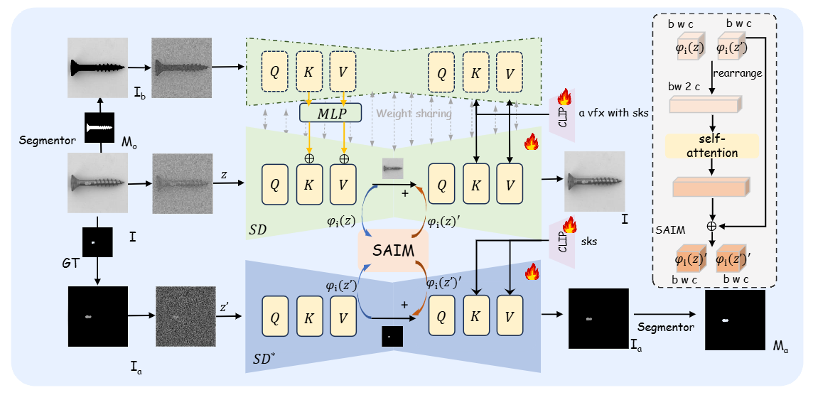

-----

| Title     | paper DualAnoDiff                                     |
| --------- | ----------------------------------------------------- |
| Created @ | `2025-06-10T02:39:25Z`                                |
| Updated @ | `2025-06-25T02:40:34Z`                                |
| Labels    | \`\`                                                  |
| Edit @    | [here](https://github.com/junxnone/aiwiki/issues/522) |

-----

# DualAnoDiff

  - 双分支扩散机制
  - 背景补偿模块
  - 嵌套提示词设计

## Arch

  - 如图展示了DualAnoDiff的架构:
      - 1）DualAnoDiff的两个分支利用不同但嵌套的提示词，同步生成异常图像及对应的异常部分。
      - 2）在去噪过程中，两个分支借助自注意力交互模块（SAIM），在每个注意力块之后共享注意力信息，以保证生成图像的一致性。
      - 3）背景补偿模块（BCM）提取背景图像的键（Key）和值（Value），并对稳定扩散模型（SD）进行自适应融合，助力模型将更多注意力放在图像的物体上。

### Inference

  - **输入**: 一组 Prompt `a vfx with sks` 和 `sks`
  - **输出**: 一组异常图像及对应的异常部分图像

## Reference

  - [paper](https://arxiv.org/abs/2408.13509)
  - [Code](https://github.com/yinyjin/DualAnoDiff)
