-----

| Title     | paper DualAnoDiff cn                                  |
| --------- | ----------------------------------------------------- |
| Created @ | `2025-06-10T02:42:05Z`                                |
| Updated @ | `2025-06-10T07:01:39Z`                                |
| Labels    | \`\`                                                  |
| Edit @    | [here](https://github.com/junxnone/aiwiki/issues/523) |

-----

# DualAnoDiff CN

**Dual-Interrelated Diffusion Model for Few-Shot Anomaly Image
Generation**

    Ying Jin1∗, Jinlong Peng2*, Qingdong He2∗, Teng Hu3, Jiafu Wu2, Hao Chen1
    Haoxuan Wang1, Wenbing Zhu1, Mingmin Chi1†
    , Jun Liu2, Yabiao Wang2,4†
    1Fudan University, 2Youtu Lab, Tencent, 3Shanghai Jiao Tong University, 4Zhejiang University
    {yjin22, haochen22, hxwang23, wbzhu23}@m.fudan.edu.cn, mmchi@fudan.edu.cn
    {jeromepeng, yingcaihe, jiafwu, juliusliu}@tencent.com, hu-teng@sjtu.edu.cn, yabiaowang@zju.edu.cn

**<https://github.com/yinyjin/DualAnoDiff>**

## 摘要

工业制造中的异常检测性能受到异常数据稀缺的限制。为了克服这一挑战，研究人员已开始采用异常生成方法来扩充异常数据集。然而，现有异常生成方法存在生成异常的多样性有限、难以实现异常与原始图像的无缝融合等问题。此外，生成的掩码通常与生成的异常区域不匹配。在本文中，我们从新的视角克服了这些挑战，同时生成了一对整体图像和相应的异常部分。我们提出了**DualAnoDiff**，这是一种新型的基于扩散模型的小样本异常图像生成模型，该模型通过**使用两个相互关联的扩散模型来生成多样化且逼真的异常图像，其中一个模型用于生成整体图像，另一个用于生成异常部分。此外，我们提取背景和形状信息，以缓解小样本图像生成中的扭曲和模糊现象**。大量实验表明，我们提出的模型在多样性、真实性和掩码准确性方面优于最先进的方法。总体而言，我们的方法显著提高了下游异常检测任务的性能，包括异常检测、异常定位和异常分类任务。代码将公开提供。

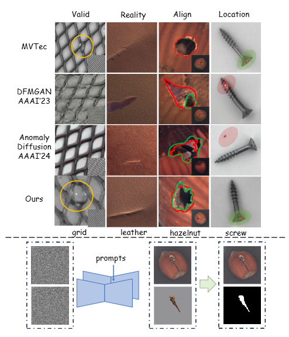

> 图1.
> 上图：从四个方面评估异常生成质量——是否生成有效异常、真实感程度、掩码对齐情况以及掩码位置是否合理，结果显示我们的生成结果优于其他方法。（黄色区域表示有效生成，绿色表示正确掩码或区域，红色表示生成的掩码或错误区域。）下图：我们的模型可同步生成大量异常图像-掩码对。

## 1 简介

工业异常检测（即异常检测、定位与分类）在工业制造中具有重要作用\[6\]。然而，在实际工业生产中，异常样本极为稀缺。因此，当前**主流的异常检测方法要么是仅使用正常样本的无监督方法\[22,36\]，要么是同时利用正常样本和少量异常数据的半监督方法**\[48\]。尽管这些方法在异常检测任务中表现出色，但在异常定位方面性能有限，且无法处理异常分类任务\[14\]。为此，研究人员提出了异常生成方法，通过生成更多异常数据，以借助有监督的异常检测实现更优性能。

现有异常生成方法可分为两类：

  - 1）**无模型方法从现有异常或异常纹理数据集中随机裁剪补丁并粘贴到正常样本上\[20,23,46\]，但其合成的异常数据缺乏真实感**；
  - 2）**生成式方法采用生成对抗网络（GAN）和扩散模型等生成模型来生成异常数据**。

通常，基于GAN的模型\[26,47\]需要大量训练数据才能实现较好的生成性能，且无法生成掩码。DFMGAN\[6\]先在正常数据上训练，再迁移到异常数据以实现小样本生成，但该方法因**缺乏显式对齐约束设计，存在生成异常真实感不足\[29\]和掩码对齐不精准\[21\]的问题**。基于扩散模型\[33\]纹理反演技术\[7\]的AnomalyDiffusion\[14\]，分别学习异常外观和位置信息，再在掩码后的正常样本上生成异常。由于该方法仅关注异常部分，**生成的异常与原图融合不自然，且单独生成的掩码可能出现在图像背景区域**。

为解决上述局限，我们提出DualAnoDiff——一种新型小样本异常图像生成模型，通过双关联扩散机制同步生成整体图像与对应异常部分。该方法可**实现异常图像与异常部分的有效融合，生成具有高真实感、精准对齐且多样性良好的异常图像-掩码数据对**。具体而言，**模型基于预训练扩散模型，引入两个LoRA\[12\]将单一扩散模型扩展为双关联扩散架构**：

  - **全局分支**
    负责生成整体异常图像，**异常分支**生成局部异常区域，两者通过**自注意力交互模块**交换信息。该模块融合双分支的注意力层并执行共享注意力计算，实现双去噪过程中的信息交互与融合，**确保生成的整体异常图像与局部异常区域的一致性**。
  - 为进一步保持背景不变性，引入基于自注意力自适应注入的**背景补偿模块**：对背景图像添加噪声后，从中间特征层提取键（Key）和值（Value），通过自适应融合MLP**将背景信息融入全局分支，从而维持生成图像中背景的准确性和物体形状的完整性**。

图7显示，我们的生成结果在四个关键方面优于其他方法。此外，我们在MVTec
AD\[1\]数据集上进行了大量实验，从定量角度验证了DualAnoDiff生成的异常数据在下游异常检测任务中的优越性。该模型在像素级异常检测任务中达到了最先进的性能水平，AUROC值为99.1%，AP得分为84.5%。

我们的**贡献**可总结如下：

  - 我们提出了DualAnoDiff，这是一种新颖的基于扩散模型的小样本异常生成方法，该方法**通过双关联扩散模型同时生成整体图像和对应的异常部分，并附带高度对齐的掩码**。
  - 我们设计了一种**背景补偿方法**，该方法**将图像背景作为控制信息，并将中间特征注入异常图像的去噪过程中，以增强生成数据的稳定性和真实感**。
  - 大量实验表明，无论是在生成质量还是在下游异常检测任务的性能方面，我们的方法均优于现有的异常生成模型。

## 2 相关工作

### 2.1 小样本图像生成

2.1. 小样本图像生成

**小样本图像生成的目标是在避免对少量训练图像过拟合的同时，生成新颖且多样化的样本**\[45,51\]。当训练数据极少（少于10张）时，该任务极易出现过拟合，导致生成高度相似的图像。FreezeD\[25\]提出通过修改网络权重、使用多种正则化技术和数据增强来防止过拟合\[14\]。也有方法\[13\]通过在源域上进行预训练，随后通过跨域一致性损失迁移到少样本场景，以保持生成分布，从而缓解过拟合问题。文本反转（Textual
Inversion）\[7\]和Dreambooth\[37\]将少量图像编码到预训练扩散模型的文本空间中，以实现保留关键视觉特征的多样化目标定制生成。尽管这些方法能够生成逼真的图像，但无法生成像素级注释——而这对于异常图像生成任务至关重要。相比之下，我们的方法通过同步生成局部异常图像，可直接获得高质量的注释。

### 2.2 异常检测

异常检测任务包括异常检测、定位和分类\[6\]。由于工业场景中异常数据的稀缺性，大多数方法\[9,18,22,24,36,40-42\]采用无监督和半监督方法。**基于重建的方法\[3,10,39\]通过分析重建前后的残差图像来检测异常**；**基于嵌入的方法\[2,19,44\]利用预训练网络提取图像级和补丁级特征，再根据特征相似度聚类以检测异常**。但这些方法仅能处理异常检测任务，在异常定位中性能有限，且无法实现异常分类。通过生成异常图像，这三类任务可被有效解决，而我们的方法实现了当前最优性能。

### 2.3 异常生成

由于异常数据的稀缺性，异常生成已成为一个极具重要性的领域。DRAEM\[46\]、Cut-Paste\[20\]、Crop-Paste\[23\]和PRN\[48\]等方法**将不相关的纹理或现有异常裁剪并粘贴到正常样本上**。这些方法虽有一定效果，但生成的异常完全缺乏真实感，无法用于异常分类任务。随后，**生成对抗网络（GANs）**\[8\]因其生成高保真图像的能力被应用于异常生成领域。SDGAN\[26\]和DefectGAN\[47\]通过**从异常数据中学习，在正常样本上生成异常**。

然而，这些方法需要大量异常数据，且无法生成异常掩码。DFMGAN\[6\]将在正常样本上预训练的StyleGAN2\[15\]迁移到异常领域，但生成的异常缺乏真实感，且生成的异常与掩码之间无法精确对齐。随后，扩散模型因其极强的泛化能力得到更广泛的应用。AnomalyDiffusion\[14\]通过扩散模型的文本反转\[7\]技术学习异常特征和掩码分布，以在正常图像的对应掩码位置生成指定异常。但由于该方法分别学习异常部分和掩码，导致生成的掩码不一定位于物体上，且异常与物体的过渡不够自然。

相比之下，我们的方法通过利用双分支扩散模型和背景补偿模块，成功实现了异常图像中各种属性的完全解耦。因此，生成的数据更加真实和多样化，显著提升了各种下游任务的性能。

## 3 方法

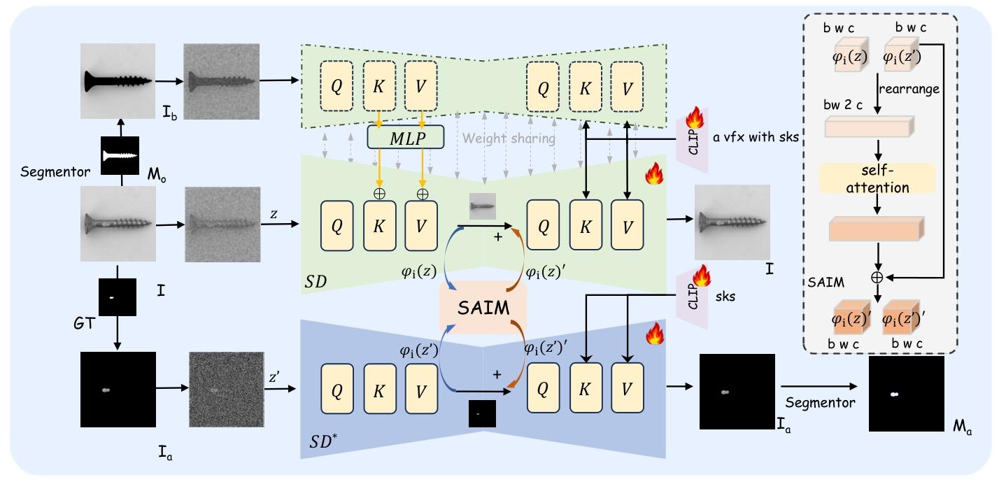

> \[\!NOTE\] 图2. DualAnoDiff的架构。
> 
>   - 1）DualAnoDiff的两个分支**通过不同但嵌套的提示词同步生成异常图像和对应的异常部分**。
>   - 2）在去噪过程中，两个分支通过自注意力交互模块（SAIM）在每个注意力块后共享注意力信息，以保持生成图像的一致性。
>   - 3）背景补偿模块（BCM）提取背景图像的键（Key）和值（Value），并对SD进行自适应融合，帮助模型更聚焦于图像中的物体。

给定一组数量有限的异常图像-掩码对，我们的目标是学习这些异常图像的特征，进而生成更多属于同一物品和异常类型的异常图像-掩码对，同时确保异常的分布和外观具有更大多样性。在我们的方法中，我们先生成整体图像和异常部分，然后对其进行分割以获得对应的掩码。

### 3.1 预备知识

**潜在扩散模型**。Stable
Diffusion（SD）作为潜在扩散模型（LDM）\[33\]的一种变体，是一种文本引导的扩散模型。为了生成高分辨率图像并提高训练过程中的计算效率，它采用预训练的变分自编码器（VAE）\[16\]编码器
$E(\\cdot)$ 将图像映射到潜在空间，并执行迭代去噪过程。随后，预测的图像通过预训练的VAE解码器 $D(\\cdot)$
映射回像素空间。 $\\epsilon\_{\\theta}$
是去噪网络，对于每个去噪步骤，简化的优化目标定义如下：

$$L\_{LDM}(\\theta)=\\mathbb{E}*{\\mathcal{E}(x),\\epsilon,t}\\left\[\\left|\\epsilon-\\epsilon*{\\theta}\\left(z\_t,t,\\tau\_{\\theta}(c)\\right)\\right|\_2^2\\right\]$$

其中， $\\epsilon$ 是潜在噪声，文本描述 $c$ 由CLIP\[31\]文本编码器
$\\tau\_{\\theta}(\\cdot)$ 编码，然后用于引导扩散去噪过程。

### 3.2 DualAnoDiff 框架

我们一直在寻找能够同时生成异常图像和掩码的方法。受Layerdiffusion\[49\]的启发，我们将异常图像分解为两部分：整体异常图像和对应的异常部分。其中，整体图像指整个异常图像
$I$ ，异常部分指仅包含异常区域的部分 $I\_a$ ，且 $I\_a = I \\times M\_a$ （ $M\_a$
为异常部分的掩码）。

如图2所示，所提出的DualAnoDiff包含两个相互关联的扩散模型，它们通过自注意力交互模块共享部分信息。我们冻结扩散模型的权重，并使用两个LoRA\[12\]对其进行微调。为了便于描述，我们将这两个扩散模型表示为
$SD$ 和 $SD^{*}$ ，其中 $SD$ 表示用于生成全局图像 $I$ 的扩散模型， $SD^{*}$ 表示用于生成异常部分
$I\_a$ 的扩散模型。

**双关联扩散模型**。AnomalyDiffusion\[14\]主要聚焦于异常部分，这可能导致生成的异常图像缺乏令人信服的真实外观。然而，生成完整的异常图像在获取对应掩码方面存在挑战。为解决这些限制，我们提出的模型同时生成整体图像和异常部分。这种新方法克服了生成真实感异常图像的难题，同时确保了准确掩码的可用性。

首先，我们通过使用变分自编码器（VAE）的编码器 $\\varepsilon(\\cdot)$ 将 $I$ 和 $I\_a$ 编码到潜在空间
$z$ 和 $z'$ 中，其中 $z = \\varepsilon(I)$ 且 $z' = \\varepsilon(I\_a)$
。接下来，我们采用前向过程在相同时间步长 $t$
下向潜在空间添加噪声，然后在不同提示词的引导下于反向过程中学习去噪。在这些过程中，信息通过自注意力交互模块（SAIM）在两个扩散模型之间共享和同步，使模型能够有效拟合训练数据对。通过单独生成异常，该方法实现了两个重要目标：通过添加两个LoRA这一简单而有效的操作，增强了生成异常的多样性和真实感；同时确保了与异常图像高度对齐的精确掩码。

**嵌套提示词**。双扩散模型的目标是生成具有包含关系的异常图像与异常部分对（ $I$ 和 $I\_a$
）。为了帮助模型理解图像中的不同实体（主体对象与异常区域），我们采用了一对旨在反映这种包含关系的提示词：

$$p: a\\ x\\ with\\ y$$ $$p':\\ \\mathbf y\\quad (2)$$

其中，提示词 $p$ 和 $p'$ 分别对应异常图像 $I$ 和相应的异常部分 $I\_a$ 。这两个提示词均由可训练的文本编码器
$\\tau\_{\\theta}(\\cdot)$ 进行编码，然后注入到扩散模型的Unet\[34\]中。

变量x和y可以是数据集提供的类别名称和异常名称。在我们的模型中，我们使用了DreamBooth\[37\]建议的“vfx”和“sks”。这些词汇在语言模型和扩散模型中均具有较弱的先验知识，因此比其他词汇更容易拟合，并且能够实现更好的生成效果，尤其是对于高先验词汇。图3展示了生成结果，并可视化了文本标记与视觉内容之间的交叉注意力图。其中a是由SD生成的异常图像，b和c是从SD的Unet生成过程后半段随机提取的64×64分辨率特征图，分别对应文本“a
vfx with”和“sks”。显然，模型正确分离了异常和物体的属性，并按需求将它们准确关联到指定文本。

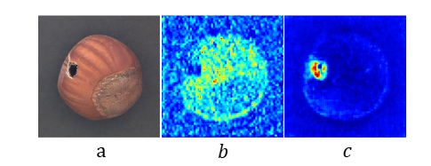

> \[\!NOTE\] 图3. a为SD生成的图像，b和c是SD中不同文本标记对应于文本“a vfx with”和“sks”的交叉注意力图。

自注意力交互模块（SAIM）：训练过程中，SD和SD\*同步进行去噪，且在扩散模型的Unet中每个注意力块后通过SAIM共享信息。例如，自注意力块更易共享位置与细节信息，交叉注意力块则共享语义信息。

在**SAIM**中，我们使用注意力机制融合来自两个分支的信息，共享步骤公式化如下：

$$\\begin{aligned} \\varphi\_{i}(\\overline{z}) = &
\\text{Rearrange}\\left(\\text{Concat}\\left(\\varphi\_{i}(z),
\\varphi\_{i}\\left(z'\\right)\\right)\\right) \\ &
\\varphi\_{i}(\\overline{z})*{\\text{new}} =
\\text{SelfAtt}\\left(\\varphi*{i}(\\overline{z})\\right)
\\end{aligned}$$

$$\\varphi\_{i}(z)', \\varphi\_{i}\\left(z'\\right)' =
\\text{Split}\\left(\\text{Rearrange}\\left(\\varphi\_{i}(\\overline{z})*{\\text{new}}
+ \\varphi*{i}(\\overline{z})\\right)\\right)$$

其中， $\\varphi\_{i}$ 表示Unet的中间表示。 $\\varphi\_{i}(z)$ 和
$\\varphi\_{i}(z')$ 的原始形状为“b w c”，其中“b”表示批量大小，“w”表示空间维度，“c”表示通道维度。我们将
$\\text{Concat}(\\varphi\_{i}(z), \\varphi\_{i}(z'))$ 重新排列为“bw
2c”形状以避免空间位移。Concat和Split是一组对应的操作，用于聚合和分离特征图。

**损失函数**。基于扩散模型的双流结构，我们的最终训练目标表示如下：

$$\\begin{aligned} \\mathcal{L} = & \\mathbb{E}*{\\mathcal{E}(I),
\\epsilon, t}\\left\[\\left| \\epsilon -
\\epsilon*{\\theta}\\left(z\_{t}, t, \\tau\_{\\theta}(p)\\right)
\\right| *{2}^{2}\\right\] \\ & +
\\mathbb{E}*{\\mathcal{E}\\left(I\_{a}\\right), \\epsilon^{*},
t}\\left\[\\left| \\epsilon^{*} -
\\epsilon\_{\\theta}^{\*}\\left(z\_{t}', t,
\\tau\_{\\theta}\\left(p'\\right)\\right) \\right| \_{2}^{2}\\right\]
\\end{aligned}$$

其中， $\\epsilon$ 和 $\\epsilon^{\*}$ 分别为异常图像和异常部分的潜在噪声， $t$ 为时间步长， $p$ 和
$p'$ 为对应的提示词，它们由可训练的文本编码器 $\\tau\_{\\theta}(\\cdot)$ 进行编码。

**掩码生成**。由于我们采用双流并行结构将异常部分作为单一实体生成，因此获取精确掩码变得非常直接。有两种获取高质量掩码的方法：1）在生成异常部分图像后，我们利用现有的分割算法（如SAM\[17\]、
$U^{2}$ -Net\[30\]）来获取高质量掩码。2）在生成过程中，我们可以提取 $SD^{\*}$
中的平均注意力图来计算掩码，例如\[43\]中广泛应用于语义分割的方法。在本文中，我们使用第一种方法。

### 3.3 背景补偿模块

尽管该模型目前已取得良好效果，但在某些情况下仍存在一些问题，这些问题是由训练数据有限导致的。图4展示了MVTec数据集中瓶子、药片和牙刷类别（每个类别的平均训练数据为8个）对应的生成结果中的几个不良案例。瓶子仅生成了一部分；药片的边缘模糊，其内部特征渗漏到背景中；此外，牙刷出现了两个刷柄，这是一种异常情况。而且，所有这些生成的图像都缺乏清晰度，背景颜色也没有保持足够的纯净度。总的来说，由于模型无法完全掌握这些案例的特征，因此存在物体与背景混合以及物体变形等问题。

为了增强模型学习物体形状的能力并更专注于物体生成，我们设计了一个背景补偿模块。首先，我们使用 $U^{2}$ -Net对图像 $I$
进行分割，获取物体掩码 $M\_{f}$ ，然后得到背景图像 $I\_{b}=(1-M\_{f})×I$ 。
$I\_{b}$ 将与 $I$ 一样通过 $SD$ 处理（除了SAIM模块）。然后，我们将包含背景和掩码信息的 $I\_{b}$
作为条件，这使我们能够在提供背景上下文的同时控制物体的形状。我们在自注意力层中收集其特征，并在每个对应的自注意力步骤中将这些特征注入到
$I$ 的 $K$ 、 $V$ 中。注入过程可表示为：

$$\\begin{aligned} \\varphi\_{i}\\left(z^{b}\\right) & =
\\text{SelfAtt}\\left(\\varphi\_{i}\\left(z^{b}\\right)\\right) \\ Q & =
W\_{Q}^{(i)} \\cdot \\varphi\_{i}(z) \\ \\varphi\_{i}(z) & =
\\varphi\_{i}(z) + \\gamma
\\text{MLP}\\left(\\varphi\_{i}\\left(z^{b}\\right)\\right) \\ K & =
W\_{K}^{(i)} \\cdot \\varphi\_{i}(z) \\ V & = W\_{V}^{(i)} \\cdot
\\varphi\_{i}(z) \\end{aligned}$$

其中， $\\gamma$
是一个可学习的缩放因子，初始化为0.1。这种设计有助于我们最大程度地保留主流SD的生成效果，同时利用背景信息和掩码形状。在
$I\_{b}$ 作为条件的情况下，损失函数变为：

$$\\begin{aligned} \\mathcal{L} & = \\mathbb{E}*{\\mathcal{E}(I),
\\epsilon, t}\\left\[\\left| \\epsilon -
\\epsilon*{\\theta}\\left(z\_{t}, t, \\tau\_{\\theta}(p), I\_{b}\\right)
\\right| *{2}^{2}\\right\] \\ & +
\\mathbb{E}*{\\mathcal{E}\\left(I\_{a}\\right), \\epsilon^{*},
t}\\left\[\\left| \\epsilon^{*} -
\\epsilon\_{\\theta}^{\*}\\left(z\_{t}', t,
\\tau\_{\\theta}\\left(p'\\right)\\right) \\right| \_{2}^{2}\\right\]
\\end{aligned}$$

从另一个角度来看，双分支结构相当于显式分离了图像中物体主体和异常这两个概念。然而，在某些含背景的图像场景中，仅靠这两个属性是不够的——模型可能会将物体主体与纯色背景混合，进而导致图4（a）所示的现象。BCM模块通过在训练过程中融入背景信息，进一步解耦物体主体与背景，从而在图4（b）中实现了更稳定的生成效果。

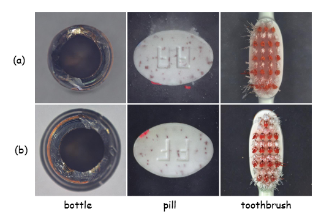

> \[\!NOTE\] 图4. 未使用（a）和使用（b）背景补偿模块的模型对比。

## 4 实验

### 4.1 实验设置

  - **数据集**。我们在MVTec\[1\]上进行实验，并遵循AnomalyDiffusion\[14\]的实验设置，使用1/3的数据进行训练，剩余2/3用于测试。
  - **实现细节**。我们针对每种异常类型单独训练一个模型，并为下游异常检测任务生成1000对异常图像-掩码对。实验的更多细节可在补充材料中找到。
  - **评估指标**。
      - 1）在生成任务中，我们如AnomalyDiffusion\[14\]所示，使用 inception 分数（IS）和簇内成对
        LPIPS 距离（IC-LPIPS）\[27\]来衡量生成质量和生成多样性。
      - 2）在异常检测任务中，我们使用 AUROC、平均精度（AP）和 F1-max
        分数来评估异常检测和定位的准确性，使用准确率来评估异常分类的效果。

### 4.2 异常生成对比

  - **基线**。
      - 1）我们选择可生成特定异常类型的CDC\[27\]、Crop-Paste\[23\]、SDGAN\[26\]、DefectGAN\[47\]、DFMGAN\[6\]和AnomalyDiffusion\[14\]，以比较异常生成质量和分类效果。
      - 2）我们选取可生成异常图像-掩码对的DRAEM\[46\]、PRN\[48\]、DFMGAN\[6\]和AnomalyDiffusion\[14\]作为对比基准，用于比较异常检测和定位性能。
  - **异常生成质量**。表1展示了图像质量量化指标的结果。对于每个异常类别，我们分配1/3的异常数据用于训练，并生成1000张异常图像以计算初始分数（IS）和簇内成对LPIPS距离（IC-LPIPS）。该过程清晰表明，我们的方法在IS和IC-LPIPS两项指标上均取得最优结果。此外，这进一步证明我们的模型生成的异常数据兼具最高质量与多样性。

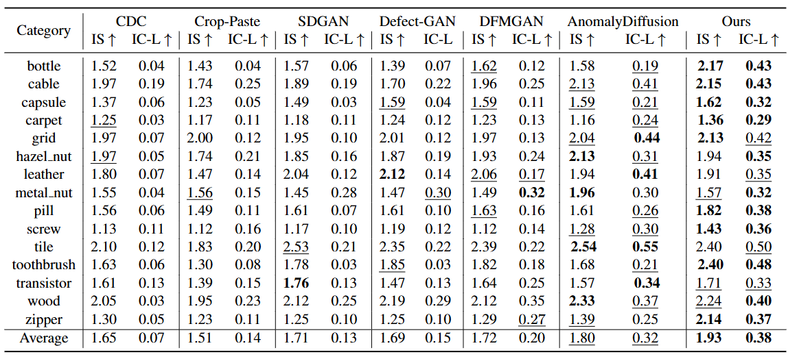

> \[\!NOTE\] 表1.
> 在MVTec数据集上的IS和IC-LPIPS对比。我们的模型生成了质量最高且最多样的异常数据，取得了最佳的IS和IC-LPIPS值。粗体和下划线分别表示最优和次优结果。

此外，我们在图5中展示了几种主流异常图像生成模型的结果。观察发现：Defect-GAN生成的图像常缺少实际异常；DFMGAN倾向于在图像中引入噪声（如瓶子、胶囊案例），且异常图像-掩码对存在对齐问题（如网格样本）；当前最优模型AnomalyDiffusion有时会在物体外部生成不合理掩码（如网格、螺丝），且生成的异常与原图贴合度不足，导致异常显得失真（如牙刷）。相比之下，我们的模型能够生成高度真实且有效的异常，甚至在处理网格弯曲等小尺度异常时表现尤为突出。更多实验结果见补充材料。

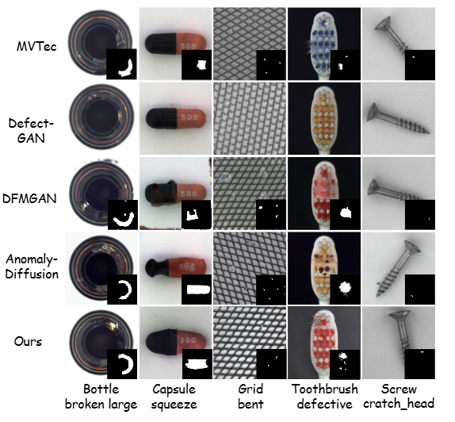

> \[\!NOTE\] 图5. 在MVTec数据集上的生成结果对比。我们的模型在生成与异常掩码精确对齐的高质量异常图像方面表现优异。

**用于异常检测与定位的异常生成**。我们通过将所提方法与现有异常生成方法在下游异常检测和定位任务中进行对比，来评估其有效性。我们针对每个类别计算了像素级和图像级的AUROC、AP和F1-max指标。结果如表2所示，由于图像级的AUROC、AP和F1-max结果较为接近，且受篇幅限制，我们仅展示最具代表性的AP结果，其他AUROC和F1-max结果见补充材料。可以看出，基于我们生成数据训练的U-net模型取得了84.5%的最高AP值和78.8%的F1-max值，相比排名第二的AnomalyDiffusion在AP指标上超出3.1%。

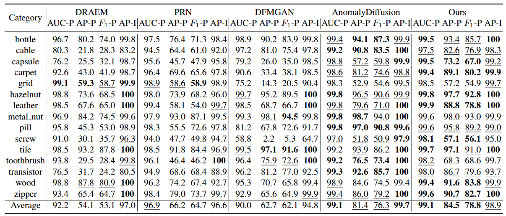

> \[\!NOTE\] 表2.
> 异常检测的量化结果。通过在DRAEM、PRN、DFMGAN、AnomalyDiffusion和我们模型生成的数据上训练U-Net，对MVTec数据集上的像素级异常定位和图像级异常检测进行比较。

**用于异常分类的异常生成**。为进一步评估我们模型生成的异常图像质量，我们利用这些图像训练下游异常分类模型。遵循DFMGAN\[6\]的实验设置，我们使用ResNet-18在生成的数据集上进行训练，然后在测试集上评估分类准确率，结果如表3所示。从数据中可以明显看出，与其他模型相比，我们的模型在大多数类别中表现出显著更高的准确率，平均准确率提升了13.58%，这表明我们生成的异常数据更加真实。

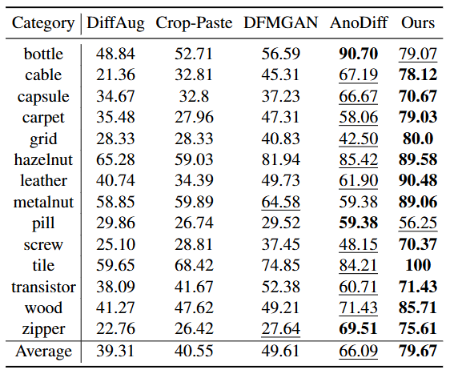

> \[\!NOTE\] 表3.
> 异常分类的量化结果。使用ResNet-18在各异常生成模型的生成数据上训练得到的分类准确率（%）对比。更高的分类准确率表明生成数据与真实数据的分布更一致。

### 4.3 与异常检测模型的对比

为进一步验证模型有效性，我们将其与DRAEM\[46\]、SSPCAB\[32\]、CFA\[19\]、RD4AD\[4\]、PatchCore\[36\]、MuSc\[22\]、DevNet\[28\]、DRA\[5\]和PRN\[48\]等前沿异常检测方法进行对比，采用各方法的官方代码或预训练模型，在相同测试数据集（MVTec测试集中2/3的异常数据）上开展评估。由于PRN无开源代码可用，故参考其论文中的结果。如表4所示，基于像素级AUROC和AP分数的评估结果表明：即便仅使用最简U-Net模型，借助本方法生成的异常数据，检测结果仍较传统方法显著提升5.9%。

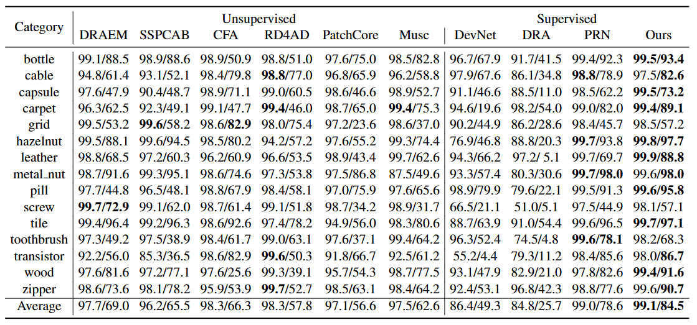

> \[\!NOTE\] 表4.
> 像素级异常定位的定量结果（AUROC/AP）。我们使用了在我们生成的数据集上训练的简单U-Net模型，以及采用官方代码或预训练模型的现有异常检测方法。

### 4.4 消融实验

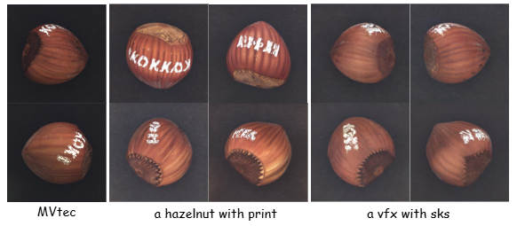

> \[\!NOTE\] 图6. 榛子印花类别上不同提示词的生成结果对比

图6展示了在我们模型中使用不同提示词的结果。显然，与直接使用类别名称相比，使用提示词“a vfx with
sks”在物体形状、颜色等方面表现出更优的性能。原因在于，将真实物体名称和缺陷类别名称作为提示词会引入大量先验知识，而来自自然世界的先验知识可能与特定数据集中的具体物体和缺陷存在较大差异。更多定量结果可在补充材料中查阅。

此外，我们评估了背景补偿模块（BCM）的有效性，该模块在瓶子、药片和牙刷等类别中展现出更为显著的改进。可视化结果如图4所示，像素级定位结果见表5。通过使用BCM，所有定性的图像生成结果和定量指标均得到显著提升，表明BCM对某些类别至关重要。

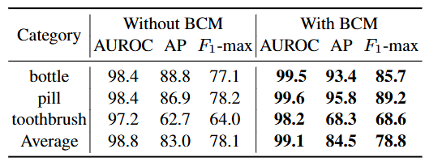

> \[\!NOTE\] 表5. 在MVTec部分类别上有无背景补偿模块的像素级异常定位对比。平均值为所有类别的均值。

## 5 结论

在本文中，我们提出了一种名为DualAnoDiff的新方法，用于生成异常图像-掩码对。我们的方法采用并行双扩散技术，同时生成异常图像和相应的异常部分。这确保了生成的异常图像-掩码对具有高度的对齐性，且异常图像具有真实感。此外，为解决具有挑战性的情况，我们引入了背景补偿模块，该模块可有效增强模型的拟合能力。大量实验表明，与现有异常生成方法相比，我们的方法表现更优。我们的模型生成的异常数据可有效提升下游异常检测任务的性能。

## 6 实现细节

### 6.1 训练细节

我们为每种异常类型训练了一组模型参数。模型训练需要5000个轮次，在NVIDIA V100 32GB
GPU上约耗时4.5小时。使用背景补偿模块（BCM）时，训练步骤仅需2000个轮次。批量大小设置为4，学习率为0.000005，LoRA的秩为32。

在训练过程中，我们采用随机翻转的方式进行数据增强。对于“背景补偿模块”，我们将其应用于所有涉及背景的类别。其中，瓶子、药片和牙刷类别呈现出极为显著的改进。而其他几个类别由于本身已能高质量生成，因此改进较为有限。

### 6.2 推理细节

在不使用背景补偿模块（BCM）的推理过程中，我们只需输入一组提示词：“a vfx with
sks”和“sks”。该过程会生成一组异常图像及对应的异常部分图像。针对每种异常，我们会生成1000对分辨率为512×512的图像。具体而言，推理步数设置为50，引导系数设置为2.5。值得注意的是，生成每对图像仅需15秒。

### 6.3 Mask 生成

我们采用(U^{2})-Net \[30\]对异常部分图像进行分割，以获取对应的掩码。根据我们的观察，该掩码完全准确。

## 7 其他消融实验

我们在表6和表7中展示了用于下游异常检测的全面像素级和图像级结果。“双重关联扩散”一词指的是使用双重关联模型框架，其中将“电缆”等类型名称用作提示词。符号“+
prompt”表示将类型名称替换为“vfx”和“sks”。此外，“+BCM”表示融入了背景补偿模块，该模块专门应用于瓶子、网格、榛子、药片和螺丝等类别。可以观察到，除牙刷类别外，我们设计的提示词表现优于使用类别名称的情况。然而，BCM模块能够有效缩小牙刷类别与提示词之间的差距。

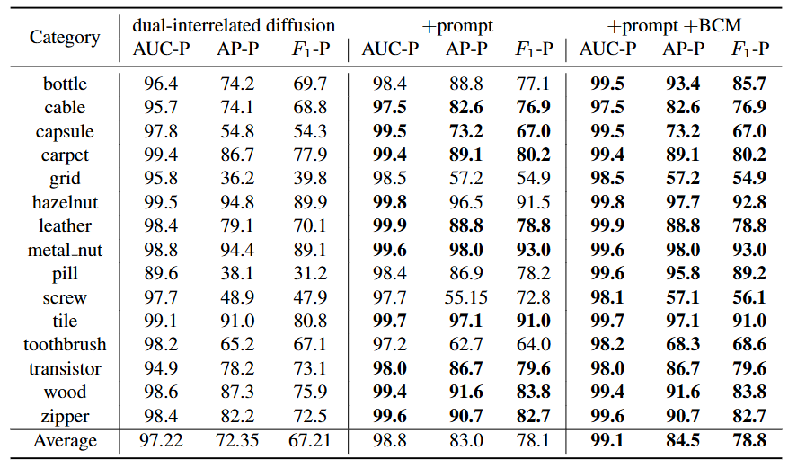

> \[\!NOTE\] 表6. 消融实验：通过在我们模型生成的数据上使用不同设置训练U-Net，对MVTec数据集上的像素级异常定位进行比较。

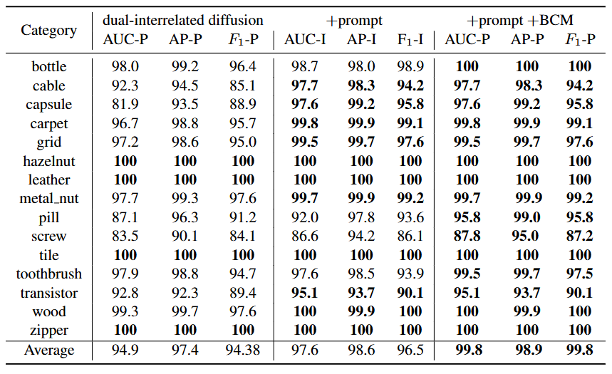

> \[\!NOTE\] 表7. 消融实验：通过在我们模型生成的数据上使用不同设置训练U-Net，对MVTec数据集上的图像级异常定位进行比较。

## 8 其他定性实验

我们对所生成的结果与现有异常图像生成方法进行了全面对比，结果如图7所示。显然，Crop\&Paste\[23\]生成的异常多样性有限；DiffAug\[50\]的结果存在过拟合问题；CDC\[27\]的生成结果缺乏真实感，常出现扭曲、变形等伪影；SDGAN\[26\]和Defect-GAN\[47\]无法生成与异常对应的掩码，且生成图像的真实性也受限；DFMGAN\[6\]产生的掩码对齐度不足，常生成斑点或噪声；当前表现最佳的方法AnomalyDiffusion\[14\]仅专注于学习异常部分，导致生成的异常数据无法与原始图像平滑融合，甚至有时会出现异常突兀叠加在图像背景上的情况。相比之下，我们的方法不仅能生成高度真实且多样的异常数据，还能产出对齐性极佳的对应掩码。

在所有这些方法中，DFMGAN和AnomalyDiffusion是目前表现最佳的两种方法，因此我们将我们的结果与这两种方法进行了更详细的可视化对比。更多可视化结果如图8-14所示。左侧展示了训练数据中的两个示例，右侧则显示了生成的图像对。

## 9 定量实验设置

### 9.1 生成数据

在所有对比方法中，为每个子类生成1000组数据用于下游检测任务。

### 9.2 评估标准

本节提供了关于使用这些指标的基本原理及其定义的补充信息。

**关于生成任务的评估指标**  
一般图像生成任务通常采用**弗雷歇初始距离**（**FID**）\[11\]评估生成数据与真实数据的分布差异。但在异常数据有限的场景下，FID指标并不可靠——过拟合模型往往会获得更高分数。因此，我们选用**初始分数**（**IS**）\[38\]作为评估标准：该指标无需训练数据，通过计算生成图像的标签边缘分布与Inception模型预测的类别条件分布之间的库尔贝克-莱布勒（KL）散度负指数，量化生成图像的质量与多样性。IS分数越高，表明生成图像的真实性与多样性越优。

此外，我们采用簇内成对LPIPS距离（IC-LPIPS）\[27\]来衡量生成数据的多样性。该方法基于LPIPS距离将图像聚类为k个组（对应k个目标样本），然后计算每个簇内样本与对应目标样本的平均LPIPS距离。IC-LPIPS分数越高，表明生成数据的多样性越好。

**关于异常检测**  
我们采用受试者工作特征曲线下面积（AUROC）、平均精度（AP）和最大 $F\_{1}$ 值（ $F\_{1}$
-max）来衡量异常检测任务的性能——这些指标遵循常规异常检测任务的评估标准。其中：

  - **AUROC**：通过描绘真实阳性率与假阳性率的关系，量化模型对正负样本的区分能力；
  - **AP**：综合考虑不同阈值下的精确率-召回率表现，反映模型在全类别检测中的平均精度；
  - \*\* $F\_{1}$ -max\*\*：通过调和精确率与召回率的最优平衡点，衡量模型检测结果的综合准确性。

### 9.3 异常检测细节

在异常检测的下游任务中，我们采用了简单的U-Net\[35\]架构。为降低随机性的影响，我们对模型进行了三次训练，并选取最佳结果作为最终输出。
